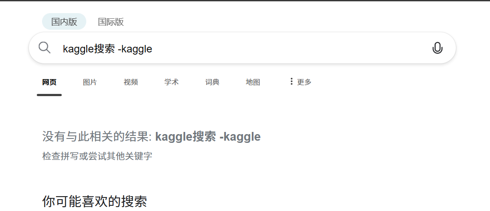
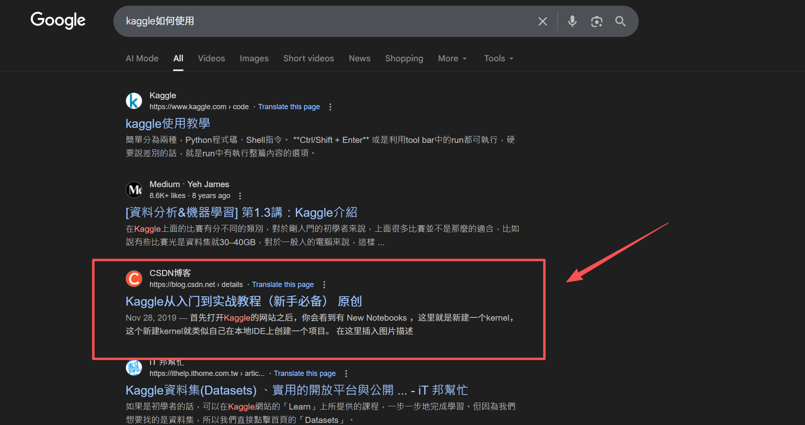
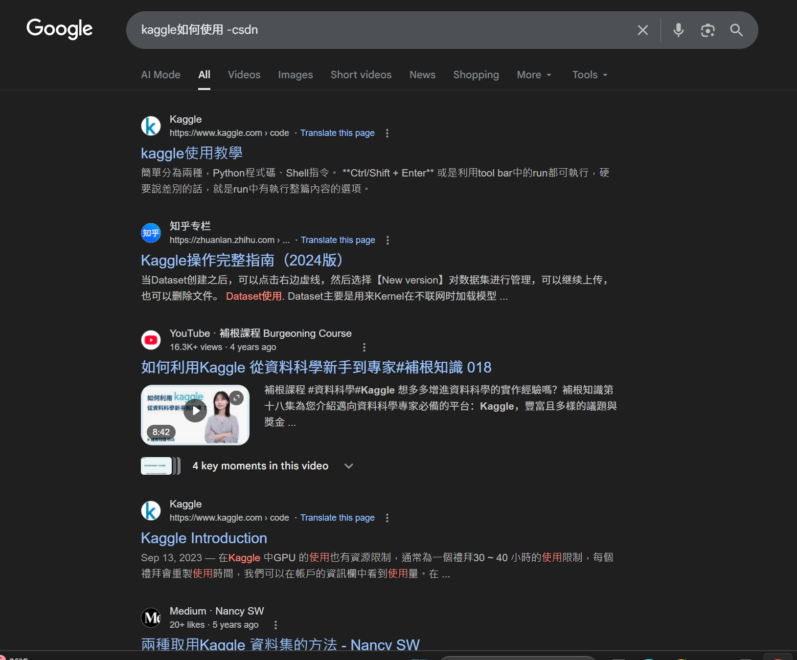

---
title: 搜索时屏蔽某些网站
date:  2025-09-21 20:05:48
categories:
  - 其他
tags:
  - 有趣
sticky: 0
---


## 0 引言

今天分享一个有趣的搜索小技巧，大家是否在平常利用各类搜索引擎进行资料搜索时，被某些平台所影响，虽然其排名前列，但是可能你并不想看到，所以我们可以使用一个搜索小技巧来屏蔽不想要的网站显示。

## 1 方法

方法十分之简单，大家只需要在搜索时加上`-网站名`即可

示例：

```
kaggle搜索 -kaggle
```




经过测试，在`-`之后添加一些中文也可以屏蔽，并且使用google引擎同样适用

**未添加限制**




添加限制后，没有相关平台的内容了

