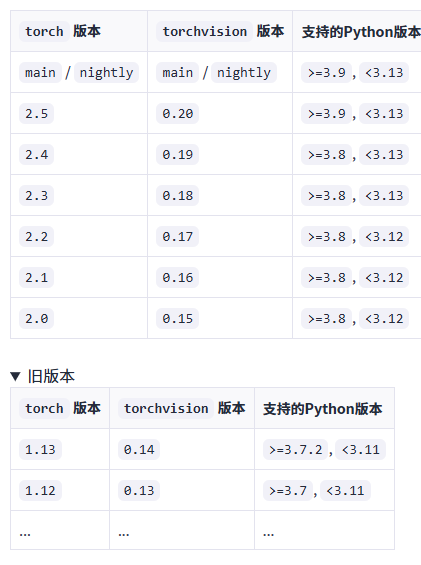
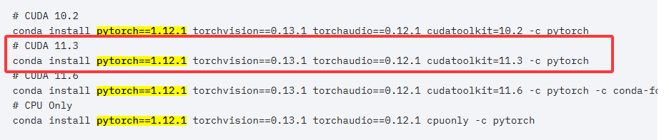
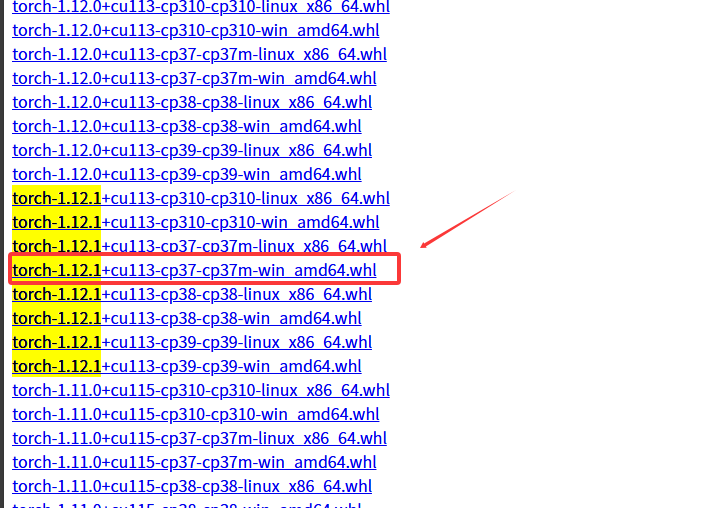
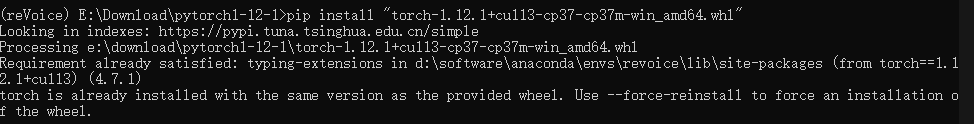
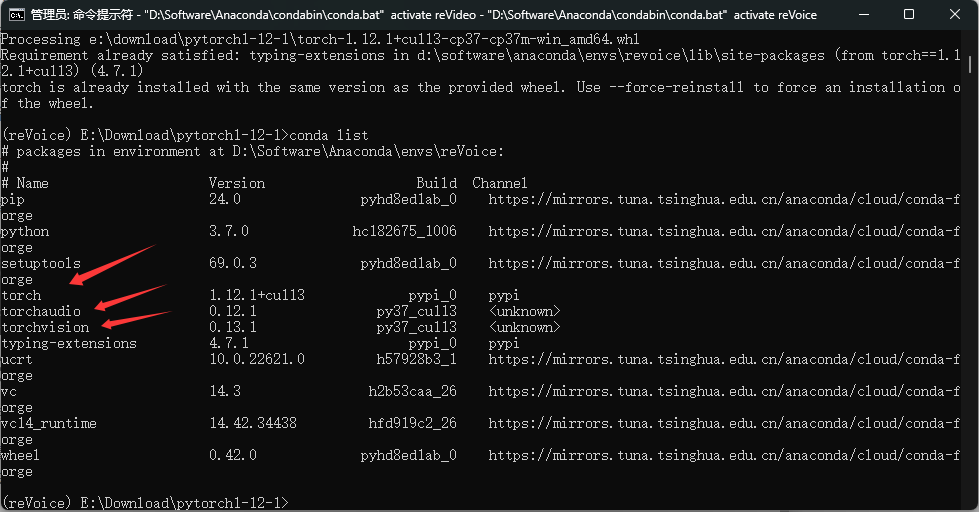
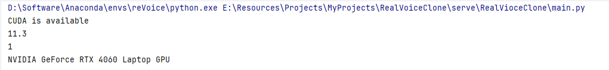

---
title: Pytorch离线安装（三步解决）
date:  2025-03-30 19:24:35
categories:
  - 工具与框架
tags:
  - pytorch
  - 环境配置
sticky: 0
---

## 0 引言

pytorch作为模型训练所需要的框架，随着人工智能的发展，模型的训练被越来越多的人熟知并使用，而pytorch作为当下最流行的训练框架，自然而然被用的更多。然而此包的大小有2G多，正常的命令行安装由于是国外的服务器，一般是很难安装成功的。有时使用清华镜像也无法安装成功，而此时就能用最后一招“**离线安装**”几乎能保证百分百安装成功。

## 1 匹配版本

离线安装最麻烦的一点就是需要事先匹配好版本，pytorch库的下载需要匹配三个**torch**、**torchaudio**和**torchvision**的版本，当时，这里默认大家已经安装好**cuda**、**cudann**和**python解释器**，确定了这三个的版本就可以确定pytorch三个包的版本。

> 这里为大家提供相应包和解释器的对应关系



在下方pytoch的官网可以直接查到对应的版本号，比如说我的python为3.7，cuda下载的是11.3的版本，那么就可以在这里CTRL+F查到这三个包对应的版本号

版本匹配网站：<https://pytorch.org/get-started/previous-versions/>




## 2 离线安装

下载网址：<https://download.pytorch.org/whl/torch/>

选择对应torch版本，必须是cu版本的，只有带**cu**才是cuda版本能进行gpu加速的，否则是cpu版本。



ps：这里可以要开外网才能快速下载，我关闭科学上网时发现下载速度很慢，如果开启，下载则很快，大概不到2min就能下载完成

下载完成之后就是一个whl文件


之后打开命令行进去该文件的文件夹，执行pip install "文件名"，注意，文件名需要加双引号，即可安装完成，

```
pip install "torch-1.12.1+cu113-cp37-cp37m-win_amd64.whl" 
```

我已经安装成功了，这是我再一次安装的结果




## 3 验证安装

安装好之后还需要查看是否安装成功，先conda list查看包是否已存在，如果没有用conda，就用pip list查看。

这里可以看到，我的pytorch包已经存在，但是包在环境里面不代表就安装好，还需要再运行相关代码，才能完全确定包已经安装完成，并且相关环境都已适配。




接着再到python运行下述代码，这里查看cuda是否可用，以及是否能用gpu进行加速，如果能打印出相关配置，即为安装成功。

```python
import torch

# 检查CUDA是否可用
if torch.cuda.is_available():
    print("CUDA is available")
    # 输出CUDA版本
    print(torch.version.cuda)
    # 输出GPU数量
    print(torch.cuda.device_count())
    # 输出当前GPU名称
    print(torch.cuda.get_device_name(0))
else:
    print("CUDA is not available")

```

输出结果




