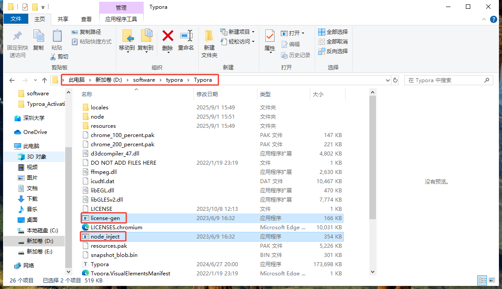
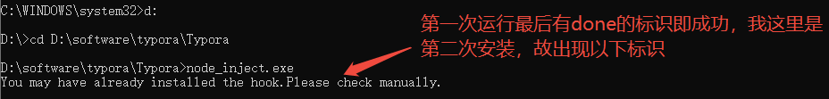
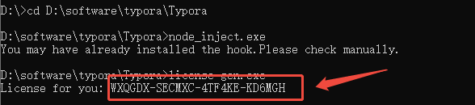

---
title: Typora的安装教程
date:  2025-09-01 16:57:20
categories:
  - 工具与框架
tags:
  - Typora
  - 软件安装
sticky: 0
---


## 0 引言

Typora是一款基于Markdown语法的编辑器，其简洁、轻量和易上手的特性，使其在众多同类编辑器中处于领先优势，拥有许多忠实的用户。正是由于其非常受欢迎，故使用时则有一些门槛（￥￥），则对于其“门槛”，为大家讲述我的思路。

> 声明：本文仅用作学习用途，不作其他作用！

## 1 工具下载

这里需要下载两个工具，一个是typora1.95版本和使用工具。

### 1.1 Typora下载

这里的Typora需安装1.95版本的，在点击下方Typora链接后，出现了1.93版本的也可以下载，其1.95版本是在此基础上升级迭代而现。安装完成后需记住其安装位置，后续第二章节的工具使用时会使用。

**Typora官方链接**：[https://typoraio.cn](https://typoraio.cn)

### 1.2 工具下载

这里下载工具文件，通过百度网盘即可下载本地，文件包含两个`exe`可执行文件。

**工具下载链接**：[百度网盘](https://pan.baidu.com/s/1QHtbNnIHQLQzG5O5n8cnKw?pwd=jb2w)

## 2 工具解压及Typora安装

### 2.1 工具解压

将这两个exe文件移到安装typora的目录下，并选择替换文件。



### 2.2 Typora安装

以管理员身份运行cmd，并跳转至这两个exe文件的路径下，接着先运行

```
node_inject.exe
```



再运行另外一个，就会出现一个序列码

```
license-gen.exe
```



接下来运行Typora，邮箱随便填写**123@qq.com**，序列码填写刚刚生成的这个，再按激活就成功了


## 3 右键添加md（可选）

这里主要方便各位需要快速新建md格式的文件

大家可以看我的这篇博客，win10和win11都适用这个方法，操作很简便

[win11右键新建加入md文件_右键新建md文件-CSDN博客](https://blog.csdn.net/qq_63786218/article/details/145740494?spm=1001.2014.3001.5502)
## 4 参考
[https://blog.csdn.net/qq_61621323/article/details/141036982](https://blog.csdn.net/qq_61621323/article/details/141036982)
