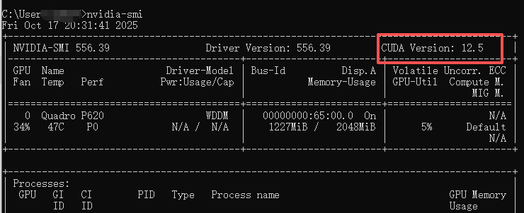
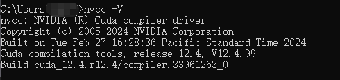
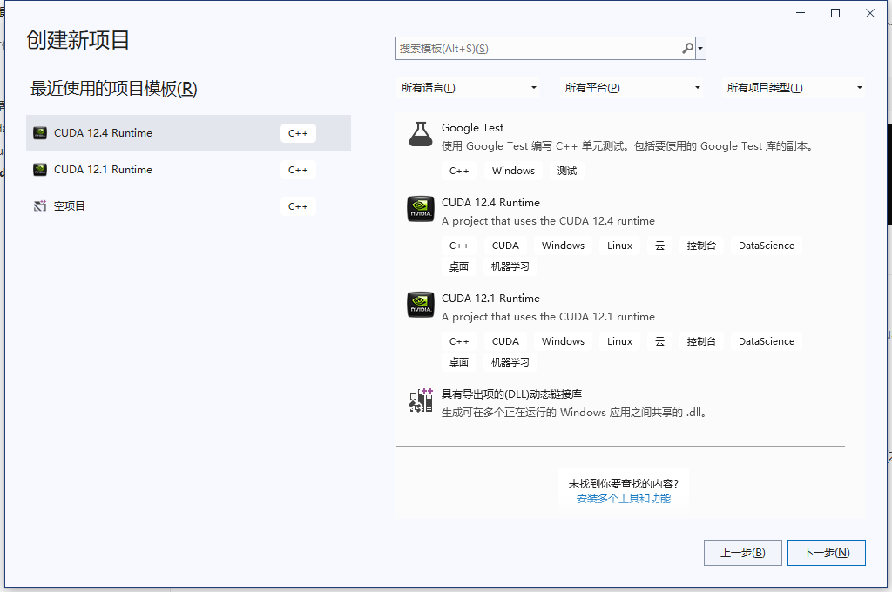
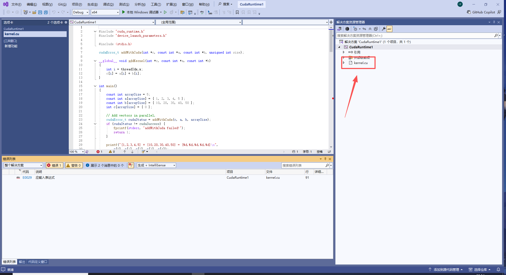
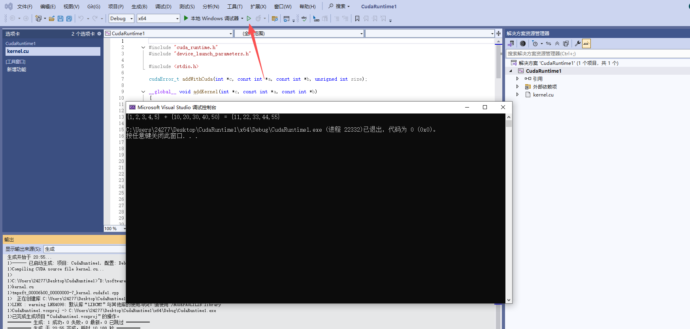

---
title: Windows CUDA教程：编写与运行CUDA代码
date:  2025-10-18 23:39:52
categories:
  - 工具与框架
tags:
  - cuda
  - 环境配置
sticky: 0
---


## 0 概要

本次主要介绍在 Windows 环境下运行 CUDA 代码的具体方法，并结合个人实践中遇到的问题进行讲解，希望能帮助大家顺利完成配置，避免常见错误。

## 1 环境配置

### 1.1 cuda安装

要想运行cuda，首先必须安装cuda，在这里有一个坑，就是后续运行代码的编辑器visual studio与cuda之间必须要兼容，否则会出很多问题，后续会讲到二者之间的配置兼容。

**确定cuda安装版本**：命令行输入下述指令，右上角会出现CUDA Version，代表你可以下载的最大版本不得超过这个指标，比如我的是12.5，也即cuda安装版本不能超过这个版本

```
nvidia-smi
```




cuda下载链接：[CUDA Toolkit Archive | NVIDIA Developer](https://developer.nvidia.com/cuda-toolkit-archive)

条件允许的话，大家可以跟我一样下载cuda 12.4.0的版本，避免后续因为版本不兼容而导致配置出错

> **安装注意！**：在自定义安装选项时，全部打勾即可，有些教程会说部分组件下载影响环境使用，亲测各版本，暂时没有影响

安装是否成功鉴定，有下述输出即为成功

```
nvcc -V
```




### 1.2 visual studio安装

> 疑问：这里有人会说直接用命令行运行cu文件是否可以，或者用dev、codeblock编辑器运行代码？
>
> 解答：在windows不行，即使安装好nvcc编译代码，但是这里还是需要cl工具，而这个工具只在visual studio中存在，本人测试过不用cl工具的情况下运行cu代码，一直无法运行。
>
> （如有大神在无需安装vs的情况下运行cu文件，可在评论区告知我这个小白0.0）

vs安装链接：[适用于 Windows、Mac 和 Linux 的 Visual Studio 和 VS Code 下载](https://visualstudio.microsoft.com/zh-hans/downloads/)

如果前面下载cuda12.4或以上版本，这里可下载vs的2022的版本，但是如果下载的是小于cuda12.4版本的，建议这里vs下载更小的版本，否则后续会出现版本不兼容，导致重新下载。

这里给大家一个作者的错误示例：作者cuda12.1的版本，无法适配vs2022，版本号 17.14.17

## 2 运行cuda

### 2.1 vs新建项目

新建项目--->选择cuda12.4

> **未出现cuda：**如果这一步没有出现cuda的选项，说明你的cuda安装没有成功，主要原因是自己在前面安装cuda的自定义选项时，是否全部打勾（主要是visual studio这个工具必须要打勾），如没有，则需要卸载重装即可！




### 2.2 运行代码

创建好之后，会出现如下图所示的示例代码，这里是创建cuda生成的demo示例




然后点击上面运行的按钮即可，出现运行结果就证明环境安装成功！




ps：如果第一次配置就成功的话，那就恭喜你了，因为作者配置了一下午，踩了很多坑才配置成功，希望对你有帮助！


