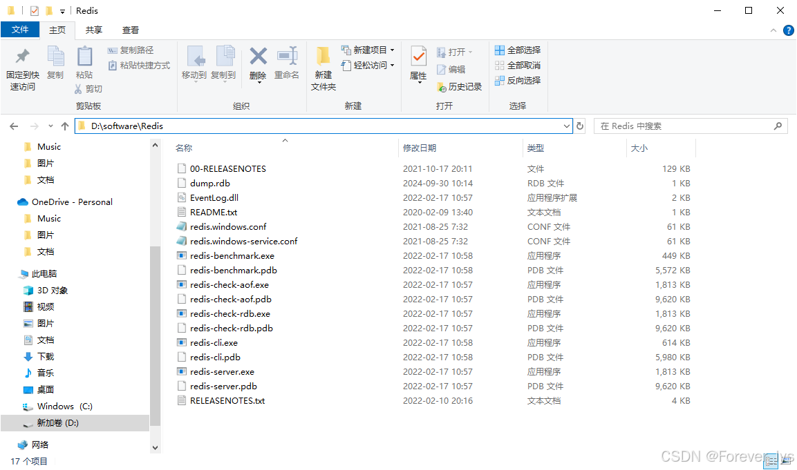
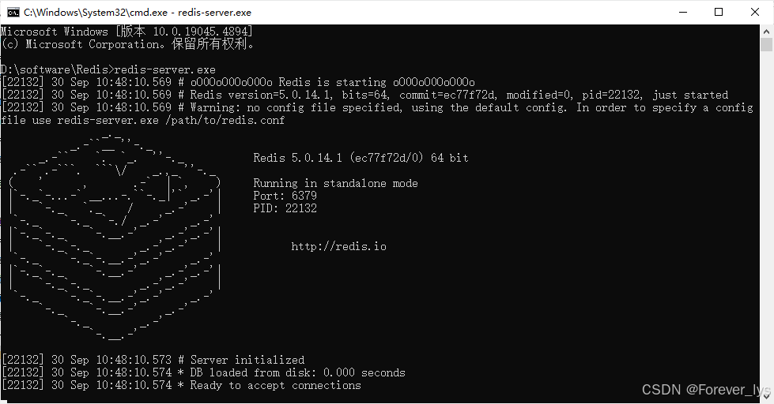
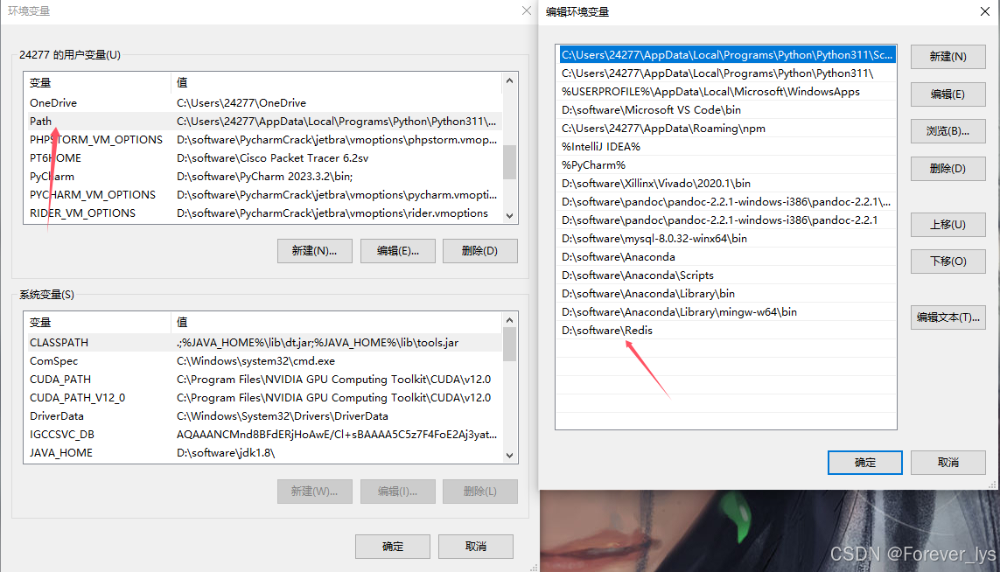
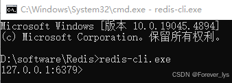
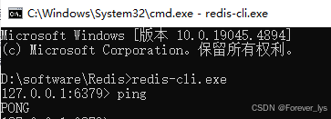
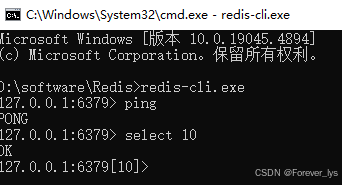
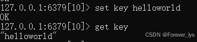
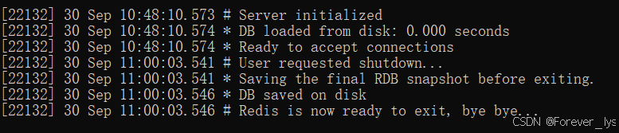

---
title: Windows下安装Redis（五分钟解决）
date:  2024-09-30 11:12:14
categories:
  - 工具与框架
tags:
  - redis
  - 环境配置
sticky: 0
---

## 0 Redis下载地址

https://github.com/tporadowski/redis/releases（下载地址一：github懂的都懂）
https://pan.baidu.com/s/1R8OZeC7fgshJOLxmz1w9IQ?pwd=6666 （下载地址二：百度网盘：提取码: 6666）

## 1 安装

解压至固定位置（不要有中文），解压完后如图所示。



然后cmd进入该文件夹，输入以下命令进行连接

```
redis-server.exe
```

默认端口为6379，出现图上的图标说明redis服务启动成功。



这里建议将路径放在系统变量中，这样下次启动就无需再进入该页面



## 2 客户端连接

打开另外一个cmd窗口（上一个窗口**不能关闭**，因为上一个窗口就是用来连接服务器的，否则会连接不成功）

在新开的cmd中写入以下命令，显示下图所示即连接成功

```
redis-cli.exe
```



检测连接命令，可以在cmd中输入ping检测，如出现PONG即为连接成功



## 3 基础操作

Redis默认拥有16个数据库，初始默认使用0号库，在命令行中通过`select`命令将数据库切换到8号数据库：

```
select 10
```



在命令中通过`set`命令设置键值，通过`get`命令取出键值：



在命令中通过`shutdown`命令来关闭redis服务，在连接窗口会出现下图所示退出图：





**Redis常用的服务指令**

卸载服务：`redis-server --service-uninstall`

开启服务：`redis-server --service-start`

停止服务：`redis-server --service-stop`
