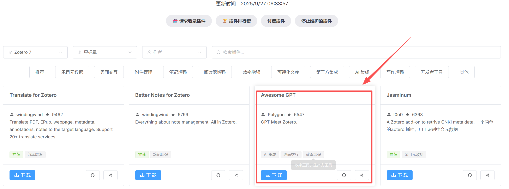
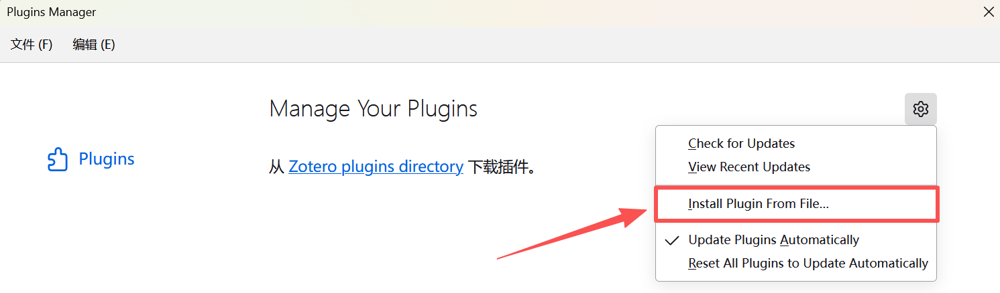
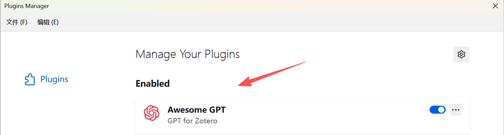
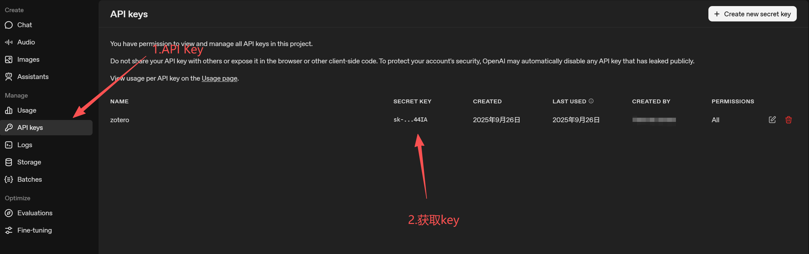
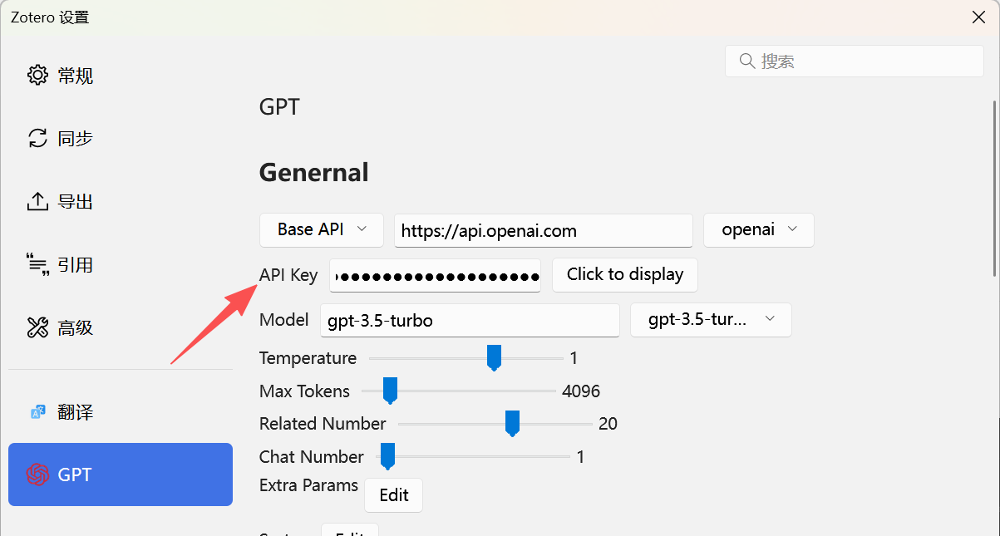
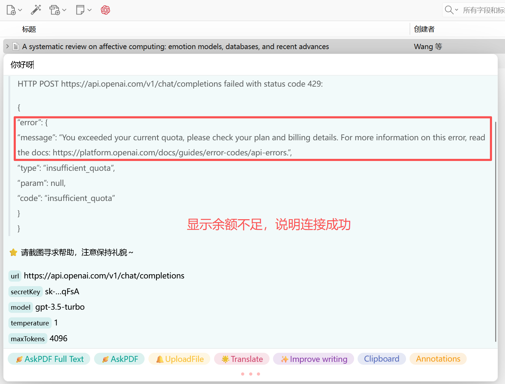
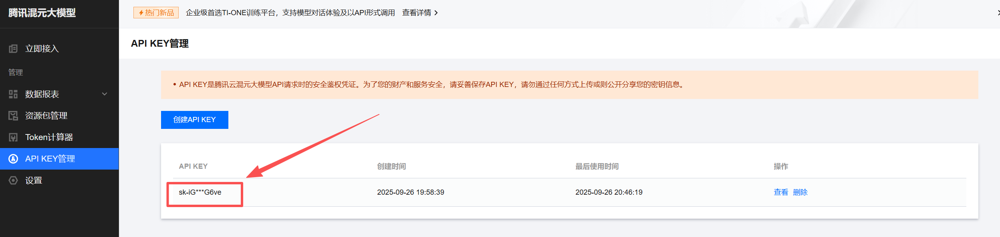
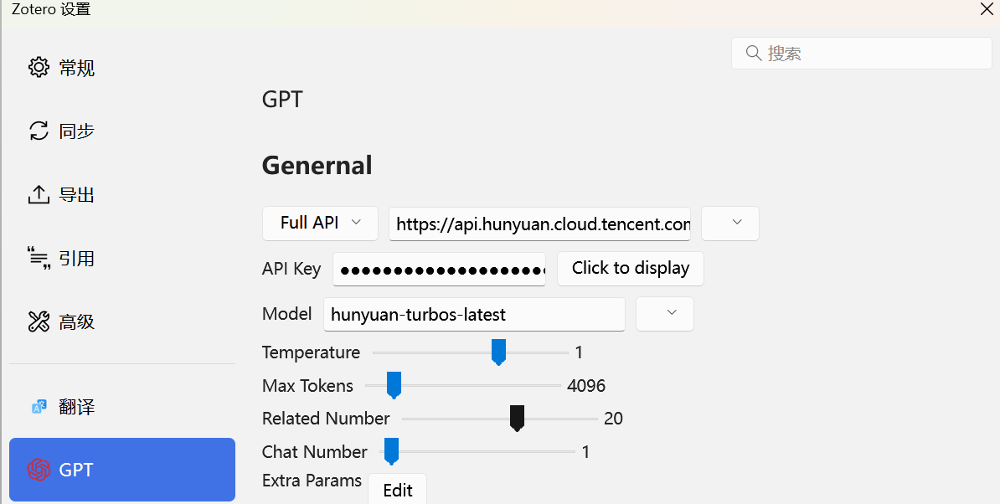
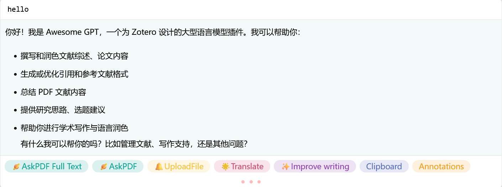
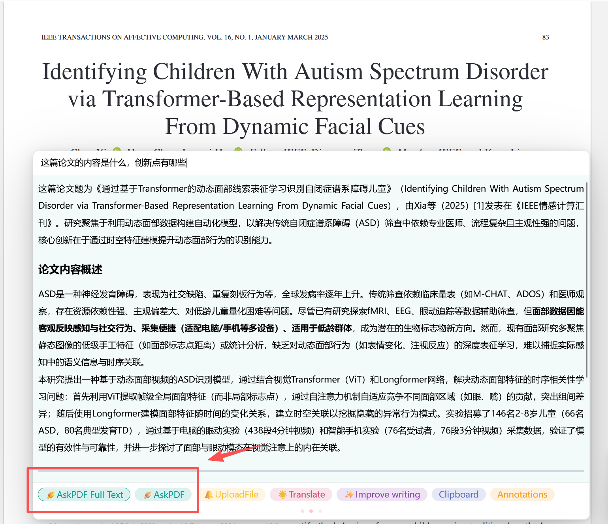

---
title: Zotero配置chatgpt和腾讯元宝大模型
date:  2025-09-27 14:09:11
categories:
  - 工具与框架
tags:
  - 环境配置
sticky: 0
---

## 0 引言

今天为大家介绍如何在zotero中配置大模型，其中包括系统中存在的一些大模型，如chatgpt、deepseek等，但还有一些大模型并不在系统的配置内，如腾讯元宝等。因为作为”白嫖客“，我们总是需要切换各类大模型来保证日常的使用，但是有一些大模型并不存在于系统内部，所以在这里以chatgpt（已内置）和腾讯元宝（未内置）的连接示例，为大家提供不同形式的连接方式。

## 1 插件下载

首先需要下载`Awesome GPT`，这里我是先将其下载到本地，再导入软件。

下载链接：[https://zotero-chinese.com/plugins/](https://zotero-chinese.com/plugins/)

## 2 文件导入

导入步骤：**工具**--->**插件**--->**设置**--->**install piugin from file**

导入后会出现`Awesome GPT`的标志

## 3 大模型配置

> 配置路径：**编辑**--->**设置**--->**GPT**
>
> 后续配置主要包含两大类**内置**和**未内置**，一类是系统就已经存在的一些大模型，如chatgpt、deepseek、Gemini等，还一部分是系统中没有，但是用户想要使用的大模型，如腾讯元宝等。
>
> 后续大家想安装其他类的大模型，都可以仿照我的步骤进行！

### 3.1 chatgpt（内置）

首先官网申请API-Key，并同时获取这个Secret Key

chatgpt申请链接：[https://platform.openai.com/api-keys](https://platform.openai.com/api-keys)

再到Zotero中进行配置，配置路径：**编辑**--->**设置**--->**GPT**

输入API-Key之后，可以选择需要的模型，这里默认GPT-3.5-turbo，如果你申请的API-Key更强，也可以选择其他模型

接着测试配置是否成功，在首页按`ctrl+/`或者直接点击上方GPT的图像，会弹出一个聊天框，在这里输入`/report`可以查看当前的配置，也可以直接输入文字，测试是否配置成功

我这里显示余额不足，需要充值才能继续使用，但这也说明我已经配置成功，后续要继续使用，只需要在openai官网中，充值获取token即可

### 3.2 腾讯元宝（未内置）

面对上述**余额不足**的情况，最好的方式就是换一个大模型，但是知名的大模型免费的额度都很少，这时我们可以使用那些虽不知名或者用的人较少，但是免费额度较高的大模型进行配置使用。

对于所有大模型的配置原理都一样：**找到api官网--->申请api-key--->再到系统上配置**

腾讯元宝api官网：[API KEY管理 - 腾讯混元大模型 - 控制台](https://console.cloud.tencent.com/hunyuan/api-key)

创建并获取api-key

需要配置以下四个部分：

1. base_url修改未full_url
2. 腾讯元宝大模型访问地址：https://api.hunyuan.cloud.tencent.com/v1/chat/completions
3. 输入自己的API-Key
4. 选择腾讯元宝大模型的模型名称：`hunyuan-turbos-latest`（也可以选择其他模型）

接着继续在首页进行测试，可以看到输入"hello"后，能正常回复，表示配置成功

## 4 GPT常见使用技巧

一般在Zotero中使用GPT，无非就是让其帮助我们分析当前论文，辅助我们快速、细致的了解论文的内容。

进入阅读文章，输入要问的问题，例如：“这篇论文的内容是什么，创新点有哪些”，接着选中下方**AskPDF Full Text**和**AskPDF**，大模型就会根据当前的论文进行回复了

例如：“这篇论文的内容是什么，创新点有哪些”，接着选中下方**AskPDF Full Text**和**AskPDF**，大模型就会根据当前的论文进行回复了

