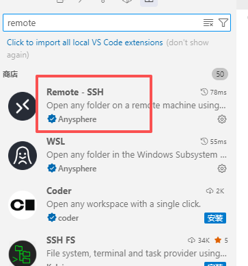
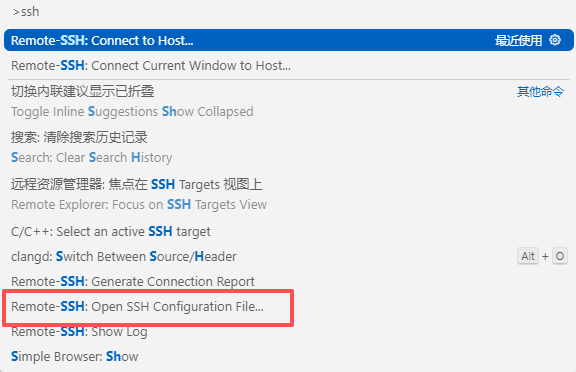
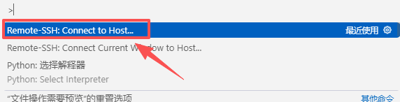
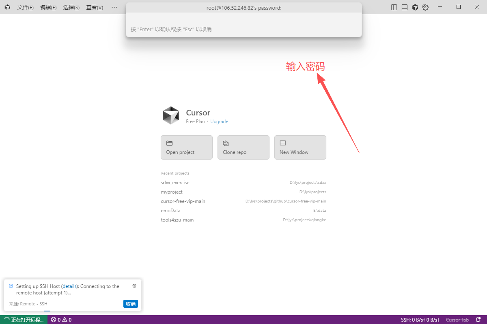

---
title: cusor连接远程服务器
date:  '2025-09-12 16:11:05'
categories:
  - 工具与框架
tags:
  - git
  - 服务器
sticky: 0
sidebar: 'auto'
---


## 0 引言

当需要操作服务器时，传统方式需通过平台界面反复登录并执行命令，流程较为繁琐。若能在本地环境中直接运行命令并连接服务器，操作将更加便捷高效。本文将以腾讯云服务器为例，详细说明如何通过Cursor工具实现本地与服务器的连接。

## 1 插件下载

这里我们需要下载`remote-ssh`这个插件




## 2 配置基础信息

下载完成后输入命令`curl+shift+p`

找到`REMOTE-SSH:Open SSH Configuration File`




打开config文件后，输入下方

- 服务器公网IP
- 用户名：没有特殊设置即为`root`
- Port：22

``` bash
# 云服务器示例
Host cloud-server
    HostName 公网IP
    User root
    Port 22
```

## 3 连接服务器

输入`curl+shift+p`，找到`Remote-SSH:Connect to Host`




接着输入服务器的**登录密码**即可



