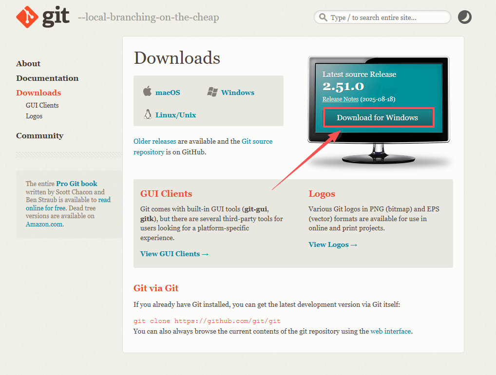
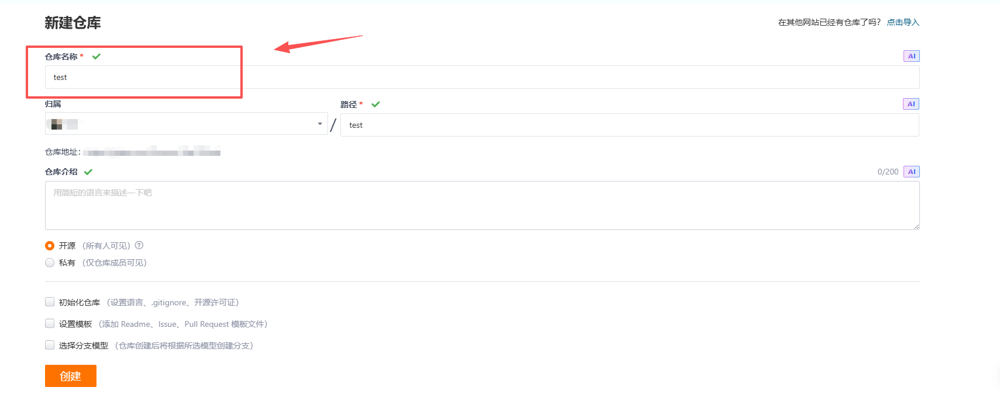
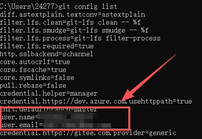
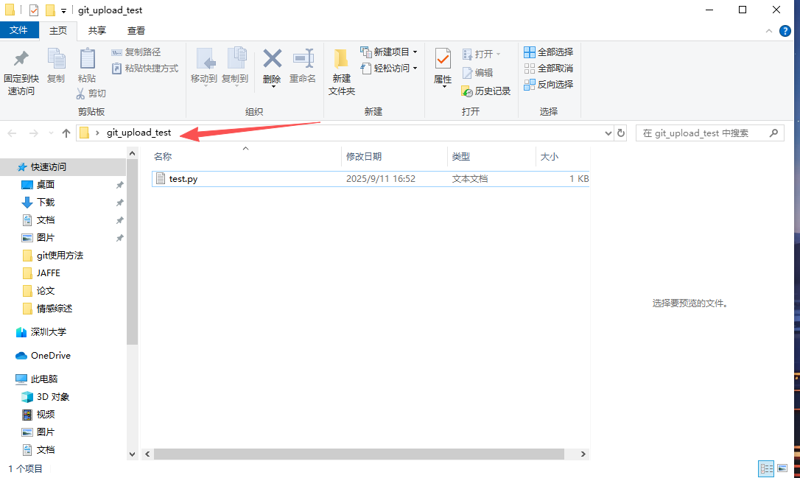
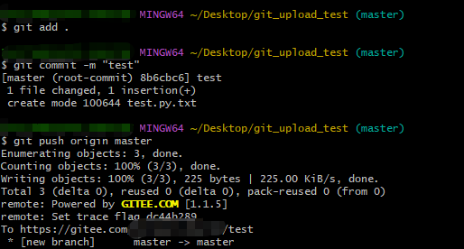
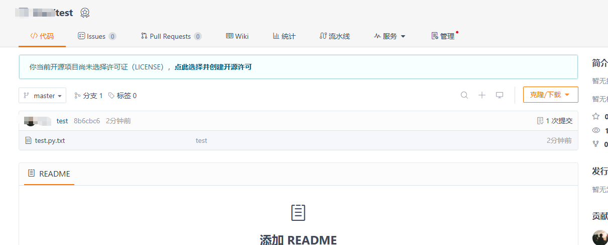
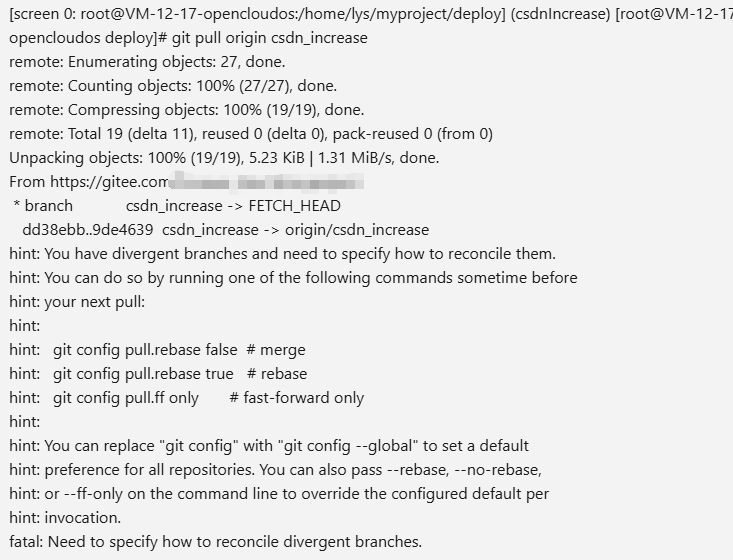

---
title: git基础配置及常用操作
date:  2025-09-11 18:52:01
categories:
  - 工具与框架
tags:
  - git
  - 环境配置
sticky: 0
---


## 0 引言

git是一个版本控制工具，它是一种分布式版本控制系统，主要用来管理项目中的代码，并且其是有Linux之父Linus Torvalds开发[1]。而本文由0及1，讲述git如何在windows上安装并与gitee实现连接。在此基础上，还讲述一些git的基本使用方法，并不定期更新在git中遇到的问题及解决办法。

## 1 git安装（windows）

点击下方链接，直接按照提示一直安装即可

下载地址：[https://git-scm.com/downloads](https://git-scm.com/downloads)




## 2 git配置

### 2.1 gitee账号准备

1. **账号注册**

​	点击下方的gitee链接，注册后并记住**ID**和**邮箱**，在后续git的连接需要用到

​	gitee官网：[https://gitee.com](https://gitee.com)

2. **新建仓库**

   点击首页右上方**加号**，选择新建仓库


​	仅仅需要输入仓库名称再点击**创建**即可




### 2.2 本地配置git

这一步主要是配置本地信息，才能通过git**拉取**和**上传**项目代码。可以理解告诉git我要将此项目上传到`gitee`还是其他代码托管平台，如：`github`。

1. **全局配置**[2]

   通过全局配置，后续本地所有文件上传，都是上传到这个平台（**新手建议设置全局**）

```
git config --global user.name "自己的github或gitte的用户名"
git config --global user.email "自己的github或gitte的绑定的主要邮箱"
```

​	这里的用户名和邮箱就是2.1第一点中注册时用到的信息，填写即可。

​	填写完毕，输入以下命令查看相关配置是否成功

```
git config list
```




2. **单个文件配置**[2]

   在涉及到某个项目的文件需要上传至与全局配置不同的代码托管平台时，则可以单独设置此文件夹下的上传路径

```
git config user.name ""
git config user.email ""
```

### 2.3 生成公钥并获取gitee的授权

可以理解成当你上传代码时，需要证明这个操作是”你“本人完成，而通过生成公钥，每次就不需要输入密码，通过这个已经配置好的公钥，服务器端就知道**”你是谁“**，并且这种方式能避免输入密码造成的泄露危险。

1. **生成`ssh key`**[2]
   - ssh-keygen -t rsa -C "xxxxx@xxxxx.com"
   - 注意：这里的 `xxxxx@xxxxx.com` 只是生成的 sshkey 的名称，并不约束或要求具体命名为某个邮箱
   - 现网的大部分教程均讲解的使用邮箱生成，其一开始的初衷仅仅是为了便于辨识所以使用了邮箱。

2. **获取 ` public key`**
   - 按照提示完成三次回车，即可生成 ssh key。通过查看 `~/.ssh/id_rsa.pub` 文件内容，获取到你的 public key
   - cat ~/.ssh/id_rsa.pub（也可以直接使用 `clip` 命令将文件内容复制到剪贴板中：clip < ~/.ssh/id_rsa.pub）
   - 复制生成后的 ssh key，通过仓库主页 **「Settings」->「SSH and GPG keys」->「SSH keys」->「New SSH key」** ，添加生成的 public key 添加到仓库中。
   - 首次使用需要确认并添加主机到本机SSH可信列表。键入下方命令，提示`Are you sure you want to continue connecting (yes/no/[fingerprint])?`，键入yes完成认证
     - ssh -T git@github.com （如果是绑定gitee，则输入：ssh -T git@gitee.com）
     - 若返回 `Hi XXX! You've successfully authenticated, but Gitee.com does not provide shell access.`，则证明添加成功

### 2.4 上传本地项目

通过上述的设置就已经将git基本配置好了，现在可以尝试将本地的任一项目上传至刚刚创建的仓库

1. **进入项目根目录**

   


2. **右键打开`git bash here`**

​	（1）初始化项目（第一次需要）

```
git init
```

​	（2）上传此页面的所有文件

```
git add .	
```

​	（3）提交至待转区

```
git commit -m "上传测试"
```

​	（4）添加要上传目的的仓库地址，在原来仓库可以找到仓库地址（第一次需要）

```
git remote add origin <remote-url>
```

​		  查看当前仓库地址

```
git remote -v
```

​	（5） 上传文件至服务器仓库

```
git push origin master
```




之后在gitee的仓库中就能看到上传的文件了




## 3 git常用操作

### 3.1 初始化文件

```
git init
```

### 3.2  添加远程仓库

```
git remote add origin <remote-url>
```

### 3.3 添加全部文件至暂存区

```
git add .
```

### 3.4 提交文件至本地仓库

```
git commit -m ""
```

### 3.5 提交本地文件至远程仓库

```
git push origin master	##master 可修改其他分支
```

### 3.6 拉取远程仓库至本地

```
git pull origin master ##master 可修改其他分支
```

### 3.7 查看分支

查看本地分支

```
git branch
```

查看远程和本地仓库全部信息

```
git branch -a
```

查看远程仓库分支信息

```
git branch -r
```

### 3.8 拉取远程仓库所有分支信息

仅仅拉取远程仓库信息，不会修改本地分支内容

```
git fetch
```

### 3.9 修改当前分支

切换本地其他分支（已存在）

```
git chechkout tree_name
```

```
git switch tree_name	## 新版本的命令，二者都可用
```

切换其他分支（若不存在，则本地强制创建）

```
git checkout -b tree_name
```

### 3.10 查看暂存区状态

```
git status
```

### 3.11 配置信息

全局配置

```
git config --global user.name ""
```

```
git config --global user.email ""
```

局部配置

```
git config user.name ""
```

```
git config user.email ""
```

## 4 未知问题及解决方案

这里将持续记录，并不间断更新我在工作中遇到的各种问题以及我对应的解决方案。因为git虽然是一个版本控制工具，但在实际项目中会遇到特别多的问题，并且当我们与其他一起合作时，“版本冲突”、“分支合并”、“版本回复”等等棘手的问题都是在工作中可能遇到的。而我将持续记录自己**真实**遇到的问题，并将自己的解决方案记录在此。
### 4.1 分支冲突

> 问题阐述

在本地修改了项目内容，并上传至gitee，此时从服务器中想拉取该分支的最新内容（服务器之前已拉取过该分支），但是系统提示分支冲突，不能直接拉取。系统显示的内容如下




> 问题解析

提示的内容主要是要求我们针对本地项目与远程仓库项目不一致，需要你手动进行确认，而为什么会出现这样的情况？通常是因为 **本地分支与远程分支的历史记录不一致**

假设远程仓库的分支有新的提交（例如别人推送了代码），而你的本地分支：

1. **从未与远程分支关联过**；
2. **本地有未提交的修改**；
3. **之前拉取过但未正确合并**。

此时，Git 无法自动确定如何同步两者的差异，因此需要你手动指定解决方式。

> 
> **解决方案**

1. **留远程，删本地**

因为我的服务器不需要留存代码，只需要拉取最新的代码运行即可，所以只需要拉取远程分支，并强制拉取到本地即可

```
git fetch --all
```

```
git reset --hard origin/csdn_increase	## 强制重置本地分支
```

2. **远程和本地文件都需要**

对于需要远程和本地代码都需要留存的，可以按照下述方式进行操作

- 提交代码至本地仓库

```
git add .
git commit -m "提交代码至本地仓库"
```

- 拉取远程仓库代码

```
git pull origin master	## 此时拉取的代码中远程和本地有冲突的地方，git的方案是将二者都保存下来
```

- 保留远程代码

```
git checkout --theirs file_name 	## 输入文件名，此时会保存远程文件
```

- 保留本地仓库代码

```
git checkout --ours file_name		## 输入文件名，此时会保存本地文件
```
- 保存修改

```
git commit -m "解决合并冲突：XXX使用远程版本，XXX使用本地版本"
```


## 参考

[1] [(9 封私信 / 44 条消息) Git 使用教程：最详细、最正宗手把手教学（万字长文） - 知乎](https://zhuanlan.zhihu.com/p/615581394)

[2] [【Git】初始配置以及常用操作命令 - 中国制造 - 博客园](https://www.cnblogs.com/suhai/p/14449889.html)


