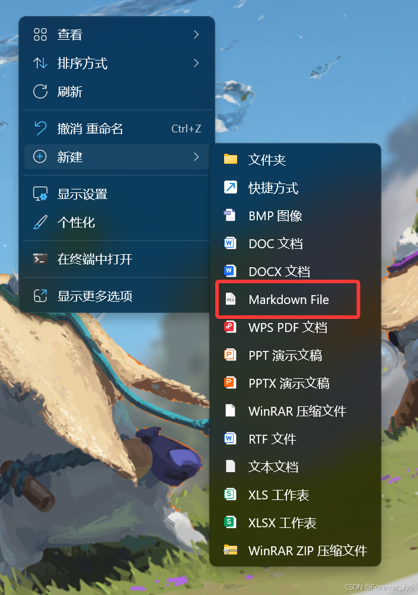

---
title: win11右键新建加入md文件
date:  2025-02-19 22:22:45
categories:
  - 工具与框架
tags:
  - 环境配置
sticky: 0
---

两步解决右键添加“md”文件

## 第一步

桌面新建一个txt文件，并粘贴下列代码

**注意**：需要将icon后面的路径改成自己的typora安装的位置

```
Windows Registry Editor Version 5.00

[HKEY_CLASSES_ROOT\.md]
@="typora.md"
"icon"="你的typora安装目录下的typora.exe文件"
[HKEY_CLASSES_ROOT\.md\OpenWithProgids]
"Typora.md"=""
"VSCode.md"=""

[HKEY_CLASSES_ROOT\.md\ShellNew]
"NullFile"=""

```

**例如**（我的配置）

```
Windows Registry Editor Version 5.00

[HKEY_CLASSES_ROOT\.md]
@="typora.md"
"icon"="E:\Software\Typora\Typora\Typora.exe"
[HKEY_CLASSES_ROOT\.md\OpenWithProgids]
"Typora.md"=""
"VSCode.md"=""

[HKEY_CLASSES_ROOT\.md\ShellNew]
"NullFile"=""

```

## 第二步

将此文件保存后退出，再将文件后缀名修改成`reg`，再双击运行即可。

此代码会将typora快速写入注册表中，达到一键解决！再右键即可看到markdown文件




