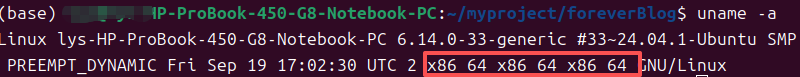
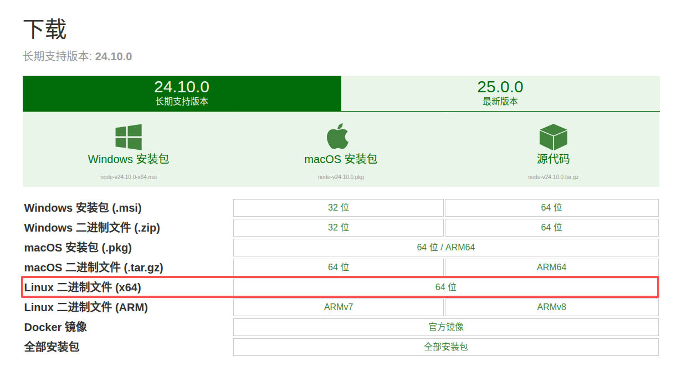
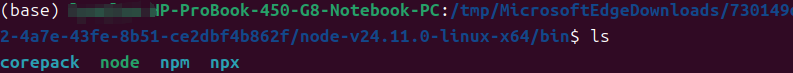
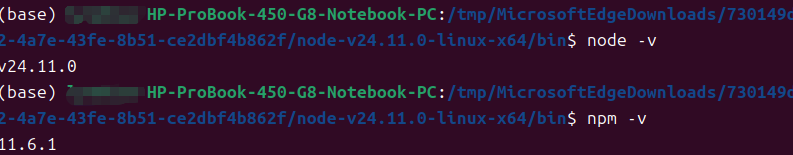
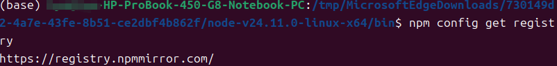
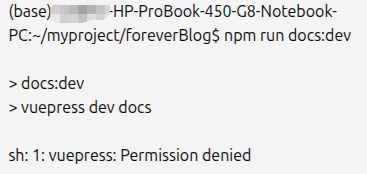

---
title: 在 Ubuntu 上快速配置 Node.js 环境（附问题说明）
date:  2025-11-04 10:15:01
categories:
  - 工具与框架
tags:
  - ubantu
  - NodeJs
sticky: 0
---
## 0 概要
本文基于Ubantu系统，全面详细展示如何一步步安装nodejs，并在此基础上，实现将一个vuepress项目拉取下来，并对其环境依赖进行配置，主要目的在于帮助大家快速配置nodejs和迅速利用nodejs进行一个新项目环境的配置。

## 1 nodejs下载
首先需要查看自己的电脑架构，因为Ubantu系统支持多种架构，比如我的是X86_64位的

```bash
uname -a
```


接着下载nodejs的安装包

英文网址：[https://nodejs.org/en/download/](https://nodejs.org/en/download/)

中文网址：[http://nodejs.cn/download/](http://nodejs.cn/download/)


## 2 配置依赖
### 2.1 解压安装包
在uabntu22.04最新的系统中，从浏览器中打开安装包的位置时，系统会自动将tar安装包解压，十分方便。
对于其他不能自动解压的，输入下述命令即可！

```bash
tar -xvf  node-v14.18.0-linux-x64.tar.xz  
```
### 2.2 移动位置
一般需要将这种环境包安装在特定的位置，直接将其移动即可（自己定义位置）

```bash
mv node-v14.18.0-linux-x64 ~/envs/nodejs
```
确认一下nodejs下bin目录是否有node 和npm文件，如果有执行下一步，如果没有重新下载执行上边步骤；

```bash
cd bin
```

```bash
ls
```


### 2.3 建立软连接，使其全局访问
这里的路径需要修改成自己的路径
```bash
sudo ln -s ~/envs/nodejs/bin/npm /usr/local/bin/ 
```

```bash
duso ln -s  ~/envs/nodejs/bin/node /usr/local/bin/
```
检查是否配置成功

```bash
node -v
```

```bash
npm -v
```


### 2.4 配置镜像原
由于网络限制，需要将其配置其他镜像原，不然下载速度很慢

```bash
npm config set registry https://registry.npmmirror.com/
```

```bash
npm config get registry
```



> 到此为止，nodejs已经配置成功！


## 3 NodeJs的使用
这里以拉去一个Vuepress项目为例，将一个完整的Vuepress项目拉取下来，并利用Nodejs对其配置，获取其依赖

### 3.1 安装依赖
进入Vuepress项目中，执行下述命令，自动安装依赖，其他相关的项目按照所示进行执行也是一样的

```bash
npm install
```
### 3.2 问题解决

Vuepress没有权限写入

修改权限

```bash
cd node_modules/.bin
```

```bash
chmod +x vuepress
```
之后再执行运行命令即可运行，原因在于此项目只有读写权限，没有执行权限，修改权限即可


## 4 安装 Node.js 的常见问题及解决方法

> 在安装 Node.js 的过程中，可能会遇到一些常见问题。以下是一些常见问题及其解决方法，帮助你顺利完成 Node.js 的安装与配置。


### 4.1 Node.js 安装失败

**问题描述**：在 Windows 或 macOS 系统上安装 Node.js 时，安装程序提示失败或者无法启动。

**解决方案**：

1. **检查系统兼容性**：确保下载的 Node.js 版本与操作系统兼容。32 位系统需下载 x86 版本，64 位系统需下载 x64 版本。
2. **以管理员权限运行**：在 Windows 上右键安装程序选择“以管理员身份运行”。
3. **清理旧版本**：如果之前安装过 Node.js，先卸载旧版本并删除相关环境变量，然后重新安装。
4. **使用包管理器安装**：

   * Windows：使用 `choco install nodejs`（需先安装 Chocolatey）。
   * macOS：使用 `brew install node`（需先安装 Homebrew）。
   * Linux：使用官方包管理命令，如 Ubuntu：

  ```bash
 curl -fsSL https://deb.nodesource.com/setup_20.x | sudo -E bash -
 sudo apt-get install -y nodejs
  ```

---

### 4.2 Node.js 命令无法识别

**问题描述**：安装完成后，在终端输入 `node -v` 或 `npm -v` 提示命令未找到。

**解决方案**：

1. **检查环境变量**：

   * Windows：确认 Node.js 安装路径（如 `C:\Program Files\nodejs\`）已加入系统 `PATH`。
   * macOS/Linux：确保 `node` 所在路径在 `PATH` 中，例如：

  ```bash
  export PATH=$PATH:/usr/local/bin/node
  ```
2. **重启终端或电脑**：环境变量修改后，需要重新启动终端或系统。
3. **验证安装路径**：

  ```bash
   which node
   which npm
  ```

---

### 4.3 npm 安装包失败

**问题描述**：使用 `npm install` 时出现权限错误或网络超时。

**解决方案**：

1. **权限问题**：

  ```bash
   sudo npm install -g <package_name>
  ```

   或配置 npm 全局安装目录：

```bash
   mkdir ~/.npm-global
   npm config set prefix '~/.npm-global'
   export PATH=~/.npm-global/bin:$PATH
```

2. **网络问题**：

   * 切换 npm 源为国内镜像：

  ``bash
     npm config set registry https://registry.npmmirror.com/
     ```
   * 或使用 `yarn` 替代 npm：

  ```bash
     npm install -g yarn
     yarn install
  ```

---

### 4.4 Node.js 与 npm 版本不一致

**问题描述**：安装完成后 Node.js 和 npm 版本不匹配，或者某些包要求特定版本。

**解决方案**：

1. **使用 n 或 nvm 管理 Node.js 版本**：

   * **nvm (Node Version Manager)**：

  ```bash
     nvm install 20
     nvm use 20
  ```
   * **n (Node 版本管理工具)**：

 ```bash
    npm install -g n
     n stable
 ```
2. **升级 npm**：

  ```bash
   npm install -g npm@latest
  ```

---

### 4.5 Windows 防火墙或杀毒拦截安装

**问题描述**：安装或运行 Node.js 时被防火墙或杀毒软件阻止。

**解决方案**：

1. 临时关闭防火墙或杀毒软件，安装完成后再开启。
2. 添加 Node.js 及 npm 到防火墙/杀毒软件白名单。

---

### 4.6 其他建议

* 尽量使用 **LTS（长期支持）版本**，兼容性和稳定性更好。
* 安装完成后执行：

 ```bash
  node -v
  npm -v
 ```

  确认版本正确。
* 遇到问题，可查阅官方文档：[Node.js 官方文档](https://nodejs.org/)


