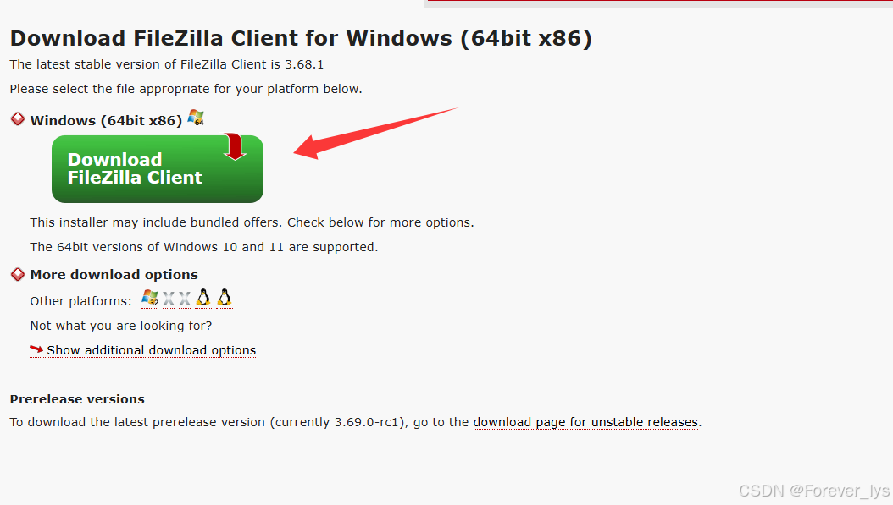
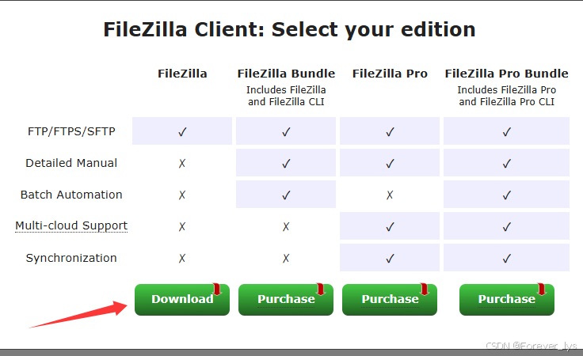
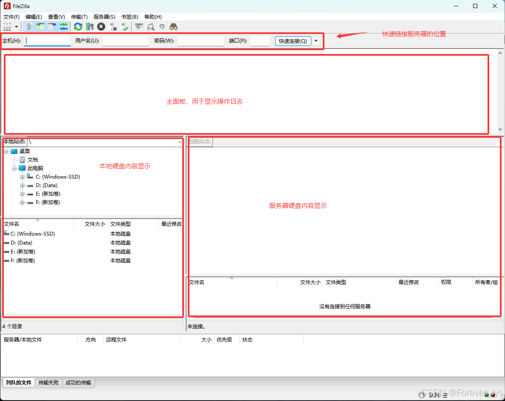
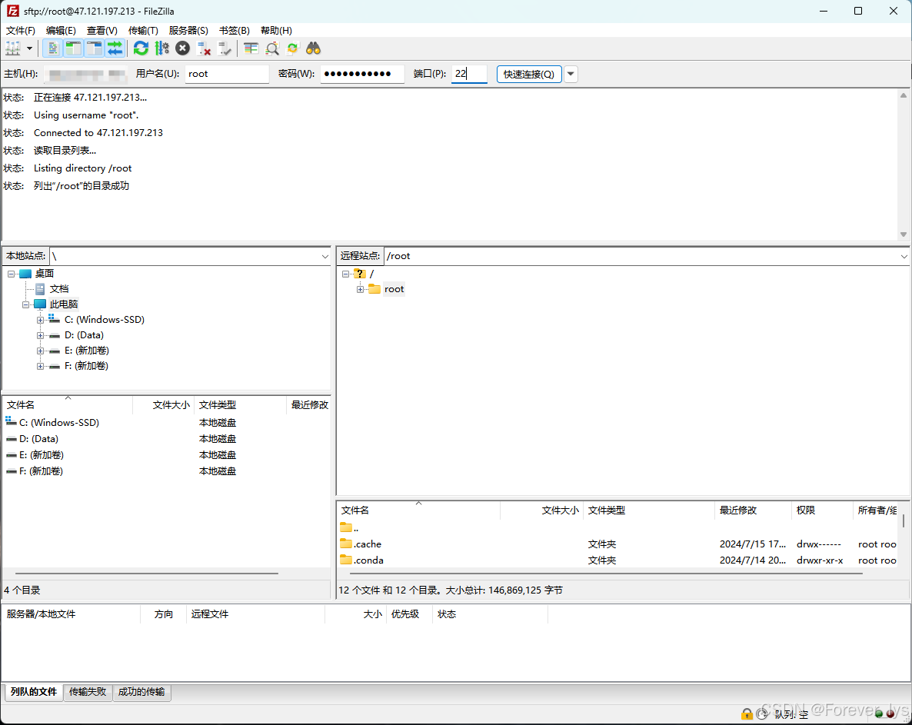
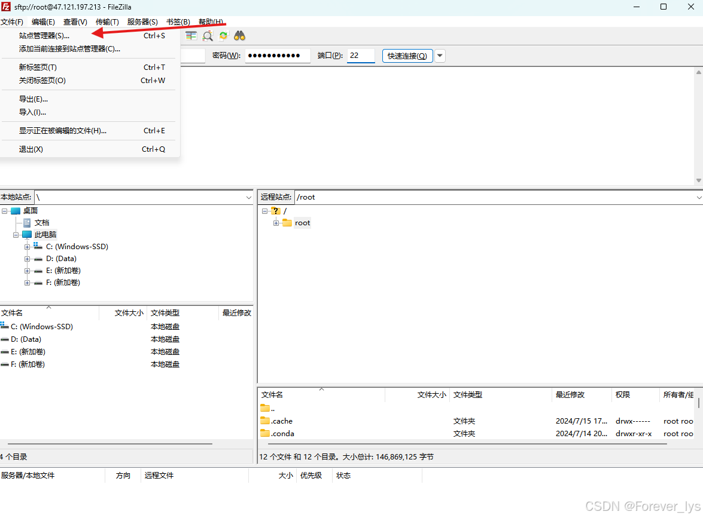
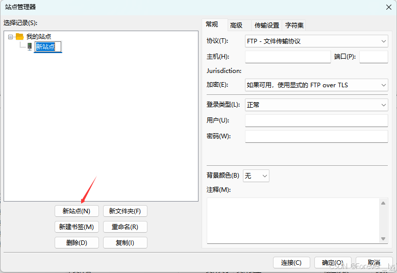
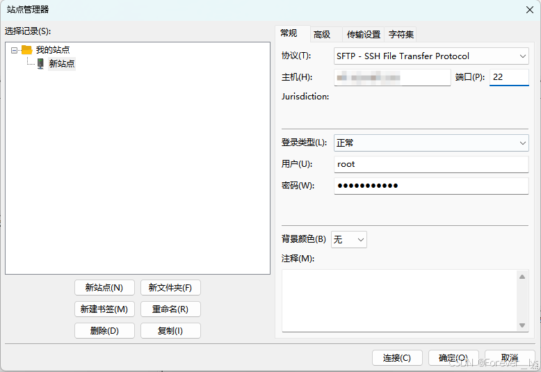
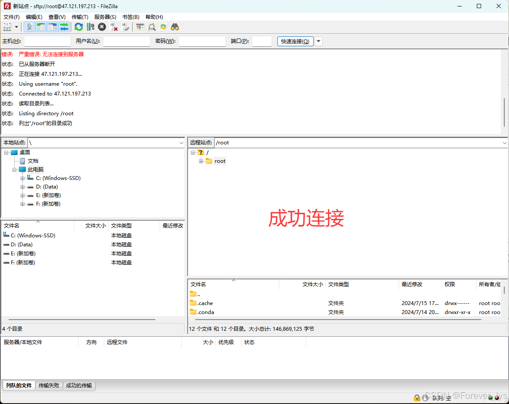
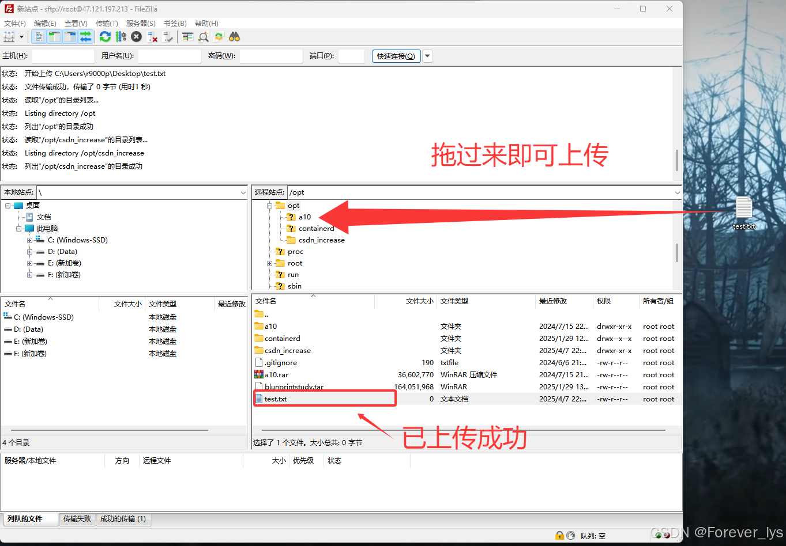

---
title: 本地上传文件至服务器
date:  2025-04-07 23:09:53
categories:
  - 工具与框架
tags:
  - 服务器
sticky: 0
---

## 0 引言

众所周知，服务器的系统大多为ubantu这些以linux为内核开发的系统，并且为了减少硬盘的占用，一般都是用命令行去书写命令和编辑一些文件，这使得我这类习惯了windows开发的人感到很为难。并且大部分我们都会在本地开发或者下载一些文件，那么本地已经下载好了，就没必要再到服务器上敲一遍了，直接将本地文件上传至服务器就可以了。这一次我将用**FileZilla**实现这一功能。

## 1 FileZilla下载

FileZilla 是一款免费开源的 **FTP/SFTP 客户端工具**，支持跨平台（Windows/macOS/Linux），主要用于在本地计算机与远程服务器之间高效传输文件。其核心功能是通过多种协议（FTP、SFTP、FTPS）实现文件的上传、下载和管理。

下载地址：<https://filezilla-project.org/download.php?type=client>

下载最左边的版本就好

下载成功后就是以下这个界面，主要分成四大块显示内容，重点时服务器连接的地方

## 2 连接服务器

在FileZilla中，服务器的连接有两个地方可以实现这一功能，而服务器连接是大家出现主要问题的地方，因为连接方式的不对，很有可能导致始终连接不上去，如第一次使用，请按照我的方式连接能最大程度成功！

### 2.1 快捷连接

在刚才的主面板的上方可以直接连接服务器，这里主要填写以下四个内容即可

1. 主机：服务器ip地址（在服务器中都会显示**公网ip地址！公网ip！公网ip！**）
2. 用户名：root（一般没有特殊设置，**都会是root**）
3. 密码：服务器登陆密码
4. 端口：22（一般都会是ssh连接，就是22的端口号，如果22不行，就试一下21）

设置成功后，再点击快捷连接即可连接成功，远程站点出现服务器的文件即表示连接成功

### 2.2 站点管理器连接

这是第二种连接方式，通过这种方式，可以将此次连接的内容配置保存下来，下次直接点击即可连接成功。

#### 01 在左上角**文件**中点击**站点管理器**

#### 02 点击新站点

#### 03 右边再配置相关信息

与前面的快捷连接相同，唯一需要注意的是协议选择**“SFTP - SSH File Transfer Protocol”**（不要选择其他，否则会报错，除非你不是这个连接方式，大部分连接都是ssh连接方式），可以参考我下方的填写方式。

成功连接

## 3 上传文件至服务器

将本地文件传至服务器，只需要将本地文件拖到服务器相应的文件夹即可上传，详见我下方的上传步骤

