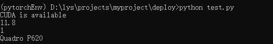

---
title: 解决pytorch导包时出现：[WinError 182]操作系统无法运行
date:  2025-09-08 18:41:26
categories:
  - 工具与框架
tags:
  - pytorch
  - 环境问题
sticky: 0
---


## 0 引言

在本地利用anaconda3正确安装了pytorch后，导入`torch`时报错，显示找不到`fbgemm.dll`这个文件，尝试了重装pytorch和微软C++相关组件，并对电脑重启后依然无法运行，始终报相同的错误。在查阅大量资料和尝试多种方法后，最终通过安装一个包成功解决此问题。本文针对导入`torch`后，运行时报操作系统无法运行的问题，并显示[WinError 182]的问题提供解决方案。

## 1 问题概要

这里报下述错误，主要是缺少一个**fbgemm.dll**文件，显示操作系统的**WinError 182**的问题

> 报错内容

```
Traceback (most recent call last):
  File ".\test.py", line 1, in <module>
    import torch
  File "D:\software\anaconda\envs\pytorchEnv\lib\site-packages\torch\__init__.py", line 128, in <module>
    raise err
OSError: [WinError 182] 操作系统无法运行 %1。 Error loading "D:\software\anaconda\envs\pytorchEnv\lib\site-packages\torch\lib\fbgemm.dll" or one of its dependencies.
```

## 2 解决方案

进入此时的虚拟环境，并执行下述安装包的命令。安装完后再运行代码即可成功，亲测有效！

```
conda install -c defaults intel-openmp -f
```
> 运行成功示例


## 3 问题原因

出现此问题的根本原因主要是与intel-openmp有关，如果你安装的是conda-forge版本，那么就会出现这个问题，解决的办法也很简单，执行上述命令即可[1]。


## 4 参考

[1] [from torch._C import * DLL load failed: 操作系统无法运行%1](https://zhuanlan.zhihu.com/p/93505274)


