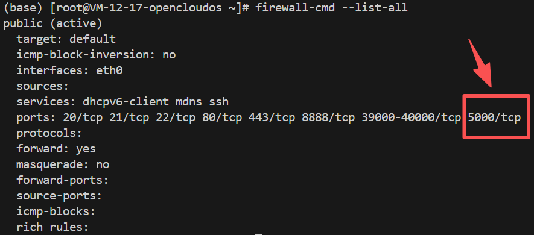

---
title: 通过公网IP访问腾讯云轻量服务器的某个端口
date:  2025-09-28 17:09:00
categories:
  - 工具与框架
tags:
  - 服务器
sticky: 0
---

## 0 简述

当前有个任务：需要将自己的项目部署在服务器上，并将其运行在5000端口中，使外部可以通过Internet直接访问该项目。由于之前使用的是阿里云服务器，只需要部署好项目让其运行起来，便无需关注其他配置。这一次需要将项目部署在**腾讯云的轻量服务器**，原以为只需要运行项目即可，但是后续一直无法通过公网IP进行访问，在查阅众多资料后发现，在腾讯云服务器上运行项目并将其部署在某个端口时，需要**先通过防火墙开放该端口**，再到**系统中开放该端口**，才能成功使其运行在某个端口上。

## 1 防火墙开放端口

由于腾讯云的安全策略限制，要想服务器暴露某个端口，首先需要在腾讯云服务器的防火墙中，**手动**开放该端口能被使用。

服务器防火墙地址：[服务器 - 轻量云 - 控制台](https://console.cloud.tencent.com/lighthouse/instance/detail?searchParams=rid%3D1&rid=1&id=lhins-mto9f607&tab=firewall)

这里首先点击**添加规则**


这里除了端口需要自定义，其他的关键值可以根据直接按照我提供的填写

- 应用类型：自定义
- 来源：全部IPv4地址
- 协议：TCP
- 端口：5000**（根据自己的需要填写）**
- 策略：允许
- 备注：测试


之后可以看到新建了一条开放端口的信息

## 2 系统中开放端口

除了在防火墙中开启了端口限制，还需要在系统开放该端口，我的系统版本是：**OpenCloudOS 9.4**，Linux内核，按照下面三个步骤进行解决

1. 在防火墙里添加 5000/tcp 并重载**（端口5000可任意修改成你需要的）**

```
firewall-cmd --add-port=5000/tcp --permanent
```

2. 命令生效

```
firewall-cmd --reload
```

3. 检查是否生效

```
firewall-cmd --list-all
```

可以看到5000端口号，TCP协议的端口已经被加入并重载，接下来就能通过公网IP访问该端口



