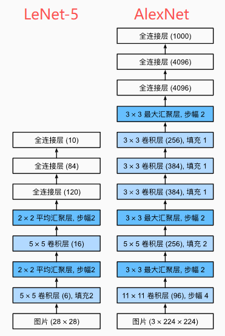
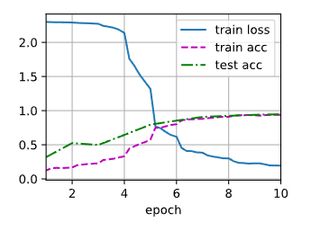

---
title: AlexNet：深度学习革命的起点
date:  2025-10-24 10:08:50
categories:
  - 深度学习
tags:
  - 深度学习
sticky: 0
---


## 0 引言

2012 年，AlexNet 在 ImageNet 图像识别竞赛中取得了突破性的成绩，错误率从 26% 一举降到 15.3%，标志着深度学习正式进入计算机视觉的主流舞台。作为推动 AI 浪潮的重要模型，AlexNet 以其创新的网络结构和训练策略，彻底改变了传统机器学习在图像识别领域的地位。

这篇博客将从结构原理、关键技术、训练方法和影响力等多个角度，深入浅出地解析 AlexNet，帮助读者全面理解它为何能够开创深度学习时代。

## 1 AlexNet 的网络结构

AlexNet 是典型的卷积神经网络（CNN），深度为 8 层，其中包括 5 层卷积层和 3 层全连接层。其核心结构如下：

| 层级    | 类型     | 参数配置             | 特点                       |
| ------- | -------- | -------------------- | -------------------------- |
| Conv1   | 卷积层   | 11x11 卷积核, 步长 4 | 大卷积核迅速提取低级特征   |
| Conv2   | 卷积层   | 5x5 卷积核           | 使用 ReLU 激活+LRN         |
| Conv3-5 | 卷积层   | 3x3 卷积核           | 网络加深，提取高级语义特征 |
| FC6-8   | 全连接层 | 4096->4096->1000     | 实现分类输出               |

1.  **激活函数：ReLU 替代 Sigmoid**

AlexNet 首次使用 ReLU 激活函数，解决了 Sigmoid 的梯度消失问题，大幅提升训练速度。

2. **局部相应归一化**

局部响应归一化（LRN）模拟生物神经抑制机制，提高模型泛化能力。

3. **Dropout 技术**

在全连接层使用 Dropout，降低过拟合概率，是深度学习正则化技术的开端。




------

## 2 AlexNet 的训练策略

AlexNet 的成功不仅在于网络结构，更得益于其训练策略创新：

- **GPU 加速**：首次使用双 GPU 并行训练，在当时是革命性的工程优化。
- **数据增强**：随机裁剪、水平翻转、颜色扰动等手段显著扩大数据集规模。
- **批量梯度下降 + Momentum**：加速收敛并避免陷入局部最优。

## 3 AlexNet训练代码

这里的代码以**DIVE INTO DEEP LEARNING**为例演示，大家需要提前将环境搭配好

### 3.1 定义AlenNet神经网络

```python
import torch
from torch import nn
from d2l import torch as d2l

net = nn.Sequential(
    nn.Conv2d(1, 96, kernel_size=11, stride=4, padding=1), nn.ReLU(),
    nn.MaxPool2d(kernel_size=3, stride=2),
    nn.Conv2d(96, 256, kernel_size=5, padding=2), nn.ReLU(),
    nn.MaxPool2d(kernel_size=3, stride=2),
    nn.Conv2d(256, 384, kernel_size=3, padding=1), nn.ReLU(),
    nn.Conv2d(384, 384, kernel_size=3, padding=1), nn.ReLU(),
    nn.Conv2d(384, 256, kernel_size=3, padding=1), nn.ReLU(),
    nn.MaxPool2d(kernel_size=3, stride=2),
    nn.Flatten(),
    nn.Linear(6400, 4096), nn.ReLU(),
    nn.Dropout(p=0.5),
    nn.Linear(4096, 4096), nn.ReLU(),
    nn.Dropout(p=0.5),
    nn.Linear(4096, 10))
```

### 3.2 测试输出结构

```python
X = torch.randn(1, 1, 224, 224)
for layer in net:
    X=layer(X)
    print(layer.__class__.__name__,'output shape:\t',X.shape)
```


### 3.3 加载数据集

如果已经下载好数据集后，修改数据集的root的位置即可，但是如果没有下载过，需要将`doenload`设置为`TRUE`

```python   
from torch.nn.modules import transformer
from torchvision import datasets,transforms


transform = transforms.Compose([
    transforms.Resize((224,224)),
    transforms.ToTensor()

])

## 加载训练集
train_dataset = datasets.MNIST(
    root='../../dataset/mnist/train',
    train=True,
    transform=transform,
    download=False  ## 已经在本地
)

## 加载测试集
test_dataset = datasets.MNIST(
    root='../../dataset/mnist/test',
    train=False,
    transform=transform,
    download=False
)
```

### 3.4 设置数据集大小（可选）

这一步是我添加的，因为这里是模拟训练224×224大小格式的图片，后续需要将图片从28×28提升至224大小，如果显卡不够的，可以将数据集减小，我这里减小了10%，你们可以根据自己的需要选择。

> 如果显卡够强，可跳过！

```python
from torch.utils.data import DataLoader, Subset
import math

## 取训练集的 10%
num_train_samples = len(train_dataset)
subset_size = math.floor(num_train_samples * 0.1)  ## 10%
subset_indices = list(range(subset_size))          ## 前 10% 的索引

train_dataset = Subset(train_dataset, subset_indices)

## 取测试集的 10%
num_test_samples = len(test_dataset)
subset_size = math.floor(num_test_samples * 0.1)  ## 10%
subset_indices = list(range(subset_size))          ## 前 10% 的索引

test_dataset = Subset(test_dataset, subset_indices)
len(train_dataset),len(test_dataset)
```

### 3.5 设置参数

```python
from torch.utils.data import DataLoader
batch_size = 128
train_iter = DataLoader(train_dataset,batch_size=batch_size)
test_iter = DataLoader(test_dataset,batch_size=batch_size)
```

### 3.6 定义评估准确率函数

```python
def evaluate_accuracy_gpu(net, data_iter, device=None): ##@save
    """使用GPU计算模型在数据集上的精度"""
    if isinstance(net, nn.Module):
        net.eval()  ## 设置为评估模式
        if not device:
            device = next(iter(net.parameters())).device
    ## 正确预测的数量，总预测的数量
    metric = d2l.Accumulator(2)
    with torch.no_grad():
        for X, y in data_iter:
            if isinstance(X, list):
                ## BERT微调所需的（之后将介绍）
                X = [x.to(device) for x in X]
            else:
                X = X.to(device)
            y = y.to(device)
            metric.add(d2l.accuracy(net(X), y), y.numel())
    return metric[0] / metric[1]
```

### 3.7 定义训练函数

```python
def train_ch6(net,train_iter,test_iter,num_epochs,lr,device):
    def init_weights(m):
        if type(m) == nn.Linear or type(m) == nn.Conv2d:
            nn.init.xavier_uniform_(m.weight)
    net.apply(init_weights)
    print("devices on :",device)
    net.to(device)
    optimizer = torch.optim.SGD(net.parameters(),lr=lr)     ## 获取需要更新的参数
    loss = nn.CrossEntropyLoss()            ## 交叉熵损失函数，先用softmax取值，取得负对数得到损失值
    animator = d2l.Animator(xlabel='epoch', xlim=[1, num_epochs],
                            legend=['train loss', 'train acc', 'test acc'])
    timer, num_batches = d2l.Timer(), len(train_iter)
    for epoch in range(num_epochs):
        metric = d2l.Accumulator(3)
        net.train()
        for i,(X,y) in enumerate(train_iter):
            timer.start()
            optimizer.zero_grad()
            X, y = X.to(device), y.to(device)
            y_hat = net(X)
            l = loss(y_hat,y)
            l.backward()
            optimizer.step()
            with torch.no_grad():
                metric.add(l * X.shape[0], d2l.accuracy(y_hat, y), X.shape[0])
            timer.stop()
            train_l = metric[0]/metric[2]
            train_acc = metric[1] / metric[2]
            if (i + 1) % (num_batches // 5) == 0 or i == num_batches - 1:
                animator.add(epoch + (i + 1) / num_batches,
                             (train_l, train_acc, None))
        test_acc = evaluate_accuracy_gpu(net, test_iter)
        animator.add(epoch + 1, (None, None, test_acc))
    print(f'loss {train_l:.3f}, train acc {train_acc:.3f}, '
          f'test acc {test_acc:.3f}')
    print(f'{metric[2] * num_epochs / timer.sum():.1f} examples/sec '
          f'on {str(device)}')
```

### 3.8 开始训练

```python
lr,epoch=0.01 ,10
train_ch6(net, train_iter, test_iter, epoch, lr, d2l.try_gpu())
```




## 4 影响力与历史地位

AlexNet 的发布直接引发了深度学习爆发式增长：

- 开启了 CNN 在图像领域的统治地位
- 促进 GPU 计算硬件的快速发展
- 为后续 VGG、ResNet、MobileNet 等模型提供基础框架

从学术到工业界，AlexNet 的设计理念至今仍被广泛使用。

------


## 5 总结

AlexNet 不是最先进的模型，却是最具历史意义的模型。它首次证明：**深度神经网络 + 大数据 + GPU 计算 = 人工智能新时代**。理解 AlexNet，不仅是学习深度学习的起点，更是打开计算机视觉世界的大门。

如果你正在入门深度学习，AlexNet 是最值得理解和复现的经典模型之一。

## 参考

[0] [https://zh-v2.d2l.ai/chapter_convolutional-modern/alexnet.html](https://zh-v2.d2l.ai/chapter_convolutional-modern/alexnet.html)
