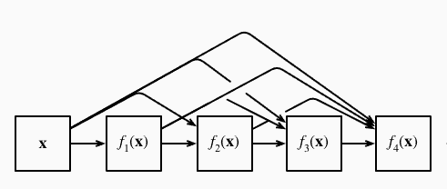
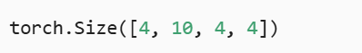
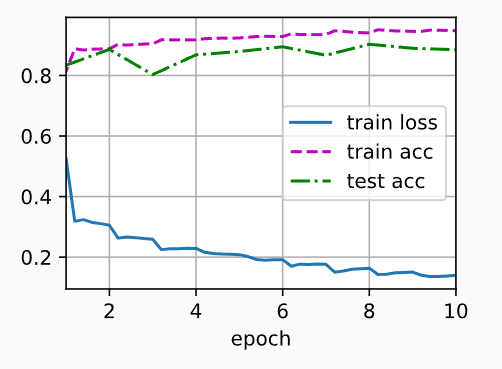

---
title: DenseNet：密集连接网络解析与实践
date:  2025-10-31 09:00:00
categories:
  - 深度学习
tags:
  - 深度学习
sticky: 0
---

## 0 引言

在深度学习图像分类领域，**ResNet** 通过残差块解决了深层网络训练困难的问题，而 **DenseNet（Densely Connected Convolutional Networks）** 则在此基础上提出了更加紧密的连接方式，让每一层都能直接访问前面所有层的特征。

## 1 DenseNet 的核心思想

DenseNet 的关键在于**密集连接（Dense Connectivity）**：

- 对于网络中的任意一层 ，其输入不是单一来自上一层，而是**前面所有层的特征图的拼接**：

**ResNet 与 DenseNet 的关键区别**在于输出的处理方式：ResNet 通过简单相加实现残差，而 DenseNet 则使用**特征连接（concatenation）**，将前面所有层的输出拼接在一起。

这种设计意味着，当网络经过越来越复杂的函数序列后，我们可以将每一层的输出展开，并将它们结合到多层感知机中，从而再次压缩特征数量。实现上非常简单：无需额外运算，只需将各层特征直接拼接即可。

DenseNet 的名称正来源于这种**稠密连接**的设计：网络的最后一层与之前的所有层紧密相连。稠密连接的示意如图所示，直观地展示了每一层都能直接访问前面所有层的特征。




## 2 代码实现

这里的代码以*DIVE INTO DEEP INEARING*为示例代码，需要提前将环境配置好

### 2.1 定义稠密块

```python
import torch
from torch import nn
from d2l import torch as d2l


def conv_block(input_channels, num_channels):
    return nn.Sequential(
        nn.BatchNorm2d(input_channels), nn.ReLU(),
        nn.Conv2d(input_channels, num_channels, kernel_size=3, padding=1))
```

### 2.2 定义DenseNet

```python
class DenseBlock(nn.Module):
    def __init__(self, num_convs, input_channels, num_channels):
        super(DenseBlock, self).__init__()
        layer = []
        for i in range(num_convs):
            layer.append(conv_block(
                num_channels * i + input_channels, num_channels))
        self.net = nn.Sequential(*layer)

    def forward(self, X):
        for blk in self.net:
            Y = blk(X)
            ## 连接通道维度上每个块的输入和输出
            X = torch.cat((X, Y), dim=1)
        return X
```

### 2.3 过渡层

由于每个稠密块都会带来通道数的增加，使用过多则会过于复杂化模型。 而过渡层可以用来控制模型复杂度。 它通过卷积层来减小通道数，并使用步幅为2的平均汇聚层减半高和宽，从而进一步降低模型复杂度。

```python
def transition_block(input_channels, num_channels):
    return nn.Sequential(
        nn.BatchNorm2d(input_channels), nn.ReLU(),
        nn.Conv2d(input_channels, num_channels, kernel_size=1),
        nn.AvgPool2d(kernel_size=2, stride=2))
        
        
blk = transition_block(23, 10)
blk(Y).shape
```




### 2.4 定义参数

```python
b1 = nn.Sequential(
    nn.Conv2d(1, 64, kernel_size=7, stride=2, padding=3),
    nn.BatchNorm2d(64), nn.ReLU(),
    nn.MaxPool2d(kernel_size=3, stride=2, padding=1))
```

在每个模块之间，ResNet通过步幅为2的残差块减小高和宽，DenseNet则使用过渡层来减半高和宽，并减半通道数。

```python
## num_channels为当前的通道数
num_channels, growth_rate = 64, 32
num_convs_in_dense_blocks = [4, 4, 4, 4]
blks = []
for i, num_convs in enumerate(num_convs_in_dense_blocks):
    blks.append(DenseBlock(num_convs, num_channels, growth_rate))
    ## 上一个稠密块的输出通道数
    num_channels += num_convs * growth_rate
    ## 在稠密块之间添加一个转换层，使通道数量减半
    if i != len(num_convs_in_dense_blocks) - 1:
        blks.append(transition_block(num_channels, num_channels // 2))
        num_channels = num_channels // 2
```

与ResNet类似，最后接上全局汇聚层和全连接层来输出结果。

```python
net = nn.Sequential(
    b1, *blks,
    nn.BatchNorm2d(num_channels), nn.ReLU(),
    nn.AdaptiveAvgPool2d((1, 1)),
    nn.Flatten(),
    nn.Linear(num_channels, 10))
```

### 2.5 定义评估函数

```python
def evaluate_accuracy_gpu(net, data_iter, device=None): ##@save
    """使用GPU计算模型在数据集上的精度"""
    if isinstance(net, nn.Module):
        net.eval()  ## 设置为评估模式
        if not device:
            device = next(iter(net.parameters())).device
    ## 正确预测的数量，总预测的数量
    metric = d2l.Accumulator(2)
    with torch.no_grad():
        for X, y in data_iter:
            if isinstance(X, list):
                ## BERT微调所需的（之后将介绍）
                X = [x.to(device) for x in X]
            else:
                X = X.to(device)
            y = y.to(device)
            metric.add(d2l.accuracy(net(X), y), y.numel())
    return metric[0] / metric[1]
```

### 2.6 定义训练函数

```python
def train_ch6(net,train_iter,test_iter,num_epochs,lr,device):
    def init_weights(m):
        if type(m) == nn.Linear or type(m) == nn.Conv2d:
            nn.init.xavier_uniform_(m.weight)
    net.apply(init_weights)
    print("devices on :",device)
    net.to(device)
    optimizer = torch.optim.SGD(net.parameters(),lr=lr)     ## 获取需要更新的参数
    loss = nn.CrossEntropyLoss()            ## 交叉熵损失函数，先用softmax取值，取得负对数得到损失值
    animator = d2l.Animator(xlabel='epoch', xlim=[1, num_epochs],
                            legend=['train loss', 'train acc', 'test acc'])
    timer, num_batches = d2l.Timer(), len(train_iter)
    for epoch in range(num_epochs):
        metric = d2l.Accumulator(3)
        net.train()
        for i,(X,y) in enumerate(train_iter):
            timer.start()
            optimizer.zero_grad()
            X, y = X.to(device), y.to(device)
            y_hat = net(X)
            l = loss(y_hat,y)
            l.backward()
            optimizer.step()
            with torch.no_grad():
                metric.add(l * X.shape[0], d2l.accuracy(y_hat, y), X.shape[0])
            timer.stop()
            train_l = metric[0]/metric[2]
            train_acc = metric[1] / metric[2]
            if (i + 1) % (num_batches // 5) == 0 or i == num_batches - 1:
                animator.add(epoch + (i + 1) / num_batches,
                             (train_l, train_acc, None))
        test_acc = evaluate_accuracy_gpu(net, test_iter)
        animator.add(epoch + 1, (None, None, test_acc))
    print(f'loss {train_l:.3f}, train acc {train_acc:.3f}, '
          f'test acc {test_acc:.3f}')
    print(f'{metric[2] * num_epochs / timer.sum():.1f} examples/sec '
          f'on {str(device)}')
```

### 2.7 定义数据集

如果已经下载好数据集后，修改数据集的root的位置即可，但是如果没有下载过，需要将`doenload`设置为`TRUE`

```python
from torch.nn.modules import transformer
from torchvision import datasets,transforms


transform = transforms.Compose([
    transforms.Resize((224,224)),
    transforms.ToTensor()

])

## 加载训练集
train_dataset = datasets.MNIST(
    root='../../dataset/mnist/train',
    train=True,
    transform=transform,
    download=False  ## 已经在本地
)

## 加载测试集
test_dataset = datasets.MNIST(
    root='../../dataset/mnist/test',
    train=False,
    transform=transform,
    download=False
)
```

### 2.8 开始训练

```
lr, num_epochs, batch_size = 0.1, 10, 256
d2l.train_ch6(net, train_iter, test_iter, num_epochs, lr, d2l.try_gpu())
```




## 3 DenseNet 的优势与适用场景

> DenseNet 在图像分类、目标检测、语义分割等任务中表现优异，尤其适合需要高特征利用率的场景。

| 优势               | 说明                                          |
| ------------------ | --------------------------------------------- |
| 高效特征复用       | 每层直接使用前面所有层的特征，避免重复计算    |
| 缓解梯度消失       | 密集连接保证梯度在深层网络中顺畅传播          |
| 参数量相对少       | 由于特征复用，DenseNet 通道增长缓慢，参数更少 |
| 强大的特征表达能力 | 特别适合小样本或高精度视觉任务                |


## 参考

[1] [https://zh-v2.d2l.ai/chapter_convolutional-modern/densenet.html](https://zh-v2.d2l.ai/chapter_convolutional-modern/densenet.html)
