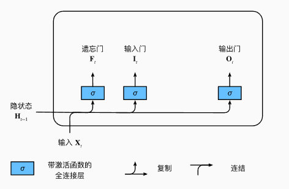
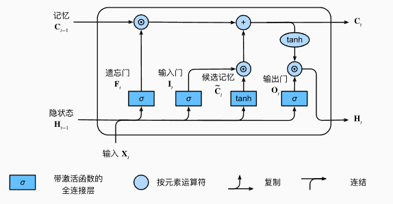
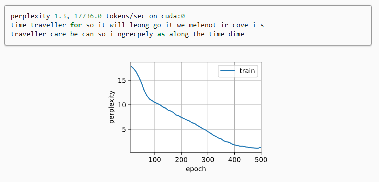

---
title: LSTM入门与实战指南：从原理到代码实现
date:  2025-11-01 15:31:11
categories:
  - 深度学习
tags:
  - 深度学习
sticky: 0
---


## 0 引言

在深度学习中，处理序列数据（如文本、语音、时间序列）是一个很常见的需求。而传统的神经网络无法很好地捕捉序列中的长期依赖信息，这就催生了**循环神经网络（RNN）**。但RNN也有缺陷——它很难处理长序列中的梯度消失和梯度爆炸问题。幸运的是，**长短期记忆网络（LSTM）**正是为解决这些问题而诞生的。

## 1 LSTM的基本原理

LSTM 是 RNN 的一种变体，它在隐藏状态的基础上引入了**细胞状态（Cell State）**，并通过三个门控机制来控制信息的流动：

1. **遗忘门（Forget Gate）**：决定哪些信息需要被丢弃。
2. **输入门（Input Gate）**：决定哪些新信息需要被写入。
3. **输出门（Output Gate）**：决定最终输出哪些信息。

通过这三个门的配合，LSTM 能够在序列很长的情况下依然保留关键的历史信息，从而解决 RNN 的长期依赖问题。

数学上，LSTM 的更新公式如下：

$$
\begin{aligned}
f_t &= \sigma\big(W_f \cdot [h_{t-1}, x_t] + b_f\big) \\
i_t &= \sigma\big(W_i \cdot [h_{t-1}, x_t] + b_i\big) \\
\tilde{C}_t &= \tanh\big(W_C \cdot [h_{t-1}, x_t] + b_C\big) \\
C_t &= f_t * C_{t-1} + i_t * \tilde{C}_t \\
o_t &= \sigma\big(W_o \cdot [h_{t-1}, x_t] + b_o\big) \\
h_t &= o_t * \tanh(C_t)
\end{aligned}
$$
虽然公式看起来复杂，但核心思想是**通过门控机制选择性保留或更新信息**。




## 2 隐状态

最后，我们需要定义**隐状态的计算方式**，这正是**输出门**发挥作用的地方。在长短期记忆网络（LSTM）中，隐状态实际上是记忆单元的**门控版本**。这种设计确保了隐状态的值始终保持在合理的区间内。

当输出门的值接近 1 时，网络可以将所有记忆信息有效传递给预测部分；而当输出门接近 0 时，则只保留记忆单元内部的信息，而不会更新隐状态。

图给出了数据流的可视化演示。




## 3 LSTM代码实战

> 这里的代码以*DIVE INTO DEEP INEARING*为示例代码，需要提前将环境配置好

### 3.1 定义训练集和词表

```python
import torch
from torch import nn
from d2l import torch as d2l

batch_size, num_steps = 32, 35
train_iter, vocab = d2l.load_data_time_machine(batch_size, num_steps)
```

### 3.2 初始化模型参数

```python
def get_lstm_params(vocab_size, num_hiddens, device):
    num_inputs = num_outputs = vocab_size

    def normal(shape):
        return torch.randn(size=shape, device=device)*0.01

    def three():
        return (normal((num_inputs, num_hiddens)),
                normal((num_hiddens, num_hiddens)),
                torch.zeros(num_hiddens, device=device))

    W_xi, W_hi, b_i = three()  ## 输入门参数
    W_xf, W_hf, b_f = three()  ## 遗忘门参数
    W_xo, W_ho, b_o = three()  ## 输出门参数
    W_xc, W_hc, b_c = three()  ## 候选记忆元参数
    ## 输出层参数
    W_hq = normal((num_hiddens, num_outputs))
    b_q = torch.zeros(num_outputs, device=device)
    ## 附加梯度
    params = [W_xi, W_hi, b_i, W_xf, W_hf, b_f, W_xo, W_ho, b_o, W_xc, W_hc,
              b_c, W_hq, b_q]
    for param in params:
        param.requires_grad_(True)
    return params
```

### 3.3 定义模型

在初始化函数中， 长短期记忆网络的隐状态需要返回一个*额外*的记忆元， 单元的值为0，形状为（批量大小，隐藏单元数）。 因此，我们得到以下的状态初始化。

```python
def init_lstm_state(batch_size, num_hiddens, device):
    return (torch.zeros((batch_size, num_hiddens), device=device),
            torch.zeros((batch_size, num_hiddens), device=device))
   
def lstm(inputs, state, params):
    [W_xi, W_hi, b_i, W_xf, W_hf, b_f, W_xo, W_ho, b_o, W_xc, W_hc, b_c,
     W_hq, b_q] = params
    (H, C) = state
    outputs = []
    for X in inputs:
        I = torch.sigmoid((X @ W_xi) + (H @ W_hi) + b_i)
        F = torch.sigmoid((X @ W_xf) + (H @ W_hf) + b_f)
        O = torch.sigmoid((X @ W_xo) + (H @ W_ho) + b_o)
        C_tilda = torch.tanh((X @ W_xc) + (H @ W_hc) + b_c)
        C = F * C + I * C_tilda
        H = O * torch.tanh(C)
        Y = (H @ W_hq) + b_q
        outputs.append(Y)
    return torch.cat(outputs, dim=0), (H, C)
```

### 3.4 定义训练函数

```python
##@save
def train_ch8(net, train_iter, vocab, lr, num_epochs, device,
              use_random_iter=False):
    """训练模型（定义见第8章）"""
    loss = nn.CrossEntropyLoss()
    animator = d2l.Animator(xlabel='epoch', ylabel='perplexity',
                            legend=['train'], xlim=[10, num_epochs])
    ## 初始化
    if isinstance(net, nn.Module):
        updater = torch.optim.SGD(net.parameters(), lr)
    else:
        updater = lambda batch_size: d2l.sgd(net.params, lr, batch_size)
    predict = lambda prefix: predict_ch8(prefix, 50, net, vocab, device)
    ## 训练和预测
    for epoch in range(num_epochs):
        ppl, speed = train_epoch_ch8(
            net, train_iter, loss, updater, device, use_random_iter)
        if (epoch + 1) % 10 == 0:
            print(predict('time traveller'))
            animator.add(epoch + 1, [ppl])
    print(f'困惑度 {ppl:.1f}, {speed:.1f} 词元/秒 {str(device)}')
    print(predict('time traveller'))
    print(predict('traveller'))
```

### 3.5 训练和预测

```python
vocab_size, num_hiddens, device = len(vocab), 256, d2l.try_gpu()
num_epochs, lr = 500, 1
model = d2l.RNNModelScratch(len(vocab), num_hiddens, device, get_lstm_params,
                            init_lstm_state, lstm)
d2l.train_ch8(model, train_iter, vocab, lr, num_epochs, device)
```




## 4 总结

LSTM 是解决长序列依赖问题的利器，它通过**门控机制**灵活地控制信息流，使模型能够“记住”重要信息。借助 PyTorch 的 `nn.LSTM`，我们可以快速搭建模型并进行训练，从而应用于字符预测、文本生成、时间序列预测等实际任务。

对于初学者，建议从小数据集入手，逐步理解**遗忘门、输入门和输出门**的作用，并观察它们对模型输出的影响。随着经验积累，可以尝试更复杂的 NLP 或时间序列任务，如情感分析、机器翻译、股票预测等。

此外，LSTM 也可以与其他模型结合使用，例如在 Seq2Seq 架构中作为编码器和解码器，或者与注意力机制结合提高长序列处理能力。掌握 LSTM 不仅有助于理解循环神经网络的基本原理，也为深入学习 Transformer 等更先进的序列模型打下坚实基础。


## 参考

[1] [https://zh-v2.d2l.ai/chapter_recurrent-modern/lstm.html](https://zh-v2.d2l.ai/chapter_recurrent-modern/lstm.html)
