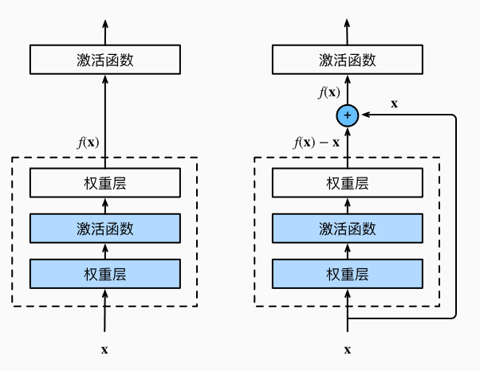
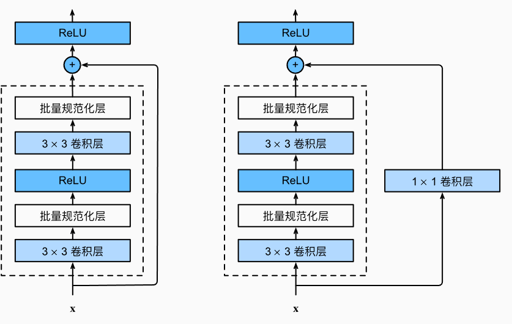
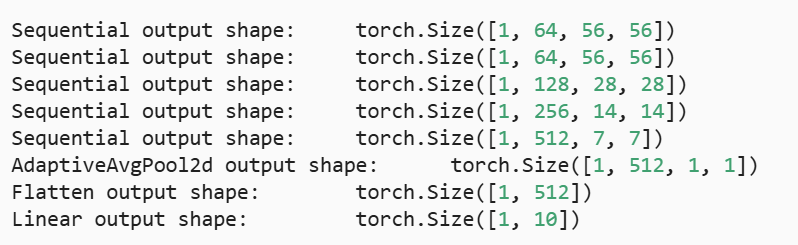
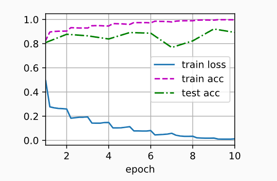

---
title: ResNet网络详解与PyTorch实现（附代码讲解）
date:  2025-10-31 08:45:00
categories:
  - 深度学习
tags:
  - 深度学习
sticky: 0
---

## 0 引言

作为卷积神经网络的一代强者，凡是学习过深度学习的，无不了解过这个神经网络架构，而其作为何凯明的一代创造，如今已经在其身上诞生过许许多多的“子孙”残差网络，而今天，将带大家一领其风骚。

## 1 创新点

> 为什么他能让网络训练的更深？

这是作者何凯明一直在思考的问题，而这篇论文的核心创新正是为了解决这一点。传统的卷积神经网络在层数增加时，往往会出现“**退化问题（degradation problem）**”：随着深度加深，训练误差反而上升，而不是如预期那样下降。其根本原因在于**梯度消失与梯度爆炸**，导致模型难以有效更新参数。

ResNet 的关键创新在于**引入了残差结构（Residual Block）**。通过跳跃连接（skip connection），网络可以将输入直接与输出相加，让信息能够“跨层流动”，从而在反向传播时保持梯度的稳定。这样，即使网络堆叠上百层，也依然能被有效训练。

更直观地说，ResNet 不再强迫每一层都学习完整的映射函数 H(x)H(x)H(x)，而是让网络学习一个残差 F(x)=H(x)−x。这样，模型更容易优化，也更符合实际梯度下降的特性。

正是这项创新，使得 ResNet 能在 ImageNet 2015 中以 **152 层的深度网络** 取得突破性的结果，成为深度学习历史上一个里程碑式的架构。

## 2 残差网络

让我们聚焦于神经网络的局部结构：如图所示，假设我们的原始输入为 x，而希望学习的理想映射为 H(x)（对应图上方激活函数的输入）。左图虚线框内的部分，需要直接拟合这个映射 H(x)；而右图虚线框内的部分，则学习残差映射 F(x)=H(x)−x。在实际训练中，残差映射通常更容易优化。

右图展示了 ResNet 的基本架构——**残差块（Residual Block）**。在残差块中，输入可以通过跨层的跳跃连接更快地向前传播，缓解梯度消失问题，同时使深层网络更易优化。

> 核心思想：跳跃连接可以保存原来网络的一些参数，即使这一层什么都没学到，最差效果就是跟上一层一样，并且由于是基于上一层进行跳跃，变化不是很大，也就避免了梯度爆炸，使网络可以训练的更深




## 3 ResNet代码

这里的代码以*DIVE INTO DEEP INEARING*为示例代码，需要提前将环境配置好。

### 3.1 定义残差网络

```
import torch
from torch import nn
from torch.nn import functional as F
from d2l import torch as d2l


class Residual(nn.Module):  ##@save
    def __init__(self, input_channels, num_channels,
                 use_1x1conv=False, strides=1):
        super().__init__()
        self.conv1 = nn.Conv2d(input_channels, num_channels,
                               kernel_size=3, padding=1, stride=strides)
        self.conv2 = nn.Conv2d(num_channels, num_channels,
                               kernel_size=3, padding=1)
        if use_1x1conv:
            self.conv3 = nn.Conv2d(input_channels, num_channels,
                                   kernel_size=1, stride=strides)
        else:
            self.conv3 = None
        self.bn1 = nn.BatchNorm2d(num_channels)
        self.bn2 = nn.BatchNorm2d(num_channels)

    def forward(self, X):
        Y = F.relu(self.bn1(self.conv1(X)))
        Y = self.bn2(self.conv2(Y))
        if self.conv3:
            X = self.conv3(X)
        Y += X
        return F.relu(Y)
```

该代码可生成两种类型的网络残差块：

1. 当 `use_1x1conv=False` 时，直接将输入与卷积输出相加，再应用 ReLU 非线性函数；
2. 当 `use_1x1conv=True` 时，先通过 1×1 卷积调整输入的通道数和分辨率，再与卷积输出相加。




### 3.2 定义第一个卷积层

```
b1 = nn.Sequential(nn.Conv2d(1, 64, kernel_size=7, stride=2, padding=3),
                   nn.BatchNorm2d(64), nn.ReLU(),
                   nn.MaxPool2d(kernel_size=3, stride=2, padding=1))
```

### 3.3 定义残差块

```
def resnet_block(input_channels, num_channels, num_residuals,
                 first_block=False):
    blk = []
    for i in range(num_residuals):
        if i == 0 and not first_block:
            blk.append(Residual(input_channels, num_channels,
                                use_1x1conv=True, strides=2))
        else:
            blk.append(Residual(num_channels, num_channels))
    return blk
```

### 3.4 加入残差块

```
b2 = nn.Sequential(*resnet_block(64, 64, 2, first_block=True))
b3 = nn.Sequential(*resnet_block(64, 128, 2))
b4 = nn.Sequential(*resnet_block(128, 256, 2))
b5 = nn.Sequential(*resnet_block(256, 512, 2))

net = nn.Sequential(b1, b2, b3, b4, b5,
                    nn.AdaptiveAvgPool2d((1,1)),
                    nn.Flatten(), nn.Linear(512, 10))
```

### 3.5 打印当前网络结构

```
X = torch.rand(size=(1, 1, 224, 224))
for layer in net:
    X = layer(X)
    print(layer.__class__.__name__,'output shape:\t', X.shape)
```




### 3.6 定义评估函数

```python
def evaluate_accuracy_gpu(net, data_iter, device=None): ##@save
    """使用GPU计算模型在数据集上的精度"""
    if isinstance(net, nn.Module):
        net.eval()  ## 设置为评估模式
        if not device:
            device = next(iter(net.parameters())).device
    ## 正确预测的数量，总预测的数量
    metric = d2l.Accumulator(2)
    with torch.no_grad():
        for X, y in data_iter:
            if isinstance(X, list):
                ## BERT微调所需的（之后将介绍）
                X = [x.to(device) for x in X]
            else:
                X = X.to(device)
            y = y.to(device)
            metric.add(d2l.accuracy(net(X), y), y.numel())
    return metric[0] / metric[1]
```

### 3.7 定义训练函数

```python
def train_ch6(net,train_iter,test_iter,num_epochs,lr,device):
    def init_weights(m):
        if type(m) == nn.Linear or type(m) == nn.Conv2d:
            nn.init.xavier_uniform_(m.weight)
    net.apply(init_weights)
    print("devices on :",device)
    net.to(device)
    optimizer = torch.optim.SGD(net.parameters(),lr=lr)     ## 获取需要更新的参数
    loss = nn.CrossEntropyLoss()            ## 交叉熵损失函数，先用softmax取值，取得负对数得到损失值
    animator = d2l.Animator(xlabel='epoch', xlim=[1, num_epochs],
                            legend=['train loss', 'train acc', 'test acc'])
    timer, num_batches = d2l.Timer(), len(train_iter)
    for epoch in range(num_epochs):
        metric = d2l.Accumulator(3)
        net.train()
        for i,(X,y) in enumerate(train_iter):
            timer.start()
            optimizer.zero_grad()
            X, y = X.to(device), y.to(device)
            y_hat = net(X)
            l = loss(y_hat,y)
            l.backward()
            optimizer.step()
            with torch.no_grad():
                metric.add(l * X.shape[0], d2l.accuracy(y_hat, y), X.shape[0])
            timer.stop()
            train_l = metric[0]/metric[2]
            train_acc = metric[1] / metric[2]
            if (i + 1) % (num_batches // 5) == 0 or i == num_batches - 1:
                animator.add(epoch + (i + 1) / num_batches,
                             (train_l, train_acc, None))
        test_acc = evaluate_accuracy_gpu(net, test_iter)
        animator.add(epoch + 1, (None, None, test_acc))
    print(f'loss {train_l:.3f}, train acc {train_acc:.3f}, '
          f'test acc {test_acc:.3f}')
    print(f'{metric[2] * num_epochs / timer.sum():.1f} examples/sec '
          f'on {str(device)}')
```

### 3.8 定义数据集

如果已经下载好数据集后，修改数据集的root的位置即可，但是如果没有下载过，需要将`doenload`设置为`TRUE`

```python
from torch.nn.modules import transformer
from torchvision import datasets,transforms
from torch.utils.data import DataLoader

transform = transforms.Compose([
    transforms.Resize((224,224)),
    transforms.ToTensor()

])

## 加载训练集
train_dataset = datasets.MNIST(
    root='../../dataset/mnist/train',
    train=True,
    transform=transform,
    download=False  ## 已经在本地
)

## 加载测试集
test_dataset = datasets.MNIST(
    root='../../dataset/mnist/test',
    train=False,
    transform=transform,
    download=False
)

train_iter = DataLoader(train_dataset,batch_size=batch_size)
test_iter = DataLoader(test_dataset,batch_size=batch_size)
```

### 3.9 开始训练

```python
lr, num_epochs, batch_size = 0.05, 10, 256
d2l.train_ch6(net, train_iter, test_iter, num_epochs, lr, d2l.try_gpu())
```




## 4 总结

ResNet 的核心在于**残差块（Residual Block）**，它使得网络可以堆叠更多层而不出现退化问题。一个标准的残差块主要包含以下几个部分：

1. **卷积层 + 批量归一化（Conv + BN）**
    每个残差块通常包含两个 3×3 的卷积层，每层后面跟着批量归一化和 ReLU 激活函数，用于提取特征并保持梯度稳定。
2. **跳跃连接（Skip Connection）**
    跳跃连接将输入直接添加到卷积层的输出中。如果输入输出的尺寸或通道数不同，则使用 1×1 卷积调整，这样可以保证维度一致。跳跃连接的作用是让网络学习残差映射 F(x)=H(x)−xF(x) = H(x) - xF(x)=H(x)−x，而不是直接拟合原映射 H(x)H(x)H(x)，从而加快训练收敛，减轻梯度消失问题。
3. **激活函数**
    最终输出经过 ReLU 激活，形成非线性映射，为下一层输入提供丰富的特征表达。

ResNet 通过堆叠大量残差块（如 ResNet-18、ResNet-34、ResNet-50）构成深层网络。在这种结构下，即便网络深达百层，也能保持训练稳定性，同时显著提升特征表达能力和分类性能。

> **小结**：残差块的设计理念可以概括为一句话：**让网络学习“变化量”，而不是“绝对值”**。这也是 ResNet 能够突破深度限制、成为深度学习里程碑的重要原因。


## 参考

[1] [https://zh-v2.d2l.ai/chapter_convolutional-modern/resnet.html](https://zh-v2.d2l.ai/chapter_convolutional-modern/resnet.html)
