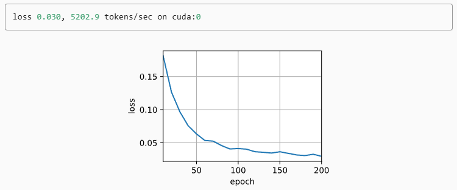

## 0 引言

在 Transformer 出现之前，主流的自然语言处理模型是 **RNN（循环神经网络）** 和 **LSTM（长短期记忆网络）**。  
这些模型的主要问题是：

- **不能并行**：RNN 需要一个词一个词地处理，训练速度慢。  
- **记忆力差**：当句子很长时，前面的信息容易“被遗忘”。  

Transformer 出现后，直接抛弃了循环结构，用**注意力机制（Attention）**取而代之，让模型一次就能“看完整句话”，快速理解长距离依赖。

> Transformer 不仅是 ChatGPT、BERT、ViT 等模型的共同祖先，也是一场彻底改变深度学习格局的革命。  
> 它让机器不再“死记硬背”，而是“学会关注重点”。今天，我们用最通俗的语言带你理解 Transformer 的魔力。

##  1 核心思想：注意力机制

注意力机制可以简单理解为：**“我该关注输入的哪些部分？”**  
比如翻译一句话：

> “The cat sat on the mat.” → “猫坐在垫子上。”

在翻译 “垫子” 时，模型会自动把注意力放在原句的 “mat” 上，而不是其他单词。

### 1.1 注意力公式

最经典的是 **Scaled Dot-Product Attention**：

$$
\text{Attention}(Q, K, V) = \text{softmax}\left(\frac{QK^T}{\sqrt{d_k}}\right)V
$$

其中：

- \(Q\) 是查询（Query）  
- \(K\) 是键（Key）  
- \(V\) 是值（Value）  
- \(d_k\) 是键的维度，用来缩放防止梯度消失  

直观理解：模型用 Query 去“问”每个 Key 对应的信息有多重要，然后加权 Value 得到输出。

### 1.2 自注意力（Self-Attention）

在 Transformer 中，最重要的是 **自注意力（Self-Attention）**。  
它的特点是：输入序列的每个位置既是 Query，也可以作为 Key 和 Value，相互之间进行信息交互。  

比如一句话：“The cat sat on the mat”，每个单词都会和句子里其他单词进行匹配，判断哪些信息对自己最重要。  

这样可以捕捉到长距离依赖关系，例如：

- “cat” 与 “sat” 关系密切  
- “mat” 与 “sat” 也有联系  

自注意力机制让模型能够理解整句上下文，而不是只看邻近词。

### 1.3 多头注意力（Multi-Head Attention）

单个注意力头可能只关注一种关系，但语言信息多样。  
**多头注意力**就是并行多个注意力头，每个头关注不同的特征或关系，然后拼接输出：

$$
\text{MultiHead}(Q, K, V) = \text{Concat}(\text{head}_1, ..., \text{head}_h) W^O
$$

其中，每个头的计算公式为：

$$
\text{head}_i = \text{Attention}(Q W_i^Q, K W_i^K, V W_i^V)
$$

- \(W_i^Q, W_i^K, W_i^V\) 是每个头的投影矩阵  
- \(W^O\) 是输出的线性变换矩阵  

直观理解：就像有多个“观察者”，每个关注不同方面，最后汇总成完整信息。

### 1.4 注意力可视化示意

为了更直观理解注意力机制，我们可以画出注意力矩阵（Attention Map）：  

- 横轴：输入序列的单词  
- 纵轴：输出序列的单词  
- 颜色深浅：注意力权重的大小  

例如翻译 “The cat sat on the mat” → “猫坐在垫子上”，模型在生成“垫子”时，注意力权重会集中在原文的“mat”上，而不是其他单词。这也是为什么 Transformer 在翻译和生成任务中表现优异的关键原因。

---

## 2  Transformer 架构概览

Transformer 主要由 **编码器（Encoder）** 和 **解码器（Decoder）** 两部分组成：

### 2.1 编码器（Encoder）

编码器由若干个 **自注意力层（Self-Attention）** + **前馈神经网络（Feed-Forward Network）** 堆叠而成，每个子层都有 **残差连接 + LayerNorm**。  
它的作用是把输入序列映射成一组**上下文向量**，捕捉每个位置和其他位置的依赖关系。

### 2.2 解码器（Decoder）

解码器除了自注意力层，还会对编码器输出做**编码器-解码器注意力**，保证生成的每个词都能参考输入序列。  
生成下一个词时，解码器只能看自己之前生成的词，避免作弊（未来信息泄露）。

Transformer 作为编码器－解码器架构的一个典型实例，其整体结构如 **下图**所示。可以看到，Transformer 由编码器和解码器两部分组成。与 图 中基于 Bahdanau 注意力的序列到序列模型相比，Transformer 的编码器和解码器都是由 **自注意力模块（Self-Attention）** 堆叠而成的。输入序列和输出序列的嵌入表示会先加入 **位置编码（Positional Encoding）**，然后分别送入编码器和解码器进行处理，从而捕捉序列中的全局依赖关系。


---

### 2.3 多头注意力（Multi-Head Attention）

单个注意力可能只关注某种模式，而语言信息复杂多样。  
**多头注意力**就是并行多组注意力，每组关注不同信息，然后拼接：
$$\text{MultiHead}(Q, K, V) = \text{Concat}(\text{head}_1, ..., \text{head}_h)W^O$$

每个 

$$
\text{head}_i = \text{Attention}(QW_i^Q, KW_i^K, VW_i^V)
$$

这样模型能同时关注句子里的不同位置和不同关系。

---

###  2.4 位置编码（Positional Encoding）

由于 Transformer 没有循环或卷积结构，它本身不知道词序。  
所以需要加**位置编码** \(PE\) 给每个词，常用正弦和余弦函数：
$$
PE_{(pos, 2i)} = \sin\left(\frac{pos}{10000^{2i/d_{model}}}\right)
$$

$$
PE_{(pos, 2i+1)} = \cos\left(\frac{pos}{10000^{2i/d_{model}}}\right)
$$

这样模型就能“知道”词在句子里的位置。

---

## 3 Transofrmer代码

这里的代码以*DIVE INTO DEEP INEARING*为示例代码，需要提前将环境配置好。

### 3.1 定义前馈网络

```python
import math
import pandas as pd
import torch
from torch import nn
from d2l import torch as d2l

#@save
class PositionWiseFFN(nn.Module):
    """基于位置的前馈网络"""
    def __init__(self, ffn_num_input, ffn_num_hiddens, ffn_num_outputs,
                 **kwargs):
        super(PositionWiseFFN, self).__init__(**kwargs)
        self.dense1 = nn.Linear(ffn_num_input, ffn_num_hiddens)
        self.relu = nn.ReLU()
        self.dense2 = nn.Linear(ffn_num_hiddens, ffn_num_outputs)

    def forward(self, X):
        return self.dense2(self.relu(self.dense1(X)))
 
ffn = PositionWiseFFN(4, 4, 8)
ffn.eval()
ffn(torch.ones((2, 3, 4)))[0]
```

### 3.2 残差连接和层规范化

```python
ln = nn.LayerNorm(2)
bn = nn.BatchNorm1d(2)
X = torch.tensor([[1, 2], [2, 3]], dtype=torch.float32)
# 在训练模式下计算X的均值和方差
print('layer norm:', ln(X), '\nbatch norm:', bn(X))

#@save
class AddNorm(nn.Module):
    """残差连接后进行层规范化"""
    def __init__(self, normalized_shape, dropout, **kwargs):
        super(AddNorm, self).__init__(**kwargs)
        self.dropout = nn.Dropout(dropout)
        self.ln = nn.LayerNorm(normalized_shape)

    def forward(self, X, Y):
        return self.ln(self.dropout(Y) + X)
        
        
add_norm = AddNorm([3, 4], 0.5)
add_norm.eval()
add_norm(torch.ones((2, 3, 4)), torch.ones((2, 3, 4))).shape
```

### 3.3 编码器

有了组成Transformer编码器的基础组件，现在可以先实现编码器中的一个层。下面的`EncoderBlock`类包含两个子层：多头自注意力和基于位置的前馈网络，这两个子层都使用了残差连接和紧随的层规范化。

```python
#@save
class EncoderBlock(nn.Module):
    """Transformer编码器块"""
    def __init__(self, key_size, query_size, value_size, num_hiddens,
                 norm_shape, ffn_num_input, ffn_num_hiddens, num_heads,
                 dropout, use_bias=False, **kwargs):
        super(EncoderBlock, self).__init__(**kwargs)
        self.attention = d2l.MultiHeadAttention(
            key_size, query_size, value_size, num_hiddens, num_heads, dropout,
            use_bias)
        self.addnorm1 = AddNorm(norm_shape, dropout)
        self.ffn = PositionWiseFFN(
            ffn_num_input, ffn_num_hiddens, num_hiddens)
        self.addnorm2 = AddNorm(norm_shape, dropout)

    def forward(self, X, valid_lens):
        Y = self.addnorm1(X, self.attention(X, X, X, valid_lens))
        return self.addnorm2(Y, self.ffn(Y))
        
X = torch.ones((2, 100, 24))
valid_lens = torch.tensor([3, 2])
encoder_blk = EncoderBlock(24, 24, 24, 24, [100, 24], 24, 48, 8, 0.5)
encoder_blk.eval()
encoder_blk(X, valid_lens).shape
```

下面实现的Transformer编码器的代码中，堆叠了`num_layers`个`EncoderBlock`类的实例。由于这里使用的是值范围在**-1**和**1**之间的固定位置编码，因此通过学习得到的输入的嵌入表示的值需要先乘以嵌入维度的平方根进行重新缩放，然后再与位置编码相加。

```python
#@save
class TransformerEncoder(d2l.Encoder):
    """Transformer编码器"""
    def __init__(self, vocab_size, key_size, query_size, value_size,
                 num_hiddens, norm_shape, ffn_num_input, ffn_num_hiddens,
                 num_heads, num_layers, dropout, use_bias=False, **kwargs):
        super(TransformerEncoder, self).__init__(**kwargs)
        self.num_hiddens = num_hiddens
        self.embedding = nn.Embedding(vocab_size, num_hiddens)
        self.pos_encoding = d2l.PositionalEncoding(num_hiddens, dropout)
        self.blks = nn.Sequential()
        for i in range(num_layers):
            self.blks.add_module("block"+str(i),
                EncoderBlock(key_size, query_size, value_size, num_hiddens,
                             norm_shape, ffn_num_input, ffn_num_hiddens,
                             num_heads, dropout, use_bias))

    def forward(self, X, valid_lens, *args):
        # 因为位置编码值在-1和1之间，
        # 因此嵌入值乘以嵌入维度的平方根进行缩放，
        # 然后再与位置编码相加。
        X = self.pos_encoding(self.embedding(X) * math.sqrt(self.num_hiddens))
        self.attention_weights = [None] * len(self.blks)
        for i, blk in enumerate(self.blks):
            X = blk(X, valid_lens)
            self.attention_weights[
                i] = blk.attention.attention.attention_weights
        return X
    
encoder = TransformerEncoder(
    200, 24, 24, 24, 24, [100, 24], 24, 48, 8, 2, 0.5)
encoder.eval()
encoder(torch.ones((2, 100), dtype=torch.long), valid_lens).shape
```

### 3.4 解码器

在掩蔽多头解码器自注意力层（第一个子层）中，查询、键和值都来自上一个解码器层的输出。对于序列到序列（sequence-to-sequence）模型，训练阶段输出序列的所有词元都是已知的；而在预测阶段，输出序列的词元是逐个生成的。因此，在任意解码器时间步中，只有已经生成的词元可以参与自注意力计算。为了保持解码器的自回归特性，掩蔽自注意力通过设置参数 `dec_valid_lens`，确保每个查询仅与解码器中已生成词元的位置（即直到该查询位置为止）进行注意力计算。

```python
class DecoderBlock(nn.Module):
    """解码器中第i个块"""
    def __init__(self, key_size, query_size, value_size, num_hiddens,
                 norm_shape, ffn_num_input, ffn_num_hiddens, num_heads,
                 dropout, i, **kwargs):
        super(DecoderBlock, self).__init__(**kwargs)
        self.i = i
        self.attention1 = d2l.MultiHeadAttention(
            key_size, query_size, value_size, num_hiddens, num_heads, dropout)
        self.addnorm1 = AddNorm(norm_shape, dropout)
        self.attention2 = d2l.MultiHeadAttention(
            key_size, query_size, value_size, num_hiddens, num_heads, dropout)
        self.addnorm2 = AddNorm(norm_shape, dropout)
        self.ffn = PositionWiseFFN(ffn_num_input, ffn_num_hiddens,
                                   num_hiddens)
        self.addnorm3 = AddNorm(norm_shape, dropout)

    def forward(self, X, state):
        enc_outputs, enc_valid_lens = state[0], state[1]
        # 训练阶段，输出序列的所有词元都在同一时间处理，
        # 因此state[2][self.i]初始化为None。
        # 预测阶段，输出序列是通过词元一个接着一个解码的，
        # 因此state[2][self.i]包含着直到当前时间步第i个块解码的输出表示
        if state[2][self.i] is None:
            key_values = X
        else:
            key_values = torch.cat((state[2][self.i], X), axis=1)
        state[2][self.i] = key_values
        if self.training:
            batch_size, num_steps, _ = X.shape
            # dec_valid_lens的开头:(batch_size,num_steps),
            # 其中每一行是[1,2,...,num_steps]
            dec_valid_lens = torch.arange(
                1, num_steps + 1, device=X.device).repeat(batch_size, 1)
        else:
            dec_valid_lens = None

        # 自注意力
        X2 = self.attention1(X, key_values, key_values, dec_valid_lens)
        Y = self.addnorm1(X, X2)
        # 编码器－解码器注意力。
        # enc_outputs的开头:(batch_size,num_steps,num_hiddens)
        Y2 = self.attention2(Y, enc_outputs, enc_outputs, enc_valid_lens)
        Z = self.addnorm2(Y, Y2)
        return self.addnorm3(Z, self.ffn(Z)), state
        
decoder_blk = DecoderBlock(24, 24, 24, 24, [100, 24], 24, 48, 8, 0.5, 0)
decoder_blk.eval()
X = torch.ones((2, 100, 24))
state = [encoder_blk(X, valid_lens), valid_lens, [None]]
decoder_blk(X, state)[0].shape
```

构建了由`num_layers`个`DecoderBlock`实例组成的完整的Transformer解码器。最后，通过一个全连接层计算所有`vocab_size`个可能的输出词元的预测值。解码器的自注意力权重和编码器解码器注意力权重都被存储下来，方便日后可视化的需要。

```python
class TransformerDecoder(d2l.AttentionDecoder):
    def __init__(self, vocab_size, key_size, query_size, value_size,
                 num_hiddens, norm_shape, ffn_num_input, ffn_num_hiddens,
                 num_heads, num_layers, dropout, **kwargs):
        super(TransformerDecoder, self).__init__(**kwargs)
        self.num_hiddens = num_hiddens
        self.num_layers = num_layers
        self.embedding = nn.Embedding(vocab_size, num_hiddens)
        self.pos_encoding = d2l.PositionalEncoding(num_hiddens, dropout)
        self.blks = nn.Sequential()
        for i in range(num_layers):
            self.blks.add_module("block"+str(i),
                DecoderBlock(key_size, query_size, value_size, num_hiddens,
                             norm_shape, ffn_num_input, ffn_num_hiddens,
                             num_heads, dropout, i))
        self.dense = nn.Linear(num_hiddens, vocab_size)

    def init_state(self, enc_outputs, enc_valid_lens, *args):
        return [enc_outputs, enc_valid_lens, [None] * self.num_layers]

    def forward(self, X, state):
        X = self.pos_encoding(self.embedding(X) * math.sqrt(self.num_hiddens))
        self._attention_weights = [[None] * len(self.blks) for _ in range (2)]
        for i, blk in enumerate(self.blks):
            X, state = blk(X, state)
            # 解码器自注意力权重
            self._attention_weights[0][
                i] = blk.attention1.attention.attention_weights
            # “编码器－解码器”自注意力权重
            self._attention_weights[1][
                i] = blk.attention2.attention.attention_weights
        return self.dense(X), state

    @property
    def attention_weights(self):
        return self._attention_weights
```

### 3.5 训练

```python
num_hiddens, num_layers, dropout, batch_size, num_steps = 32, 2, 0.1, 64, 10
lr, num_epochs, device = 0.005, 200, d2l.try_gpu()
ffn_num_input, ffn_num_hiddens, num_heads = 32, 64, 4
key_size, query_size, value_size = 32, 32, 32
norm_shape = [32]

train_iter, src_vocab, tgt_vocab = d2l.load_data_nmt(batch_size, num_steps)

encoder = TransformerEncoder(
    len(src_vocab), key_size, query_size, value_size, num_hiddens,
    norm_shape, ffn_num_input, ffn_num_hiddens, num_heads,
    num_layers, dropout)
decoder = TransformerDecoder(
    len(tgt_vocab), key_size, query_size, value_size, num_hiddens,
    norm_shape, ffn_num_input, ffn_num_hiddens, num_heads,
    num_layers, dropout)
net = d2l.EncoderDecoder(encoder, decoder)
d2l.train_seq2seq(net, train_iter, lr, num_epochs, tgt_vocab, device)
```



### 3.6 测试结果

```python
engs = ['go .', "i lost .", 'he\'s calm .', 'i\'m home .']
fras = ['va !', 'j\'ai perdu .', 'il est calme .', 'je suis chez moi .']
for eng, fra in zip(engs, fras):
    translation, dec_attention_weight_seq = d2l.predict_seq2seq(
        net, eng, src_vocab, tgt_vocab, num_steps, device, True)
    print(f'{eng} => {translation}, ',
          f'bleu {d2l.bleu(translation, fra, k=2):.3f}')
```


##  4 Transformer 的影响力

自 2017 年提出以来，Transformer 已成为 NLP、CV 甚至多模态 AI 的核心：

- **NLP**：BERT、GPT 系列、T5  
- **CV**：ViT（视觉 Transformer）  
- **多模态**：CLIP、DALL·E  

它解决了长距离依赖、并行计算难题，让训练更快、效果更好。

此外，Transformer 的成功不仅在于具体模型的性能提升，更在于它引领了一种全新的建模方式：

- **通用性强**：同一套 Transformer 架构可以处理文本、图像、音频甚至多模态数据，只需对输入做适当编码。  
- **长距离依赖捕捉能力**：自注意力机制使模型可以直接建立序列中任意位置之间的联系，无需像 RNN 那样逐步传递信息。  
- **高度并行化**：相比循环网络，Transformer 可以同时处理整个序列，大幅提升训练效率。  
- **易于扩展**：增加层数或注意力头数即可提升模型容量，从小模型到超大模型（如 GPT-4、PaLM）都能使用相同架构。  

随着研究的不断深入，Transformer 的应用已经扩展到更多领域：

- **强化学习与决策**：如 Decision Transformer，将序列建模能力应用于动作策略预测。  
- **生物信息学**：蛋白质结构预测（AlphaFold）使用 Transformer 建模序列间关系。  
- **生成式 AI**：文本生成、图像生成、多模态内容生成成为可能。  

总的来说，Transformer 不仅是一种模型架构，更是一种通用的序列建模范式，它改变了 AI 研究和应用的格局，为各类智能系统的发展奠定了基础。

---

##   5 总结

- Transformer 核心是 **注意力机制**，能动态选择重要信息  
- **多头注意力**可以捕捉多种关系  
- **位置编码**弥补了词序信息  
- 编码器-解码器架构让模型能做翻译、生成文本等任务  
- 它已经成为深度学习最重要的基础架构之一  

> Transformer 的出现，让 AI 不再只是“死记硬背”，而是真正学会“看重点”，开启了现代 AI 的新时代。

### 参考

[1] [https://zh-v2.d2l.ai/chapter_attention-mechanisms/transformer.html](https://zh-v2.d2l.ai/chapter_attention-mechanisms/transformer.html)