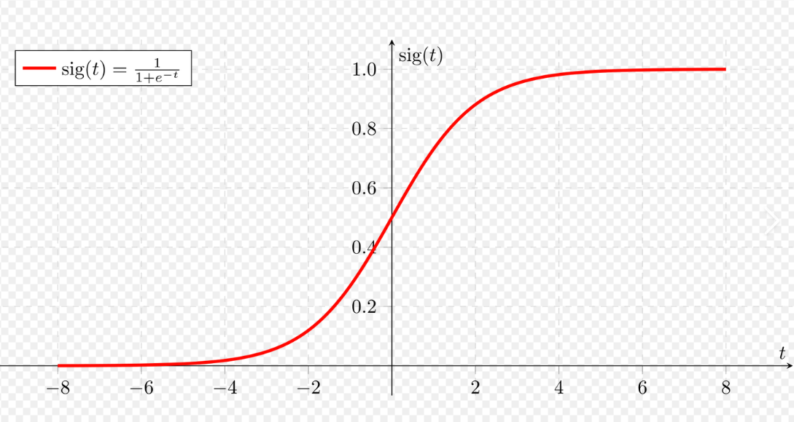
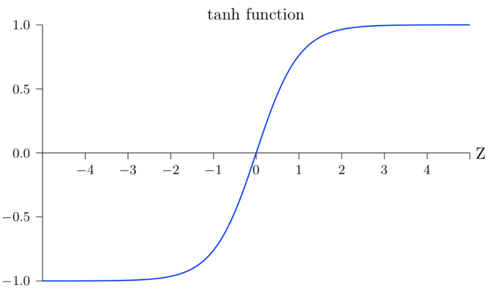
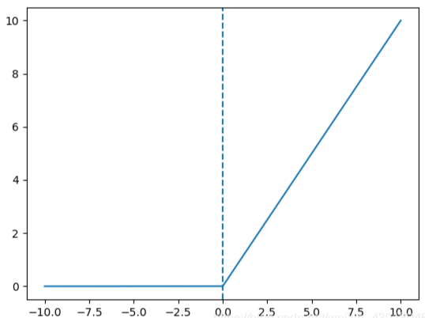
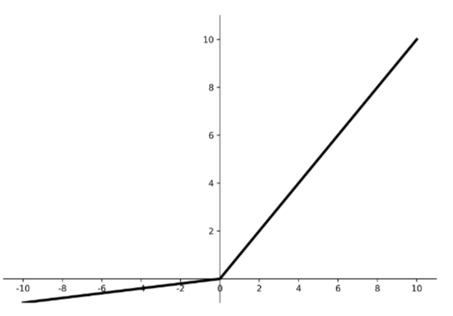
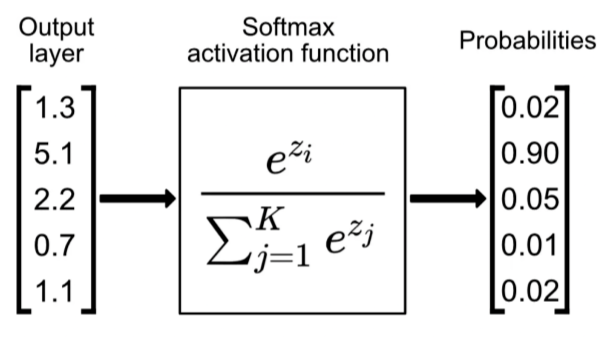

---
title: 一文搞懂激活函数在深度学习中的作用（详细版）
date:  2025-11-06 09:00:00
categories:
  - 深度学习
tags:
  - 深度学习
sticky: 0
sidebar: true
---
## 0 引言

在深度学习的世界中，激活函数是神经网络中不可或缺的组成部分。它们决定了网络的非线性特性，并且对模型的训练和性能起着至关重要的作用。本文将详细介绍激活函数的作用、常见类型及其优缺点，帮助你深入理解激活函数在神经网络中的关键作用。

## 1 激活函数的作用

神经网络由许多神经元（即节点）组成，每个神经元的作用是接受输入，进行计算，然后输出一个结果。在神经网络的基本形式中，每个神经元的计算可以表示为：

$$
y = f(w_1x_1 + w_2x_2 + \cdots + w_nx_n + b)
$$
其中，$x_1, x_2, \dots, x_n$ 是输入，$w_1, w_2, \dots, w_n$ 是权重，$b$ 是偏置，$f$ 就是我们要讨论的激活函数。

## 2 为什么需要激活函数？

> 激活函数让神经网络能够处理图像识别、语音识别、自然语言处理等任务，因为它赋予了网络表达非线性关系的能力。
> 
激活函数的主要作用是引入非线性，使得神经网络能够学习和表示复杂的关系。如果没有激活函数，神经网络仅仅是多个线性变换的堆叠，那么无论有多少层，整个网络等价于一个单层的线性模型，无法处理复杂问题。
## 3 常见的激活函数

### 3.1 Sigmoid 函数

Sigmoid 函数是最早被使用的激活函数之一，它的公式如下：

$$f(x) = \frac{1}{1 + e^{-x}}$$

Sigmoid 函数的输出范围在0到1之间，因此常用于二分类任务中的输出层。例如，在二分类的神经网络中，输出层通常会使用 Sigmoid 函数来表示预测的概率。

**优点：**

* 输出范围限制在 (0, 1) 之间，适用于概率输出。

**缺点：**

* 梯度消失问题：当输入值过大或过小时，Sigmoid 的梯度接近0，导致梯度下降时权重更新缓慢，训练变得困难。
* 输出不以零为中心，可能导致在训练过程中权重更新的不稳定。

**常用场景：**

* 常用于二分类任务中的输出层，如二分类的逻辑回归、神经网络输出。

### 3.2 Tanh（双曲正切）函数

Tanh 函数是 Sigmoid 函数的一个变体，它的输出范围是 (-1, 1)，其公式为：

$$f(x) = \frac{e^x - e^{-x}}{e^x + e^{-x}}$$

与 Sigmoid 相比，Tanh 函数的优点在于它的输出值是以零为中心的，这使得网络在训练时更为稳定。

**优点：**

* 输出范围为 (-1, 1)，更加平衡，适合深度网络。
* 相较于 Sigmoid，梯度消失的问题略微减轻。

**缺点：**

* 和 Sigmoid 一样，Tanh 也存在梯度消失问题，尤其是在深层网络中。

**常用场景：**

* 常用于循环神经网络（RNN）和其他需要连续值输出的网络中，特别是在文本生成、序列建模任务中。

### 3.3 ReLU（修正线性单元）

ReLU 是目前最常用的激活函数之一，它的公式非常简单：

$f(x) = \max(0, x)$

ReLU 的输出为输入值与 0 的最大值。当输入为负数时，输出为 0；当输入为正数时，输出与输入值相等。

**优点：**

* 计算简单，收敛速度快。
* 减少了梯度消失的问题，尤其适用于深度网络。
* 在实际应用中，ReLU 通常能够有效地提高网络性能。

**缺点：**

* **死神经元问题**：当输入为负值时，ReLU 输出为 0，导致梯度为 0，从而无法进行权重更新。这可能导致一些神经元永远不被激活，影响模型的学习。

**常用场景：**

* 广泛应用于卷积神经网络（CNN）、全连接神经网络（FCN）等各类深度神经网络，尤其在图像分类、物体检测等任务中表现优秀。

### 3.4 Leaky ReLU（带泄漏的ReLU）

为了缓解 ReLU 的死神经元问题，Leaky ReLU 引入了一个小的斜率 $\alpha$ 使得负输入值也能有一个小的梯度。其公式为：

$$
f(x) = \begin{cases}
x & \text{if } x > 0 \
\alpha x & \text{if } x \leq 0
\end{cases}
$$

**优点：**

* 解决了 ReLU 的死神经元问题，确保每个神经元在训练过程中都有梯度更新。

**缺点：**

* 选择合适的 $\alpha$ 值是一个挑战，过小的 $\alpha$ 可能仍然导致梯度消失问题。

**常用场景：**

* 用于深度神经网络、卷积神经网络等，尤其在需要克服死神经元问题时。

### 3.5 ELU（指数线性单元）

ELU 是另一种常用于神经网络中的激活函数，它的公式为：

$$f(x) = \begin{cases}
x & \text{if } x > 0 \
\alpha (e^x - 1) & \text{if } x \leq 0
\end{cases}$$

ELU 通过引入指数函数，使得负值部分的输出不为 0，而是一个负值，从而避免了 ReLU 中的死神经元问题。

**优点：**

* 输出具有更好的连续性和可导性，避免了死神经元问题。
* 能够加速训练并且提高模型性能。

**缺点：**

* 计算较 ReLU 更复杂。
* 仍然需要调节超参数 $\alpha$。

**常用场景：**

* 常用于深度神经网络和卷积神经网络，尤其在处理图像分类和生成任务时有较好的效果。

### 3.6 Softmax 函数

Softmax 函数通常用于多分类任务的输出层，此函数在神经网络中应用非常多。它的公式为：

$$f(x_i) = \frac{e^{x_i}}{\sum_{j} e^{x_j}}$$

Softmax 会将每个神经元的输出转化为概率值，且所有输出的概率和为 1，适合多分类任务的预测。

**优点：**

* 输出为概率分布，易于进行分类决策。
* 在多分类问题中非常有效。

**缺点：**

* 对于类别数非常大的问题，计算开销较大。

**常用场景：**

* 多分类问题的输出层，如在图像分类、语音识别等任务中的应用。

## 4 选择激活函数的考虑因素

1. **任务需求**：对于二分类任务，Sigmoid 或者 Leaky ReLU 在隐藏层中比较常见；多分类任务则通常使用 Softmax。
2. **网络深度**：对于较深的神经网络，ReLU、Leaky ReLU 或者 ELU 常常能更好地避免梯度消失。
3. **训练速度和稳定性**：ReLU 及其变种通常比 Sigmoid 和 Tanh 更加高效，且训练时稳定性更好。

## 5 总结

激活函数在神经网络中扮演着至关**重要的角色**，它们不仅赋予神经网络非线性特性，还决定了网络在实际任务中的性能。选择合适的激活函数可以极大地提高模型的**训练效率**和**泛化能力**。虽然没有一种激活函数适用于所有情况，但根据具体的任务需求和网络结构，合理选择和调整激活函数，能够让你的神经网络训练事半功倍。

