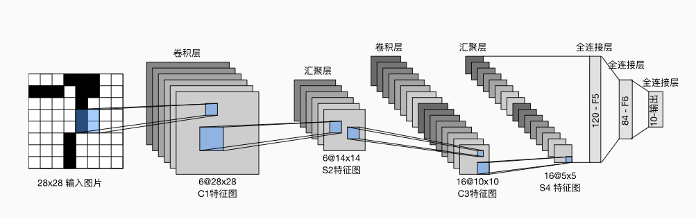
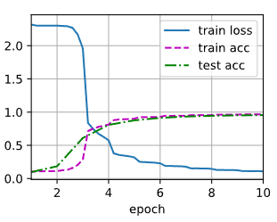

---
title: 从零理解LeNet：卷积神经网络的起点与启示
date:  2025-10-24 10:09:42
categories:
  - 深度学习
tags:
  - 深度学习
sticky: 0
---


## 0 摘要

在当今深度学习的浪潮中，卷积神经网络无疑是最耀眼的明星之一，它在图像识别、目标检测、自然语言处理等领域都取得了革命性的成果。然而，当我们谈论 CNN 时，有一个名字是绕不开的，那就是 **LeNet-5**。

LeNet-5 是由“深度学习三巨头”之一的 Yann LeCun（杨立昆）教授在 1998 年提出的，是最早的、也是最经典的卷积神经网络之一。它最初被设计用于解决手写数字识别问题（著名的 MNIST 数据集），并取得了巨大成功，尤其是在银行业的支票识别系统中得到了广泛应用。

尽管 LeNet-5 的结构在今天看来相对简单，但它奠定了现代 CNN 架构的基础。理解 LeNet-5 对于深入学习 CNN 的原理至关重要。

## 1 LeNet-5 的架构

在LeNet中，数据从输入到输出按顺序流动。首先，网络接收手写数字图像作为输入；随后，经过卷积层提取局部特征，再通过池化层进行降维和特征整合；接着，全连接层将这些特征映射到高维空间以进行分类；最终，输出层生成对应10个数字类别的概率分布，表示网络对每个类别的预测信心。




每个卷积块的基本组成包括：**卷积层 → sigmoid 激活函数 → 平均池化层**。需要注意的是，虽然现代卷积神经网络通常使用 ReLU 激活函数和最大池化层，但在 20 世纪 90 年代，这些技术尚未出现。

每个卷积层通过卷积核和 sigmoid 激活函数，将输入映射为多个二维特征图（feature map），并通常增加通道数。**第一卷积层**有 6 个输出通道，而**第二卷积层**有 16 个输出通道。每个池化操作（步幅为 2）通过空间下采样将特征图尺寸缩小 4 倍。卷积输出的形状由 **批量大小（batch size）、通道数、高度、宽度** 四个维度决定。

为了将卷积块的输出传递给全连接层（稠密块），必须在每个小批量中将每个样本展平。换句话说，将四维张量转换为全连接层所期望的二维输入：

- **第一维**：小批量中的样本索引
- **第二维**：每个样本展平后的向量表示

LeNet 的稠密块由三个全连接层组成，输出单元数分别为 **120、84 和 10**。由于这是一个分类任务，输出层的 10 个单元对应数字类别的预测概率。

## 2 代码详解

这里的代码以*Dive INTO DEEP LEARNING*提供的代码来解释，环境需要提前搭建好

### 2.1 Lenet架构搭建

这段代码实现了一个 **LeNet-5 风格的卷积神经网络**，用于处理灰度图像（如 MNIST 手写数字）。网络由两层卷积层和平均池化层组成，用于提取空间特征；随后通过展平操作将多通道特征图转换为一维向量，送入三个全连接层进行特征组合和分类。前两层全连接层使用 sigmoid 激活函数，最后输出层包含 10 个神经元，对应数字 0~9 的预测类别。

```python
import torch
from torch import nn
from d2l import torch as d2l

net = nn.Sequential(
    nn.Conv2d(1, 6, kernel_size=5, padding=2), nn.Sigmoid(),
    nn.AvgPool2d(kernel_size=2, stride=2),
    nn.Conv2d(6, 16, kernel_size=5), nn.Sigmoid(),
    nn.AvgPool2d(kernel_size=2, stride=2),
    nn.Flatten(),
    nn.Linear(16 * 5 * 5, 120), nn.Sigmoid(),
    nn.Linear(120, 84), nn.Sigmoid(),
    nn.Linear(84, 10))
```

### 2.2 查看结构

这段代码的作用是 **逐层观察网络的输出形状**，可以帮助理解数据在 LeNet-5 网络中如何变化。

```python
X = torch.rand(size=(1, 1, 28, 28), dtype=torch.float32)
for layer in net:
    X = layer(X)
    print(layer.__class__.__name__,'output shape: \t',X.shape)
```

### 2.3 加载训练集

需要注意，这里如果没有下载mnist数据集的话，将download设置为`True`，还需要修改数据路劲

```python
from torchvision import datasets,transforms

transform = transforms.Compose([
    transforms.ToTensor()
])

## 加载训练集
train_dataset = datasets.MNIST(
    root='../../dataset/mnist/train',
    train=True,
    transform=transform,
    download=False  ## 已经在本地
)

## 加载测试集
test_dataset = datasets.MNIST(
    root='../../dataset/mnist/test',
    train=False,
    transform=transform,
    download=False
)
```

### 2.4 定义训练、测试集

```python
from torch.utils.data import DataLoader

batch_size = 256

train_iter = DataLoader(train_dataset,batch_size=batch_size)
test_iter = DataLoader(test_dataset,batch_size=batch_size)
```

### 2.5 定义评估函数

`evaluate_accuracy_gpu` 会将模型切换到评估模式（`eval()`），避免在测试时启用 dropout 或 batch normalization 的训练行为。如果未指定设备，会自动获取模型参数所在的设备（CPU 或 GPU）。函数通过 `torch.no_grad()` 禁用梯度计算，提高评估速度和节省显存，然后遍历数据迭代器，将每个批次的输入和标签搬到指定设备上，计算预测结果与真实标签的匹配数，并累加正确预测和总样本数。最后返回 **整体准确率**，即正确预测样本数除以总样本数。

```python
def evaluate_accuracy_gpu(net, data_iter, device=None): ##@save
    """使用GPU计算模型在数据集上的精度"""
    if isinstance(net, nn.Module):
        net.eval()  ## 设置为评估模式
        if not device:
            device = next(iter(net.parameters())).device
    ## 正确预测的数量，总预测的数量
    metric = d2l.Accumulator(2)
    with torch.no_grad():
        for X, y in data_iter:
            if isinstance(X, list):
                ## BERT微调所需的（之后将介绍）
                X = [x.to(device) for x in X]
            else:
                X = X.to(device)
            y = y.to(device)
            metric.add(d2l.accuracy(net(X), y), y.numel())
    return metric[0] / metric[1]
```

### 2.6 定义训练函数

`train_ch6` 会先对网络的卷积层和全连接层使用 **Xavier 均匀初始化** 权重，然后将模型移动到指定设备（CPU 或 GPU）。使用 **随机梯度下降 (SGD)** 和交叉熵损失函数进行训练。在每个 epoch 中，函数遍历训练数据：前向计算得到预测，计算损失，反向传播梯度并更新参数，同时累积训练损失和训练准确率。训练过程中利用 `d2l.Animator` 实时绘制训练损失、训练准确率以及测试集准确率曲线，便于观察训练动态。每个 epoch 结束后调用 `evaluate_accuracy_gpu` 在测试集上评估模型性能，并输出最终训练损失、训练准确率、测试准确率以及训练速度（样本数/秒）。

```python
##@save
def train_ch6(net, train_iter, test_iter, num_epochs, lr, device):
    """用GPU训练模型(在第六章定义)"""
    def init_weights(m):
        if type(m) == nn.Linear or type(m) == nn.Conv2d:
            nn.init.xavier_uniform_(m.weight)
    net.apply(init_weights)
    print('training on', device)
    net.to(device)
    optimizer = torch.optim.SGD(net.parameters(), lr=lr)
    loss = nn.CrossEntropyLoss()
    animator = d2l.Animator(xlabel='epoch', xlim=[1, num_epochs],
                            legend=['train loss', 'train acc', 'test acc'])
    timer, num_batches = d2l.Timer(), len(train_iter)
    for epoch in range(num_epochs):
        ## 训练损失之和，训练准确率之和，样本数
        metric = d2l.Accumulator(3)
        net.train()
        for i, (X, y) in enumerate(train_iter):
            timer.start()
            optimizer.zero_grad()
            X, y = X.to(device), y.to(device)
            y_hat = net(X)
            l = loss(y_hat, y)
            l.backward()
            optimizer.step()
            with torch.no_grad():
                metric.add(l * X.shape[0], d2l.accuracy(y_hat, y), X.shape[0])
            timer.stop()
            train_l = metric[0] / metric[2]
            train_acc = metric[1] / metric[2]
            if (i + 1) % (num_batches // 5) == 0 or i == num_batches - 1:
                animator.add(epoch + (i + 1) / num_batches,
                             (train_l, train_acc, None))
        test_acc = evaluate_accuracy_gpu(net, test_iter)
        animator.add(epoch + 1, (None, None, test_acc))
    print(f'loss {train_l:.3f}, train acc {train_acc:.3f}, '
          f'test acc {test_acc:.3f}')
    print(f'{metric[2] * num_epochs / timer.sum():.1f} examples/sec '
          f'on {str(device)}')
```

### 2.7 训练并可视化

```python
lr, num_epochs = 0.9, 10
train_ch6(net, train_iter, test_iter, num_epochs, lr, d2l.try_gpu())
```




## 3 LeNet-5 的核心思想与贡献

LeNet-5 虽小，五脏俱全。它引入并验证了几个至今仍在使用的关键概念：

1.  **卷积（Convolution）：** LeNet 证明了使用卷积核来提取局部特征是非常有效的。图像中的特征（如边缘、角点）是局部的。
2.  **权值共享（Weight Sharing）：** 在同一个卷积层中，所有神经元共享同一组卷积核（权重）。这极大地减少了模型的参数数量（相比于全连接网络），降低了过拟合的风险，并使得模型更容易训练。
3.  **池化（Pooling）：** 池化层（或子采样层）降低了特征图的分辨率，减少了计算量，同时对微小的平移、缩放和形变具有一定的不变性。
4.  **层次化特征提取（Hierarchical Feature Extraction）：** LeNet-5 采用了“卷积-池化-卷积-池化”的堆叠结构。浅层（如 C1）学习到的是低级特征（如边缘），深层（如 C3）则在低级特征的基础上组合出更高级、更抽象的特征（如形状、部件）。

## 4 LeNet-5 与现代 CNN 的区别

虽然 LeNet-5 是先驱，但与 AlexNet、VGG、ResNet 等现代 CNN 相比，它也有一些“过时”的设计：

1.  **激活函数：** LeNet-5 主要使用 `sigmoid` 或 `tanh`。而现代 CNN 普遍使用 **ReLU (Rectified Linear Unit)** 及其变体，因为 ReLU 能有效缓解梯度消失问题，加速模型收敛。
2.  **池化方法：** LeNet-5 使用的是 **平均池化（Average Pooling）**。而现代 CNN 更多使用 **最大池化（Max Pooling）**，实践证明最大池化通常能保留更多纹理信息，效果更好。
3.  **网络规模：** LeNet-5 只有约 6 万个参数，是一个非常小的网络。现代 CNN（如 GPT-3 用于视觉任务时）的参数量可以达到数十亿甚至更多。
4.  **正则化：** LeNet-5 没有使用（或很少使用）正则化技术。现代 CNN 广泛使用 **Dropout**、**批量归一化（Batch Normalization, BN）** 等技术来防止过拟合。

## 5 总结

LeNet-5 是卷积神经网络发展史上的一个里程碑。它不仅成功地解决了手写数字识别这一实际问题，更重要的是，它提出的 **局部感受野、权值共享、池化下采样** 和 **分层特征提取** 等核心思想，共同构建了现代 CNN 的基本框架。

尽管技术在不断进步，但 LeNet-5 作为“开山之作”的地位不可动摇。学习 LeNet-5，是每一位深度学习者理解 CNN 原理的必经之路。


## 参考

[1] [https://zh-v2.d2l.ai/chapter_convolutional-neural-networks/lenet.html](https://zh-v2.d2l.ai/chapter_convolutional-neural-networks/lenet.html)
