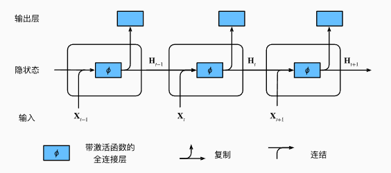
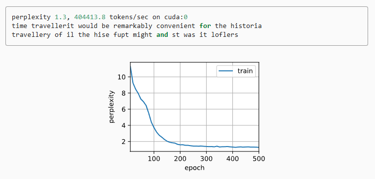

---
title: 从零理解RNN：原理与应用
date:  2025-11-01 15:31:53
categories:
  - 深度学习
tags:
  - 深度学习
sticky: 0
sidebar: true
---


## 0 概要

随着卷积神经网络（CNN）的迅速发展，人们发现虽然卷积在提取某些物体特征方面表现出色，但在处理序列数据时却存在局限。根本原因在于，CNN的设计初衷是**如何更好地提取局部特征**，而序列数据的关键在于**如何捕捉前后元素之间的关系**。举个例子，“我喜欢吃苹果”和“我喜欢苹果手机”中的“苹果”，在不同语境下属于不同的意义类别。如果按照传统的分类思路，很难为同一个词打上统一的标签。针对这一问题，循环神经网络（RNN）应运而生，它能够有效处理序列数据，捕捉上下文之间的依赖关系，从而解决传统方法难以处理的序列任务。

## 1 隐状态

最基本的 RNN 与传统的 CNN 最大的区别在于它引入了一个**隐状态（hidden state）**。隐状态可以看作是网络的“记忆”，用于存储序列中前面时间步的信息。每当 RNN 处理一个新的输入时，它不仅考虑当前输入，还会结合上一时间步的隐状态进行计算。

用公式表示就是：
$$
h_t = f\big(W_{xh} x_t + W_{hh} h_{t-1} + b_h\big)
$$
其中：

- `X_t`是当前时间步的输入，
- `h_t−1`是上一时间步的隐状态，
- `W_xh` 和 `W_hh`是权重矩阵，
- `b_h`是偏置，
- `f` 是激活函数（通常用 tanh 或 ReLU）。

可以理解为，RNN 每一步都会将“当前信息”和“过去记忆”结合起来，从而捕捉序列中的依赖关系。正是这种隐状态，使得 RNN 能够处理语言、时间序列、视频等需要考虑前后关联的数据，而不是像 CNN 那样只关注局部特征。

在本例中，模型的参数包括 $W_{xh}$ 和 $W_{hh}$ 的拼接矩阵，以及 $b_h$ 的偏置。当前时间步的隐状态 $h_t$ 不仅会用于计算下一时间步的隐状态 $h_{t+1}$，还会被送入全连接输出层，用于生成当前时间步的输出 $y_t$。




## 2 RNN代码

这里的代码以*DIVE INTO DEEP INEARING*为示例代码，需要提前将环境配置好

### 2.1 定义训练和词表

```python
import torch
from torch import nn
from torch.nn import functional as F
from d2l import torch as d2l

batch_size, num_steps = 32, 35
train_iter, vocab = d2l.load_data_time_machine(batch_size, num_steps)
```

### 2.2 定义模型

```python
num_hiddens = 256
rnn_layer = nn.RNN(len(vocab), num_hiddens)

state = torch.zeros((1, batch_size, num_hiddens))
state.shape
```

### 2.3 定义网络结构

```python
#@save
class RNNModel(nn.Module):
    """循环神经网络模型"""
    def __init__(self, rnn_layer, vocab_size, **kwargs):
        super(RNNModel, self).__init__(**kwargs)
        self.rnn = rnn_layer
        self.vocab_size = vocab_size
        self.num_hiddens = self.rnn.hidden_size
        # 如果RNN是双向的（之后将介绍），num_directions应该是2，否则应该是1
        if not self.rnn.bidirectional:
            self.num_directions = 1
            self.linear = nn.Linear(self.num_hiddens, self.vocab_size)
        else:
            self.num_directions = 2
            self.linear = nn.Linear(self.num_hiddens * 2, self.vocab_size)

    def forward(self, inputs, state):
        X = F.one_hot(inputs.T.long(), self.vocab_size)
        X = X.to(torch.float32)
        Y, state = self.rnn(X, state)
        # 全连接层首先将Y的形状改为(时间步数*批量大小,隐藏单元数)
        # 它的输出形状是(时间步数*批量大小,词表大小)。
        output = self.linear(Y.reshape((-1, Y.shape[-1])))
        return output, state

    def begin_state(self, device, batch_size=1):
        if not isinstance(self.rnn, nn.LSTM):
            # nn.GRU以张量作为隐状态
            return  torch.zeros((self.num_directions * self.rnn.num_layers,
                                 batch_size, self.num_hiddens),
                                device=device)
        else:
            # nn.LSTM以元组作为隐状态
            return (torch.zeros((
                self.num_directions * self.rnn.num_layers,
                batch_size, self.num_hiddens), device=device),
                    torch.zeros((
                        self.num_directions * self.rnn.num_layers,
                        batch_size, self.num_hiddens), device=device))
```

### 2.4 定义随机梯度

```python
def grad_clipping(net, theta):  #@save
    """裁剪梯度"""
    if isinstance(net, nn.Module):
        params = [p for p in net.parameters() if p.requires_grad]
    else:
        params = net.params
    norm = torch.sqrt(sum(torch.sum((p.grad ** 2)) for p in params))
    if norm > theta:
        for param in params:
            param.grad[:] *= theta / norm
```

### 2.5 训练策略

```python
#@save
def train_epoch_ch8(net, train_iter, loss, updater, device, use_random_iter):
    """训练网络一个迭代周期（定义见第8章）"""
    state, timer = None, d2l.Timer()
    metric = d2l.Accumulator(2)  # 训练损失之和,词元数量
    for X, Y in train_iter:
        if state is None or use_random_iter:
            # 在第一次迭代或使用随机抽样时初始化state
            state = net.begin_state(batch_size=X.shape[0], device=device)
        else:
            if isinstance(net, nn.Module) and not isinstance(state, tuple):
                # state对于nn.GRU是个张量
                state.detach_()
            else:
                # state对于nn.LSTM或对于我们从零开始实现的模型是个张量
                for s in state:
                    s.detach_()
        y = Y.T.reshape(-1)
        X, y = X.to(device), y.to(device)
        y_hat, state = net(X, state)
        l = loss(y_hat, y.long()).mean()
        if isinstance(updater, torch.optim.Optimizer):
            updater.zero_grad()
            l.backward()
            grad_clipping(net, 1)
            updater.step()
        else:
            l.backward()
            grad_clipping(net, 1)
            # 因为已经调用了mean函数
            updater(batch_size=1)
        metric.add(l * y.numel(), y.numel())
    return math.exp(metric[0] / metric[1]), metric[1] / timer.stop()
```

### 2.6 预测定义

```python
def predict_ch8(prefix, num_preds, net, vocab, device):  #@save
    """在prefix后面生成新字符"""
    state = net.begin_state(batch_size=1, device=device)
    outputs = [vocab[prefix[0]]]
    get_input = lambda: torch.tensor([outputs[-1]], device=device).reshape((1, 1))
    for y in prefix[1:]:  # 预热期
        _, state = net(get_input(), state)
        outputs.append(vocab[y])
    for _ in range(num_preds):  # 预测num_preds步
        y, state = net(get_input(), state)
        outputs.append(int(y.argmax(dim=1).reshape(1)))
    return ''.join([vocab.idx_to_token[i] for i in outputs])
```

### 2.7 训练定义

```python
#@save
def train_ch8(net, train_iter, vocab, lr, num_epochs, device,
              use_random_iter=False):
    """训练模型（定义见第8章）"""
    loss = nn.CrossEntropyLoss()
    animator = d2l.Animator(xlabel='epoch', ylabel='perplexity',
                            legend=['train'], xlim=[10, num_epochs])
    # 初始化
    if isinstance(net, nn.Module):
        updater = torch.optim.SGD(net.parameters(), lr)
    else:
        updater = lambda batch_size: d2l.sgd(net.params, lr, batch_size)
    predict = lambda prefix: predict_ch8(prefix, 50, net, vocab, device)
    # 训练和预测
    for epoch in range(num_epochs):
        ppl, speed = train_epoch_ch8(
            net, train_iter, loss, updater, device, use_random_iter)
        if (epoch + 1) % 10 == 0:
            print(predict('time traveller'))
            animator.add(epoch + 1, [ppl])
    print(f'困惑度 {ppl:.1f}, {speed:.1f} 词元/秒 {str(device)}')
    print(predict('time traveller'))
    print(predict('Beijin'))
```

### 2.8 开始训练

```python
num_epochs, lr = 500, 1
d2l.train_ch8(net, train_iter, vocab, lr, num_epochs, device)
```




## 3 RNN 的应用示例

循环神经网络（RNN）在处理序列数据方面非常擅长，因此它在很多实际场景中都有应用：

1. **文本生成**
    RNN 可以根据已有文字生成下一步的文字内容，例如输入一句话“我今天想吃”，RNN 可以预测后续可能的词汇，如“苹果”或“火锅”。通过不断迭代，RNN 可以生成完整的文章或诗歌。
2. **时间序列预测**
    RNN 可用于预测股价、气温或传感器数据等随时间变化的序列。例如，给定过去 30 天的股票收盘价，RNN 可以学习价格的变化趋势，并预测未来几天的走势。
3. **情感分析**
    在自然语言处理任务中，RNN 可以处理句子或段落的情绪信息。例如，对于一条评论“这部电影真的很感人”，RNN 可以理解上下文，将情绪分类为“正向”。
4. **语音识别和机器翻译**
    RNN 能够处理语音信号或文本序列，通过逐步读取输入，识别出语音中的文字或将一句话翻译成另一种语言。

总体来说，RNN 的核心优势在于**能够记住前面时间步的信息，并将其用于当前的预测**，这使它在需要上下文理解的任务中表现优异。


## 参考

[1] [https://zh-v2.d2l.ai/chapter_recurrent-neural-networks/rnn-concise.html](https://zh-v2.d2l.ai/chapter_recurrent-neural-networks/rnn-concise.html)
