---
title: 实战Kaggle房价预测+基础和提升方法的源码讲解
date:  2025-09-20 17:56:25
categories:
  - 深度学习
tags:
  - 深度学习
sticky: 0
---


## 0 引言

本文将从零开始，带你完整体验一次 Kaggle 机器学习项目。以 **波士顿房价预测** 为例，我们将从最基础的 MLP 和线性回归入手，再到经典的 XGBoost 与随机森林。在基础的 `MLP` 部分，我们参考了 **《动手学深度学习》4.10 实战 Kaggle 比赛：预测房价**[1] 的章节进行讲解，详细解析代码含义，并指出运行中可能遇到的环境问题。在此基础上，我们还会进行**算法**与**参数**优化，逐步拆解思路与源码，让新手也能轻松上手，真正做到**一看就懂**。


## 1 基础模型：MLP 

MLP（多层感知机）是一种常见的人工神经网络结构。它由输入层、输出层以及若干隐藏层组成。最简单的 MLP 由三层构成，即一层输入层、一层隐藏层和一层输出层，如图1所示。

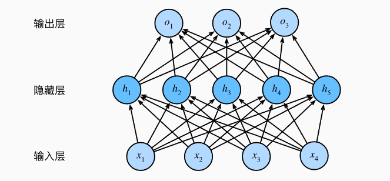


<center>图1.1 最简单的MLP神经网络结构图</center>

### 1.1 房价预测数据获取

这里可以参考[1]中的描述，通过代码下载数据集。这样做的好处是可以直接用代码完成下载，无需手动打开网站一步步操作。不过，由于网络或环境等原因，下载可能会不稳定，容易失败。有兴趣的同学可以点击[查看代码下载方法](https://zh-v2.d2l.ai/chapter_multilayer-perceptrons/kaggle-house-price.html)，查看代码下载数据集。新手小白建议在网站中下载。

House_pred数据集下载：[House Prices - Advanced Regression Techniques | Kaggle](https://www.kaggle.com/competitions/house-prices-advanced-regression-techniques/data)

点击`Download All`就能下载全部数据集，下载后可以查看相关数据集介绍，以及在训练完后上传预测后的数据格式要求。

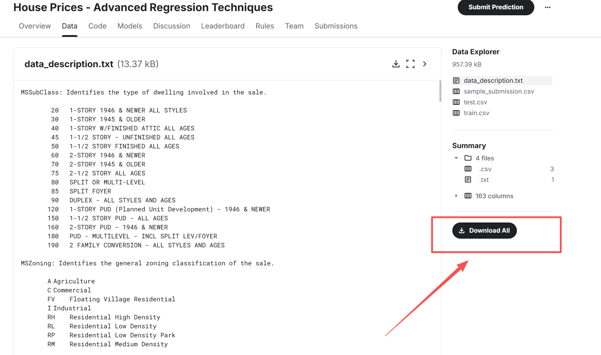


<center>图1.1 模型下载</center>

### 1.2 代码讲解

这里大家可以按照我给的代码一步步来，这都是我都是运行过的，**只要环境没问题，都是能运行的**！

#### 1.2.1 数据集获取

这里的 `train_data` 和 `test_data` 用于加载我们在 1.1 节下载的数据集。需要注意的是，路径设置可能会出问题：有时写根目录下的路径会报错，相对路径也可能不稳定。为了避免这些问题，建议使用 **绝对路径**，并且在路径前加上 **转义符号 `r`**。

```python
import pandas as pd

train_data = pd.read_csv("../../data/kaggle_house_pred_train.csv")
test_data = pd.read_csv("../../data/kaggle_house_pred_test.csv")
```

#### 1.2.2 数据分析

如图 2 所示，打印训练集和测试集的数据可以看到：训练集有 1460 行、81 列，而测试集有 1459 行、80 列。由此可见，训练集比测试集多出的一列就是 **标签**。需要注意的是，测试集不能用于训练，而且训练集和测试集的 **数据处理必须保持一致**，否则后续的预测不仅无法进行，效果也会很差。

```python
print(train_data.shape)
print(test_data.shape)
```

```python
print(train_data.iloc[0:4, [0, 1, 2, 3, -3, -2, -1]])
```

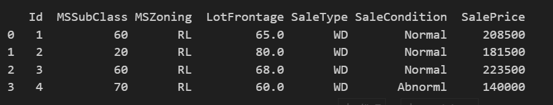


<center>图1.2 打印前五行及1到4列和倒数第3到倒数第一列数据</center>

#### 1.2.3 合并训练和测试集特征

在模型训练中，我们需要保证输入模型的数值在大小上要保持一致，所以这里的训练集和测试集都需要统一处理。

这里将合并训练集第二列至倒数第二列以及测试集第二列到最后一列，除去了无关特征ID和标签（训练集最后一列），最后可以看到合并的所有特征值大小是（2919，79）

```python
all_features = pd.concat((train_data.iloc[:, 1:-1], test_data.iloc[:, 1:]))
all_features.shape
```

#### 1.2.4 特征值处理

1. 获取330个特征值中是**数值**类型的特征

```python
## 若无法获得测试数据，则可根据训练数据计算均值和标准差
numeric_features = all_features.dtypes[all_features.dtypes != 'object'].index
```

2. 将这些数值特征全部归一化处理，以0为均值，1为方差进行标准化处理。

```python
all_features[numeric_features] = all_features[numeric_features].apply(
    lambda x: (x - x.mean()) / (x.std()))
```

3. 在标准化数据之后，所有均值消失，因此我们可以将缺失值设置为0

```python
all_features[numeric_features] = all_features[numeric_features].fillna(0)
```

4. 对于object（文本）类型的特征进行`one-hot`编码

```python
## 仅改变文本类型的值，“Dummy_na=True”将“na”（缺失值）视为有效的特征值，并为其创建指示符特征
all_features = pd.get_dummies(all_features, dummy_na=True)
```

- 通过以上方法处理后，如图1.3和图1.4所示，所有 **数值** 类型都统一为 `float64`，而文本类型则转化为 `bool`。这样做的好处主要有以下几点：
  - 所有特征都能转化为数值形式，方便后续输入模型进行训练。
  - 统一数据类型后，可以避免不同格式在计算过程中导致的错误或不兼容问题。
  - 数值化和标准化处理有助于模型更快收敛，提高训练效率和稳定性。
  - 对于布尔特征，使用 0/1 表示能够简化模型结构，同时保持信息完整性。

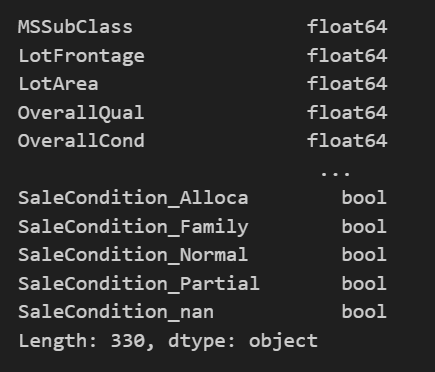


<center>图1.3 特征处理后的数值类型</center>

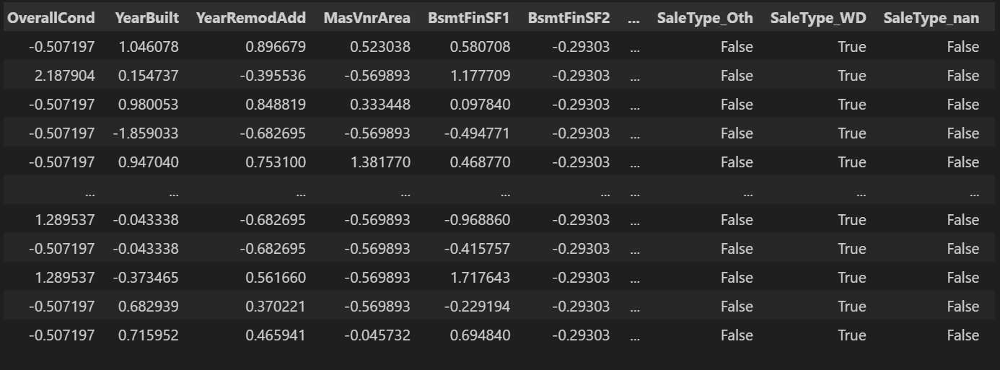


<center>图1.4 处理后的部分数据</center>

#### 1.2.5 数值转向量

在现代机器学习和深度学习中，各类算法模型的核心本质都是对张量的运算。以图像识别为例，一张图片会被转换成大小为 255×255 的三维张量，然后输入模型进行处理。简单来说，张量就是在不同维度上扩展的向量或矩阵，是数据在计算机中组织和存储的基本形式。

1. 将分别获取训练集和测试集，并将其都转为张量格式

```python
import torch
## 获取训练集特征有多少行
n_train = train_data.shape[0]
## 将所有特征由原来的DataFrame类型转为tensor张量格式
X_all = all_features.to_numpy(dtype=np.float32)
## 分别将训练集和测试集转成张量，并分别保存
train_features = torch.from_numpy(X_all[:n_train])
test_features = torch.from_numpy(X_all[n_train:])
```

2. 获取标签，也就是我们预测的值`SalePrice`

```python
## reshape将其由原来的(1,1459)转为(1459,1),保证格式一致，否则训练会报错
train_labels = torch.from_numpy(
    train_data["SalePrice"].to_numpy(dtype=np.float32)
).reshape(-1,1)	
```

#### 1.2.6 定义损失函数和神经网络结构

这里定义了一个简单的线性回归模型。虽然它属于基础模型，能力有限，但可以作为一个 **基线模型**。在后续使用其他模型进行预测时，可以将其效果与基线模型进行对比。如果连基线模型都不如，那说明优化没有起作用。

```python
from torch import nn

## 定义损失函数为均方误差（MSE），常用于回归任务
loss = nn.MSELoss()

## 获取输入特征维度，例如 train_features 是 (num_samples, num_features)
in_features = train_features.shape[1]

## 定义一个简单的全连接神经网络
def get_net():
    net = nn.Sequential(nn.Linear(in_features,1))
    return net

```

#### 1.2.7 方差定义

房价预测中，我们更关心 **相对误差** 而非绝对误差，因为相同的绝对偏差在不同价位的房子上影响差异很大。为此，可以对房价取对数后计算均方根误差，使模型评估更能反映相对预测准确性，这也是比赛中官方采用的评价指标。

```python
def log_rmse(net, features, labels):
    ## 为了在取对数时进一步稳定该值，将小于1的值设置为1
    clipped_preds = torch.clamp(net(features), 1, float('inf'))
    rmse = torch.sqrt(loss(torch.log(clipped_preds),
                           torch.log(labels)))
    return rmse.item()
```

#### 1.2.8 模型训练过程

使用 Adam 优化器对给定的神经网络进行多轮迭代训练，通过最小化预测房价与真实房价对数的均方根误差（log RMSE）来更新权重，并在每轮记录训练集和测试集的误差，以便评估模型的学习效果和泛化能力。

```python
def train(net, train_features, train_labels, test_features, test_labels,
          num_epochs, learning_rate, weight_decay, batch_size):
    train_ls, test_ls = [], []
    train_iter = d2l.load_array((train_features, train_labels), batch_size)
    ## 这里使用的是Adam优化算法
    trainer = gluon.Trainer(net.collect_params(), 'adam', {
        'learning_rate': learning_rate, 'wd': weight_decay})
    for epoch in range(num_epochs):
        for X, y in train_iter:
            with autograd.record():
                l = loss(net(X), y)
            l.backward()
            trainer.step(batch_size)
        train_ls.append(log_rmse(net, train_features, train_labels))
        if test_labels is not None:
            test_ls.append(log_rmse(net, test_features, test_labels))
    return train_ls, test_ls
```

#### 1.2.9 K折交叉验证

K 折交叉验证有助于模型选择和超参数调优。我们需要先定义一个函数，在每次交叉验证中返回第 k 折的数据：将第 k 个切片作为验证集，其余部分作为训练集。需要注意的是，这种方法并不是处理大规模数据最高效的方式，对于更大的数据集可以采用其他优化策略。

```python
def get_k_fold_data(k, i, X, y):
    assert k > 1
    fold_size = X.shape[0] // k
    X_train, y_train = None, None
    for j in range(k):
        idx = slice(j * fold_size, (j + 1) * fold_size)
        X_part, y_part = X[idx, :], y[idx]
        if j == i:
            X_valid, y_valid = X_part, y_part
        elif X_train is None:
            X_train, y_train = X_part, y_part
        else:
            X_train = torch.cat([X_train, X_part], 0)
            y_train = torch.cat([y_train, y_part], 0)
    return X_train, y_train, X_valid, y_valid
```

这段代码在房价预测中实现了 **K 折交叉验证** 的流程：它将训练数据划分为 K 份，依次使用其中一份作为验证集，其余作为训练集，重复训练神经网络并记录每折的训练和验证误差（log RMSE），最终返回所有折的平均训练误差和验证误差，从而帮助评估模型性能和选择最优超参数。

```python
def k_fold(k, X_train, y_train, num_epochs, learning_rate, weight_decay,
           batch_size):
    train_l_sum, valid_l_sum = 0, 0
    for i in range(k):
        data = get_k_fold_data(k, i, X_train, y_train)
        net = get_net()
        train_ls, valid_ls = train(net, *data, num_epochs, learning_rate,
                                   weight_decay, batch_size)
        train_l_sum += train_ls[-1]
        valid_l_sum += valid_ls[-1]
        if i == 0:
            d2l.plot(list(range(1, num_epochs + 1)), [train_ls, valid_ls],
                     xlabel='epoch', ylabel='rmse', xlim=[1, num_epochs],
                     legend=['train', 'valid'], yscale='log')
        print(f'折{i + 1}，训练log rmse{float(train_ls[-1]):f}, '
              f'验证log rmse{float(valid_ls[-1]):f}')
    return train_l_sum / k, valid_l_sum / k
```

#### 1.2.10 训练模型并查看模型效果

使用 **5 折交叉验证** 对房价预测模型进行训练与评估。具体做法是将训练数据分成 5 份，依次用每一份作为验证集，其余作为训练集，训练 100 轮神经网络（学习率 0.1，权重衰减 35，批量大小 256），并计算每折的训练和验证 log RMSE，最后输出 5 折的 **平均训练误差和平均验证误差**，用于评估模型的整体性能。

如图1.5所示，可以看到模型的平均训练误差和验证误差相差不大，并没有过拟合，后续优化模型时可以以这个为基准，来判断模型优化效果是否达到目标。

```python
from d2l import torch as d2l

k, num_epochs, lr, weight_decay, batch_size = 5, 100, 0.1, 35, 256
train_l, valid_l = k_fold(k, train_features, train_labels, num_epochs, lr,
                          weight_decay, batch_size)
print(f'{k}-折验证: 平均训练log rmse: {float(train_l):f}, '
      f'平均验证log rmse: {float(valid_l):f}')
```

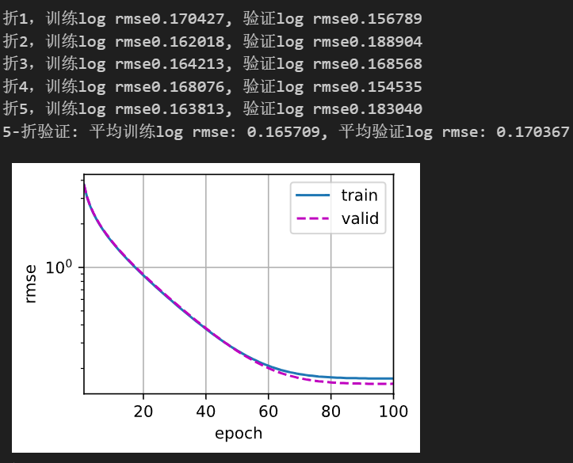


<center>图1.5 模型效果图</center>

#### 1.2.11 预测房价并导出结果文件

这段代码先在训练集上训练 MLP 模型并记录训练误差，然后绘制误差曲线，最后用训练好的模型预测测试集房价，并将预测结果导出为可提交到 Kaggle 的 CSV 文件。

```python
def train_and_pred(train_features, test_features, train_labels, test_data,
                   num_epochs, lr, weight_decay, batch_size):
    ## 获取一个新的神经网络实例
    net = get_net()
    
    ## 在训练集上训练模型，返回每轮的训练误差（log RMSE）
    train_ls, _ = train(net, train_features, train_labels, None, None,
                        num_epochs, lr, weight_decay, batch_size)
    
    ## 绘制训练误差随迭代轮次的变化曲线
    d2l.plot(np.arange(1, num_epochs + 1), [train_ls],
             xlabel='epoch', ylabel='log rmse',
             xlim=[1, num_epochs], yscale='log')
    
    ## 输出最后一轮的训练误差
    print(f'训练log rmse：{float(train_ls[-1]):f}')
    
    ## 使用训练好的网络对测试集进行预测
    preds = net(test_features).detach().numpy()
    
    ## 将预测结果重新格式化以便导出到Kaggle
    test_data['SalePrice'] = pd.Series(preds.reshape(1, -1)[0])
    submission = pd.concat([test_data['Id'], test_data['SalePrice']], axis=1)
    
    ## 保存为 CSV 文件，便于提交
    submission.to_csv('../../result/mlp_optimize.csv', index=False)

```

导出结果，并显示训练的效果

```python
train_and_pred(train_features, test_features, train_labels, test_data,
               num_epochs, lr, weight_decay, batch_size)
```

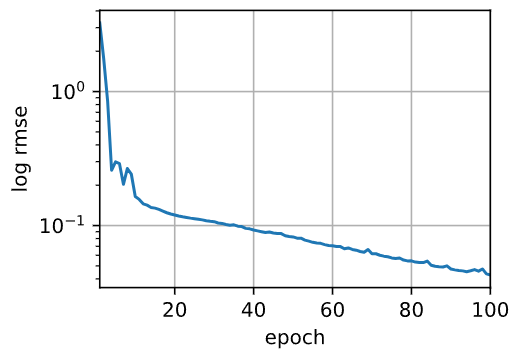


<center>图1.6 训练结果</center>

### 1.3 上传结果

将生成的 CSV 文件上传至 Kaggle，即可查看模型在测试集上的预测效果。需要注意的是，Kaggle 的评测逻辑是将预测值与实际房价计算对数均方根误差（RMSE），与我们在 1.2.7 中定义的误差计算方式一致。因此，得到的误差值越低，说明模型预测越准确，得分越高，模型性能也越强。此外，通过对比不同模型或超参数配置的提交结果，我们可以进一步优化模型，提高预测精度。

上传文件地址：[House Prices - Advanced Regression Techniques | Kaggle](https://www.kaggle.com/competitions/house-prices-advanced-regression-techniques/data)

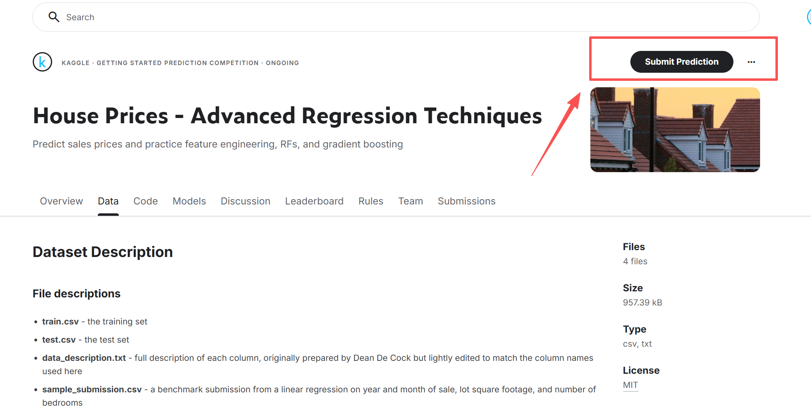


<center>图1.7 结果上传位置</center>

如图 1.8 所示，`MLP` 基准模型的得分为 0.16715。理论上，后续优化的模型得分需要高于这个值，才能说明优化是成功的。

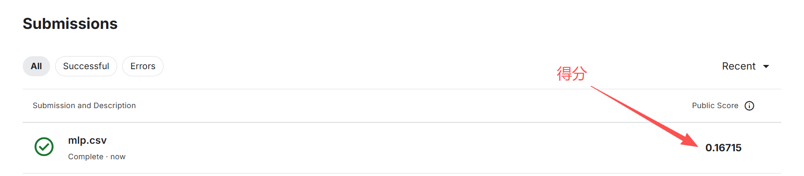


<center>图1.8 得分</center>

## 2 MLP模型优化

> **注意**：后续代码的优化，都是在第一章节的基础上，主要是一些数据处理的操作，其他按照我给的进行修改即可，代码都能跑起来，如果跑不动，可发评论区大家一起看看

### 2.1 优化方向

为了让预测结果更准确，我们可以从多个方面进行优化提升，后面会详细讲到。这里，我们主要对 MLP 的模型结构和部分参数进行优化，以使模型能够更好地拟合数据，应对更复杂的情况。

### 2.2 模型结构优化

原先的模型太简单了，就是一个简单的线性模型。而这段代码定义了一个简单的 **多层感知机（MLP）** 神经网络，用于房价预测。相比之前的线性模型，这里最大的提升在于引入了 **隐藏层和非线性激活函数（ReLU）**，使模型能够学习输入特征之间的复杂非线性关系，而不仅仅是线性组合，从而在捕捉房价数据中潜在的复杂模式和特征交互上具有更强的表达能力。

```python
def get_net():
    net = nn.Sequential(
        nn.Flatten(),
        nn.Linear(in_features,1024),
        nn.ReLU(),
        nn.Linear(1024,1)
        )
    return net
```

### 2.3 参数优化

这里主要修改学习率、权重和批量大小

- **lr = 0.1（学习率）**：调整权重更新步长，平衡训练速度与收敛稳定性。
- **weight_decay = 35（权重衰减）**：作为 L2 正则化，防止模型过拟合，提高泛化能力。
- **batch_size = 256（批量大小）**：增加每次迭代的样本量，有助于梯度估计更稳定，同时提升训练效率。

```python
k, num_epochs, lr, weight_decay, batch_size = 5, 100, 0.1, 35, 256
```

### 2.4 优化结果分析

如图2.1所示，通过观察训练结果的损失方差可以看到，原先训练集的平均损失方差为0.16，现在只由0.04，但平均验证集是0.13与训练集的误差较大，虽然效果均有提升，**但是模型在训练集上拟合较好，在验证集上效果较差，这有可能发生过拟合**。具体效果，我们还需要将训练的效果放入Kaggle上查看结果来分析

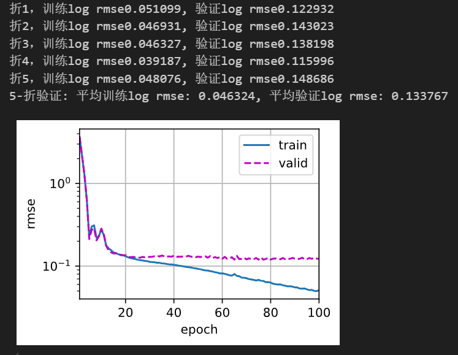


<center>图2.1 训练结果</center>

如图 2.2 所示，在完成模型结构优化和参数调整后，预测效果提升约 **22.15%**（从 0.16715 提升至 0.13012），这一提升幅度相当显著。这表明在相同任务下，即使不对特征进行额外加工，仅通过重构模型结构和合理设置训练参数，也能够显著提高预测精度。这也进一步说明了**模型设计与训练策略在房价预测任务中的关键作用**，为后续结合特征工程或集成方法进一步优化模型提供了良好的基础。

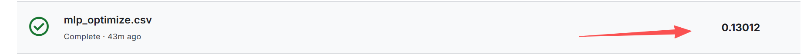


<center>图2.2 MLP优化后的预测效果</center>

## 3 Xgboost模型

### 3.1 模型介绍

#### 3.11 梯度提升树

在了解 XGBoost 之前，需要先理解 GBDT。

> 如图3.1所示，GBDT（Gradient Boosting Decision Tree），又称 MART（Multiple Additive Regression Tree），是一种基于 **Boosting** 思想的集成决策树算法。它通过多棵决策树的累加预测来提升整体模型性能：每棵新树都在前一轮残差的基础上进行拟合，从而逐步减小预测误差。简而言之，GBDT 将多棵弱学习器（决策树）集成为一个强学习器，使模型在回归或分类任务中表现更准确和稳健。[2]

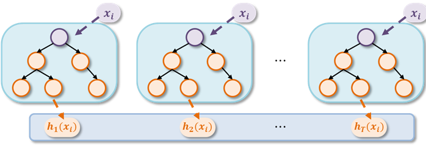


<center>图3.1 GBDT 集成模型示意图</center>

#### 3.1.2 Xgboost简介

XGBoost（Extreme Gradient Boosting）是 GBDT 模型的一种高效改进实现。其核心改进在于优化 GBDT 中每棵 CART 回归树的生成过程，通过引入正则化项、列抽样、并行计算以及对缺失值的高效处理，使模型在训练速度和泛化能力上都有显著提升。在房价预测任务中，XGBoost 能更好地捕捉特征之间的复杂非线性关系，同时减少过拟合，通常比传统 GBDT 或单一回归模型表现出更高的预测精度和稳定性。

此外，XGBoost 的灵活性还体现在可以通过调节树的深度、学习率、正则化系数等超参数，实现对不同数据集的精细化建模，从而进一步提升预测效果。

### 3.2 代码讲解

#### 3.2.1 特征处理

由于原先的 MLP 对缺失值敏感，同时对数值特征的尺度差异较为依赖，因此在建模前需要对数据进行归一化等处理。但是Xgboost对这类不敏感，所以我们只需要对数值取平均值，对文本进行one-hot处理即可，无需缩放数值。

```python
## 取平均值
all_features.fillna(all_features[numertic_features].mean(), inplace=True)

all_features = pd.get_dummies(all_features, dummy_na=True)
all_features
```

如图3.2 所示，处理后的数值保持原样，而对于缺失值，则进行了平均数处理，其他与前面的MLP模型处理无区别。

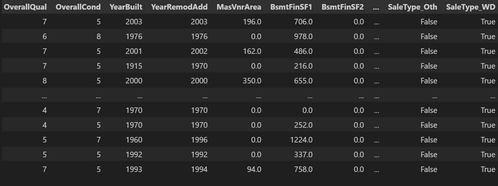


<center>图3.2 Xgboost处理后的数据</center>

#### 3.2.2 获取标签和训练测试集

这段代码的作用是将处理后的完整特征数据集 `all_features` 按训练集和测试集进行划分，其中前 `n_train` 行对应训练集特征 `X` 和目标变量 `y`，剩余部分 `pred_data` 用作测试集特征，用于后续模型训练和预测。

```python
n_train = train_data.shape[0]

X = all_features.iloc[:n_train]
y = train_data["SalePrice"]

pred_data = all_features.iloc[n_train:]
```

这段代码的作用是将训练数据 `X` 和目标变量 `y` 按 **8:2** 的比例随机划分为训练集 (`X_train`, `y_train`) 和验证集 (`X_test`, `y_test`)，`random_state=42` 用于保证划分的可复现性，方便模型训练和性能评估。

```python
from sklearn.model_selection import train_test_split

X_train, X_test, y_train, y_test = train_test_split(
    X, y, test_size=0.2, random_state=42
)
```

#### 3.2.3 模型设置及训练

这段代码的作用是初始化一个 **XGBoost 回归模型**（`XGBRegressor`）用于房价预测，并设置了一些关键超参数**（部分参数我已优化）**：

- **n_estimators=500**：总共构建 500 棵树。
- **max_depth=4**：每棵树的最大深度，控制模型复杂度，防止过拟合。
- **learning_rate=0.05**：学习率，控制每棵树对最终预测的贡献权重。
- **subsample=0.8**：训练每棵树时使用 80% 的样本，增强模型泛化能力。
- **colsample_bytree=0.8**：训练每棵树时随机选择 80% 的特征，增加模型的随机性，防止过拟合。
- **random_state=42**：随机种子，保证实验可复现。

初始化完成后，`xg_reg` 就可以用于训练、预测和评估房价预测模型。

```python
import xgboost as xgb
from sklearn.metrics import mean_squared_error

n_estimators=500
max_depth=4
learning_rate=0.05
subsample=0.8
colsample_bytree=0.8
random_state=42

## 初始化回归器
xg_reg = xgb.XGBRegressor(
    n_estimators=n_estimators,
    max_depth=max_depth,
    learning_rate=learning_rate,
    subsample=subsample,
    colsample_bytree=colsample_bytree,
    random_state=random_state
)
```

<center>图3.3 模型预测</center>

#### 3.2.4 Xgboost训练

如图3.3所示，训练完成后能看到Xgboost参数设置图

```python
## 训练
xg_reg.fit(X_train, y_train)
```

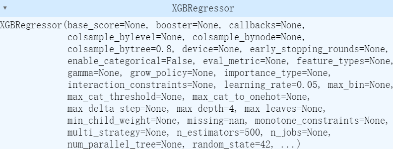


<center>图3.3 Xgboost参数配置图</center>

#### 3.2.5 评估及预测导出

这段代码的功能是使用训练好的 XGBoost 回归模型对验证集和测试集进行房价预测，计算验证集上的均方根误差（RMSE）评估模型性能，并将测试集预测结果与对应 ID 合并后导出为 CSV 文件 `xgboost.csv`，以便提交或进一步分析。

```python
## 预测
y_pred = xg_reg.predict(X_test)
y_pred.shape

## 评估
rmse = mean_squared_error(y_test, y_pred, squared=False)
print(f"RMSE: {rmse}")

test_pred = xg_reg.predict(pred_data)
test_pred.shape,test_pred[:10]

df_pred = pd.Series(test_pred,name="SalePrice")
df_id = pd.Series(test_data.iloc[:,0],name="ID")
df = pd.concat([df_id,df_pred],axis=1)
filename = rf"../../result/xgboost.csv"
df.to_csv(filename,index=False)
```

### 3.3 Xgboost模型效果

如图 3.4 所示，模型预测效果达到了 0.12828，这一成绩在 Kaggle 上可以进入前一千名。虽然与顶尖选手相比仍有差距，但相比我们之前的 **MLP 基线模型**，提升已经非常显著。这也体现了基线模型的重要性：尽管其预测能力不一定最强，但凭借强适应性和快速上手的特点，它能够帮助我们快速评估任务特性、判断哪类模型更适合，以及优化方向是否合理，为后续深入改进提供参考。

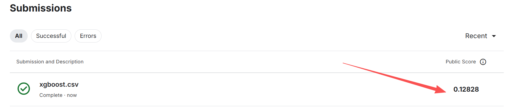


<center>图3.4 Xgboost成绩</center>


## 4 随机森林模型

### 4.1 模型介绍

> 如图4.1所示，随机森林是一种集成学习（Ensemble Learning）方法，通过构建大量“去相关”的决策树，并将它们的预测结果进行集成，提升整体模型的准确率和鲁棒性。
>
> 1. 本质：多个决策树的集成，每棵树都是在“有放回抽样”的数据子集和“随机特征子集”上训练得到。
>
> 2. 任务类型：既可用于分类（Classification），也可用于回归（Regression）。
>
> 3. 优点：高准确率、抗过拟合、对异常值和噪声鲁棒、可处理大规模高维数据。[3]

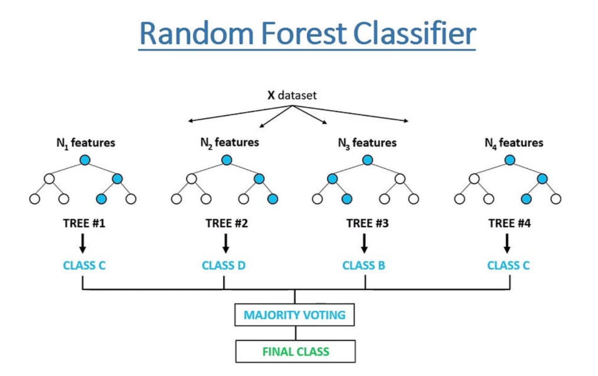


<center>图4.1 随机森林架构图</center>

对于房价预测任务，随机森林有几个明显优势：

1. **捕捉非线性关系**：能够学习特征之间复杂的非线性关系，这对于受位置、面积、装修等多种因素影响的房价预测尤为重要。
2. **抗过拟合能力强**：通过集成大量去相关的决策树，减少单棵树在训练集上的过拟合风险，提高对未知房源的预测稳定性。
3. **对异常值和噪声鲁棒**：在存在极端值或录入错误的数据中，依然能够保持较稳定的预测效果，减少对结果的干扰。
4. **处理高维和大规模数据能力强**：可以同时利用大量特征而无需复杂的特征选择步骤，提升预测效率和可靠性。

### 4.2 代码讲解

#### 4.2.1 特征处理

原先的 MLP 对缺失值较为敏感，并且对数值特征的尺度差异依赖较大，因此在建模前需要进行归一化等处理。而 XGBoost 对这类问题不敏感，所以在使用它时，只需对数值特征填充平均值，对文本特征进行 one-hot 编码即可，无需对数值进行缩放。

```python
## 取平均值
all_features.fillna(all_features[numertic_features].mean(), inplace=True)

all_features = pd.get_dummies(all_features, dummy_na=True)
all_features
```

如图3.2 所示，处理后的数值保持原样，而对于缺失值，则进行了平均数处理，其他与前面的MLP模型处理无区别。


<center>图4.2 Xgboost处理后的数据</center>

#### 4.2.2 获取标签和训练测试集

这段代码的作用是将处理后的完整特征数据集 `all_features` 按训练集和测试集进行划分，其中前 `n_train` 行对应训练集特征 `X` 和目标变量 `y`，剩余部分 `pred_data` 用作测试集特征，用于后续模型训练和预测。

```python
n_train = train_data.shape[0]

X = all_features.iloc[:n_train]
y = train_data["SalePrice"]

pred_data = all_features.iloc[n_train:]
```

这段代码的作用是将训练数据 `X` 和目标变量 `y` 按 **8:2** 的比例随机划分为训练集 (`X_train`, `y_train`) 和验证集 (`X_test`, `y_test`)，`random_state=42` 用于保证划分的可复现性，方便模型训练和性能评估。

```python
from sklearn.model_selection import train_test_split

X_train, X_test, y_train, y_test = train_test_split(
    X, y, test_size=0.2, random_state=42
)
```

#### 4.2.3 模型设置及训练

这段代码实现了 **随机森林回归模型** 的训练和评估流程：首先初始化一个随机森林回归器 `RandomForestRegressor`，设置 800 棵树、最大深度 15、叶子节点最小样本数为 1，并采用平方根特征选择和并行训练以加快计算；随后在训练集 `X_train`、`y_train` 上训练模型；接着对验证集 `X_test` 进行预测，并使用均方根误差（RMSE）评估预测精度，最终输出模型在验证集上的 RMSE 值，用于衡量房价预测性能。

```python
from sklearn.ensemble import RandomForestRegressor
from sklearn.metrics import mean_squared_error

## 初始化模型
rf_model = RandomForestRegressor(
    n_estimators=800,       ## 树的数量
    max_depth=15,           ## 树最大深度
    min_samples_split=2,    ## 内部节点最小样本数
    min_samples_leaf=1,     ## 叶子节点最小样本数
    max_features='sqrt',    ## 每棵树随机选择的特征数
    random_state=42,
    n_jobs=-1               ## 并行训练
)

## 训练
rf_model.fit(X_train, y_train)

## 预测
y_pred = rf_model.predict(X_test)

## 评估
rmse = mean_squared_error(y_test, y_pred, squared=False)
print("随机森林 RMSE:", rmse)
```

#### 4.2.4 房价预测

这段代码的作用是使用训练好的随机森林模型对 **测试集特征 `pred_data`** 进行房价预测，将预测结果与测试集 ID 合并成 DataFrame，并导出为 CSV 文件 `ranforest.csv`，方便提交或后续分析，如图3.3所示，同时显示前 10 条预测结果以便快速查看。

```python
y_new_pred = rf_model.predict(pred_data)
df_pred = pd.Series(y_new_pred,name="SalePrice")
df_ID = pd.Series(test_data.iloc[:,0],name="ID")
df = pd.concat([df_ID,df_pred],axis=1)
df.to_csv('../../result/ranforest.csv', index=False)
df.head(10)
```

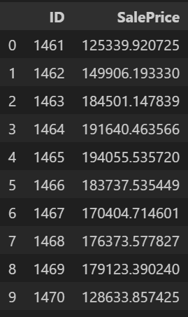


<center>图4.3 模型预测</center>

### 4.3 随机森林模型效果

如图4.4所示，随机森林的预测结果为 0.15696，相比基线模型有明显提升。虽然其效果不如 XGBoost，但这并不意味着在所有回归任务中随机森林就一定比 XGBoost 差。其优劣仍有待结合具体任务和调优策略进行判断。读者可以参考第五章提出的优化方法，对随机森林进行进一步调参，探索其性能能否进一步提升，甚至像优化 MLP 那样，仅通过修改参数就可能实现约 20% 的性能提升。


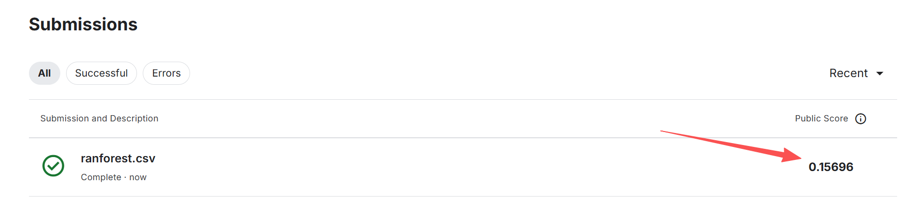


<center> 图4.4 随机森林预测效果</center>


## 5 模型优化方向

提升房价预测效果可以从 **数据优化、特征工程、模型选择与集成、训练策略、损失函数设计和预测后处理** 多方面入手。例如，清洗数据、构造高信息量特征、尝试不同模型及集成方法、调优训练策略、设计与评测指标一致的损失函数，以及对预测结果进行适当校正，都能有效提高模型的精度和泛化能力。

### 5.1 数据层面优化

- **特征工程**
  - 增加有信息量的特征（位置、建筑年代、装修、交通、学区等）。
  - 对类别特征进行合适编码（One-Hot、Target Encoding、Embedding 等）。
  - 对数值特征做标准化或归一化。
  - 构造交互特征（如面积×房间数、楼层/总楼层比例等）。
- **缺失值和异常值处理**
  - 填补缺失值（均值、中位数、预测值等）。
  - 识别并处理异常值或极端值，减少对模型的干扰。
- **数据增强与扩充**
  - 对小数据集可以生成合成样本或使用外部数据扩充。

### 5.2 模型选择与结构优化

- **尝试不同模型**
  - 线性模型（Ridge、Lasso）、树模型（XGBoost、LightGBM、CatBoost）、神经网络（MLP、TabNet 等）。
- **模型融合/集成**
  - 多模型平均、加权或堆叠（stacking）提高稳定性和精度。
- **模型结构调整**
  - 对神经网络调整隐藏层数量、节点数、激活函数、正则化策略等。

------

### 5.3 训练策略优化

- **超参数调优**
  - 学习率、正则化系数、树的深度、叶子节点数量、batch size 等。
  - 可使用网格搜索、随机搜索或贝叶斯优化。
- **正则化与防过拟合**
  - L1/L2 正则化、Dropout、Early Stopping、数据增强等。
- **优化器选择**
  - 对神经网络尝试 Adam、AdamW、RMSProp 等优化器。

------

### 5.4. 损失函数与评估指标优化

- **选择合适的损失函数**
  - 房价差异大时，考虑对数 RMSE 或加权 RMSE，关注相对误差。
- **指标对齐**
  - 训练损失与最终评测指标保持一致（如 Kaggle 用 log RMSE，则训练也用 log RMSE）。

------

### 5.5 后处理优化

- **预测结果调整**
  - 对预测值做截断或校正（防止负值或极端值）。
- **利用外部信息**
  - 合并宏观经济指标、周边设施、历史交易价格等，提高预测的背景信息。

## 6 思考

1. 能通过直接最小化价格的对数来改进模型吗？如果试图预测价格的对数而不是价格，会发生什么？
2. 用平均值替换缺失值总是好主意吗？提示：能构造一个不随机丢失值的情况吗？


## 参考

[1] [4.10. 实战Kaggle比赛：预测房价 — 动手学深度学习 2.0.0 documentation](https://zh-v2.d2l.ai/chapter_multilayer-perceptrons/kaggle-house-price.html)

[2] [机器学习——XGBoost原理笔记_xgboost原理图-CSDN博客](https://blog.csdn.net/VincentYZm/article/details/128935151)

[3] [https://blog.csdn.net/ai_aijiang/article/details/148851794](https://blog.csdn.net/ai_aijiang/article/details/148851794)

