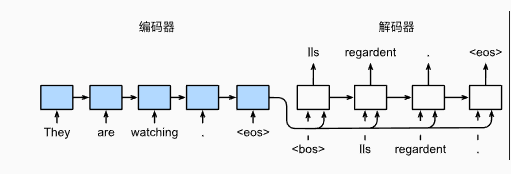
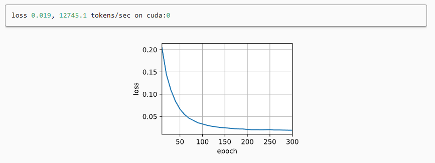
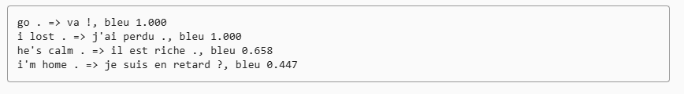

---
title: 序列到序列学习Seq2Seq基于Pytorch全面解析（附代码解析）
date:  2025-11-04 10:13:48
categories:
  - 深度学习
tags:
  - 深度学习
sticky: 0
---
## 0 引言

在自然语言处理（NLP）和其他序列建模任务中，**序列到序列学习（Sequence-to-Sequence, Seq2Seq）** 已经成为一种核心技术。它的目标是将一个序列映射为另一个序列，例如：**机器翻译、文本摘要、语音识别、聊天机器人**等。

## 1 什么是 Seq2Seq？

简单来说，Seq2Seq 是一种 **端到端模型**，输入一个序列 (X = (x_1, x_2, ..., x_n))，输出一个序列 (Y = (y_1, y_2, ..., y_m))。
特点：

- 输入和输出长度可以不一样
- 能够处理序列间复杂的对应关系

最典型的应用场景是机器翻译，比如将英文句子翻译成中文。

## 2 Seq2Seq 的核心结构

Seq2Seq 模型主要由 **编码器（Encoder）** 和 **解码器（Decoder）** 两部分组成。

遵循编码器－解码器架构的设计原则，循环神经网络（RNN）编码器能够接收长度可变的输入序列，并将其转换为固定形状的隐状态向量。换句话说，输入序列的信息被压缩并编码到编码器的隐状态中。为了连续生成输出序列的词元，独立的循环神经网络解码器会基于编码器提供的上下文信息，以及输出序列中已经生成或观察到的词元，逐步预测下一个词元。如图展示了如何在机器翻译任务中，利用两个 RNN 实现序列到序列学习。




### 2.1 编码器（Encoder）

编码器负责读取输入序列，并将其压缩成一个固定长度的向量，称为 **上下文向量（Context Vector）**。

通常使用的模型有：

- **RNN（LSTM/GRU）**：最经典的选择
- **Transformer Encoder**：现代 NLP 主流方法

编码器的输出捕捉了输入序列的语义信息。

### 2.2  解码器（Decoder）

解码器根据上下文向量逐步生成输出序列。每一步输出依赖于：

- 上一步生成的输出
- 编码器提供的上下文信息

常见做法：

- 使用 **RNN**（LSTM/GRU）生成序列
- 使用 **Attention/Transformer** 提升长序列的表现

## 3 模型代码

下面，我们利用英-法数据集及seq2seq架构来实现翻译任务，并使用最基本的GRU（循环神经网络）。

> 这里我来抛砖引玉，如果大家感兴趣，可以继续使用LSTM或者最为火热的transfomer架构来实现，

### 3.1 导包

```python
import collections
import math
import torch
from torch import nn
from d2l import torch as d2l
```

### 3.2 定义编码器

```python
##@save
class Seq2SeqEncoder(d2l.Encoder):
    """用于序列到序列学习的循环神经网络编码器"""
    def __init__(self, vocab_size, embed_size, num_hiddens, num_layers,
                 dropout=0, **kwargs):
        super(Seq2SeqEncoder, self).__init__(**kwargs)
        ## 嵌入层
        self.embedding = nn.Embedding(vocab_size, embed_size)
        self.rnn = nn.GRU(embed_size, num_hiddens, num_layers,
                          dropout=dropout)

    def forward(self, X, *args):
        ## 输出'X'的形状：(batch_size,num_steps,embed_size)
        X = self.embedding(X)
        ## 在循环神经网络模型中，第一个轴对应于时间步
        X = X.permute(1, 0, 2)
        ## 如果未提及状态，则默认为0
        output, state = self.rnn(X)
        ## output的形状:(num_steps,batch_size,num_hiddens)
        ## state的形状:(num_layers,batch_size,num_hiddens)
        return output, state
```

### 3.3 打印编码器输出

```python
encoder = Seq2SeqEncoder(vocab_size=10, embed_size=8, num_hiddens=16,
                         num_layers=2)
encoder.eval()
X = torch.zeros((4, 7), dtype=torch.long)
output, state = encoder(X)
output.shape
```

### 3.4 定义解码器

```python
class Seq2SeqDecoder(d2l.Decoder):
    """用于序列到序列学习的循环神经网络解码器"""
    def __init__(self, vocab_size, embed_size, num_hiddens, num_layers,
                 dropout=0, **kwargs):
        super(Seq2SeqDecoder, self).__init__(**kwargs)
        self.embedding = nn.Embedding(vocab_size, embed_size)
        self.rnn = nn.GRU(embed_size + num_hiddens, num_hiddens, num_layers,
                          dropout=dropout)
        self.dense = nn.Linear(num_hiddens, vocab_size)

    def init_state(self, enc_outputs, *args):
        return enc_outputs[1]

    def forward(self, X, state):
        ## 输出'X'的形状：(batch_size,num_steps,embed_size)
        X = self.embedding(X).permute(1, 0, 2)
        ## 广播context，使其具有与X相同的num_steps
        context = state[-1].repeat(X.shape[0], 1, 1)
        X_and_context = torch.cat((X, context), 2)
        output, state = self.rnn(X_and_context, state)
        output = self.dense(output).permute(1, 0, 2)
        ## output的形状:(batch_size,num_steps,vocab_size)
        ## state的形状:(num_layers,batch_size,num_hiddens)
        return output, state
```

### 3.5 打印解码器输出

```python
decoder = Seq2SeqDecoder(vocab_size=10, embed_size=8, num_hiddens=16,
                         num_layers=2)
decoder.eval()
state = decoder.init_state(encoder(X))
output, state = decoder(X, state)
output.shape, state.shape
```

### 3.6 定义损失函数

在每个时间步，解码器会预测输出词元的概率分布。类似于语言模型，这里可以使用 **softmax** 得到概率分布，并通过计算 **交叉熵损失（cross-entropy loss）** 来进行优化。

为了统一不同长度的序列，我们在序列末尾添加了填充词元（padding token），从而可以将不同长度的序列以相同形状组成小批量（batch）进行处理。然而，在计算损失时，我们应该排除对填充词元的预测。

为此，可以使用如下的 **sequence_mask** 函数，通过将无效位置置零的方式屏蔽不相关项。这样，任何涉及填充词元的计算都将乘以零，最终不会对损失产生影响。例如，假设两个序列的有效长度（不含填充词元）分别为 (L_1) 和 (L_2)，则第一个序列在第 (L_1+1) 个时间步之后，以及第二个序列在第 (L_2+1) 个时间步之后的预测都将被清零，从而排除不相关预测的干扰。

```python
##@save
def sequence_mask(X, valid_len, value=0):
    """在序列中屏蔽不相关的项"""
    maxlen = X.size(1)
    mask = torch.arange((maxlen), dtype=torch.float32,
                        device=X.device)[None, :] < valid_len[:, None]
    X[~mask] = value
    return X

X = torch.tensor([[1, 2, 3], [4, 5, 6]])
sequence_mask(X, torch.tensor([1, 2]))
```

### 3.7 定义掩码

在实践中，我们可以通过扩展 **softmax 交叉熵损失函数** 来屏蔽不相关的预测。最初，所有词元的掩码（mask）都被设置为 1。当给定序列的有效长度后，与填充词元对应的位置的掩码将被设置为 0。最终，在计算损失时，将每个词元的损失乘以其对应掩码，从而过滤掉填充词元带来的无关预测，对模型训练不会产生影响。

```python
##@save
class MaskedSoftmaxCELoss(nn.CrossEntropyLoss):
    """带遮蔽的softmax交叉熵损失函数"""
    ## pred的形状：(batch_size,num_steps,vocab_size)
    ## label的形状：(batch_size,num_steps)
    ## valid_len的形状：(batch_size,)
    def forward(self, pred, label, valid_len):
        weights = torch.ones_like(label)
        weights = sequence_mask(weights, valid_len)
        self.reduction='none'
        unweighted_loss = super(MaskedSoftmaxCELoss, self).forward(
            pred.permute(0, 2, 1), label)
        weighted_loss = (unweighted_loss * weights).mean(dim=1)
        return weighted_loss
```

### 3.8 定义训练函数

```python
##@save
def train_seq2seq(net, data_iter, lr, num_epochs, tgt_vocab, device):
    """训练序列到序列模型"""
    def xavier_init_weights(m):
        if type(m) == nn.Linear:
            nn.init.xavier_uniform_(m.weight)
        if type(m) == nn.GRU:
            for param in m._flat_weights_names:
                if "weight" in param:
                    nn.init.xavier_uniform_(m._parameters[param])

    net.apply(xavier_init_weights)
    net.to(device)
    optimizer = torch.optim.Adam(net.parameters(), lr=lr)
    loss = MaskedSoftmaxCELoss()
    net.train()
    animator = d2l.Animator(xlabel='epoch', ylabel='loss',
                     xlim=[10, num_epochs])
    for epoch in range(num_epochs):
        timer = d2l.Timer()
        metric = d2l.Accumulator(2)  ## 训练损失总和，词元数量
        for batch in data_iter:
            optimizer.zero_grad()
            X, X_valid_len, Y, Y_valid_len = [x.to(device) for x in batch]
            bos = torch.tensor([tgt_vocab['<bos>']] * Y.shape[0],
                          device=device).reshape(-1, 1)
            dec_input = torch.cat([bos, Y[:, :-1]], 1)  ## 强制教学
            Y_hat, _ = net(X, dec_input, X_valid_len)
            l = loss(Y_hat, Y, Y_valid_len)
            l.sum().backward()      ## 损失函数的标量进行“反向传播”
            d2l.grad_clipping(net, 1)
            num_tokens = Y_valid_len.sum()
            optimizer.step()
            with torch.no_grad():
                metric.add(l.sum(), num_tokens)
        if (epoch + 1) % 10 == 0:
            animator.add(epoch + 1, (metric[0] / metric[1],))
    print(f'loss {metric[0] / metric[1]:.3f}, {metric[1] / timer.stop():.1f} '
        f'tokens/sec on {str(device)}')
```

### 3.9 开始训练

```python
embed_size, num_hiddens, num_layers, dropout = 32, 32, 2, 0.1
batch_size, num_steps = 64, 10
lr, num_epochs, device = 0.005, 300, d2l.try_gpu()

train_iter, src_vocab, tgt_vocab = d2l.load_data_nmt(batch_size, num_steps)
encoder = Seq2SeqEncoder(len(src_vocab), embed_size, num_hiddens, num_layers,
                        dropout)
decoder = Seq2SeqDecoder(len(tgt_vocab), embed_size, num_hiddens, num_layers,
                        dropout)
net = d2l.EncoderDecoder(encoder, decoder)
train_seq2seq(net, train_iter, lr, num_epochs, tgt_vocab, device)
```


### 3.10 定义预测函数

```python
##@save
def predict_seq2seq(net, src_sentence, src_vocab, tgt_vocab, num_steps,
                    device, save_attention_weights=False):
    """序列到序列模型的预测"""
    ## 在预测时将net设置为评估模式
    net.eval()
    src_tokens = src_vocab[src_sentence.lower().split(' ')] + [
        src_vocab['<eos>']]
    enc_valid_len = torch.tensor([len(src_tokens)], device=device)
    src_tokens = d2l.truncate_pad(src_tokens, num_steps, src_vocab['<pad>'])
    ## 添加批量轴
    enc_X = torch.unsqueeze(
        torch.tensor(src_tokens, dtype=torch.long, device=device), dim=0)
    enc_outputs = net.encoder(enc_X, enc_valid_len)
    dec_state = net.decoder.init_state(enc_outputs, enc_valid_len)
    ## 添加批量轴
    dec_X = torch.unsqueeze(torch.tensor(
        [tgt_vocab['<bos>']], dtype=torch.long, device=device), dim=0)
    output_seq, attention_weight_seq = [], []
    for _ in range(num_steps):
        Y, dec_state = net.decoder(dec_X, dec_state)
        ## 我们使用具有预测最高可能性的词元，作为解码器在下一时间步的输入
        dec_X = Y.argmax(dim=2)
        pred = dec_X.squeeze(dim=0).type(torch.int32).item()
        ## 保存注意力权重（稍后讨论）
        if save_attention_weights:
            attention_weight_seq.append(net.decoder.attention_weights)
        ## 一旦序列结束词元被预测，输出序列的生成就完成了
        if pred == tgt_vocab['<eos>']:
            break
        output_seq.append(pred)
    return ' '.join(tgt_vocab.to_tokens(output_seq)), attention_weight_seq
```

### 3.11 定义评估函数

在序列预测任务中，需要衡量预测序列与真实序列的匹配程度。**BLEU** 最初用于机器翻译，如今广泛应用于各种序列生成任务。其核心思想是：**预测序列中的 n-gram 出现在标签序列中越多，预测越准确**。BLEU 通过计算不同长度 n-gram 的匹配精度，并结合长度惩罚，得到一个综合评分，最大值为 1，当预测完全匹配标签时达到最优。

```python
def bleu(pred_seq, label_seq, k):  ##@save
    """计算BLEU"""
    pred_tokens, label_tokens = pred_seq.split(' '), label_seq.split(' ')
    len_pred, len_label = len(pred_tokens), len(label_tokens)
    score = math.exp(min(0, 1 - len_label / len_pred))
    for n in range(1, k + 1):
        num_matches, label_subs = 0, collections.defaultdict(int)
        for i in range(len_label - n + 1):
            label_subs[' '.join(label_tokens[i: i + n])] += 1
        for i in range(len_pred - n + 1):
            if label_subs[' '.join(pred_tokens[i: i + n])] > 0:
                num_matches += 1
                label_subs[' '.join(pred_tokens[i: i + n])] -= 1
        score *= math.pow(num_matches / (len_pred - n + 1), math.pow(0.5, n))
    return score
```

### 3.12 预测

```python
engs = ['go .', "i lost .", 'he\'s calm .', 'i\'m home .']
fras = ['va !', 'j\'ai perdu .', 'il est calme .', 'je suis chez moi .']
for eng, fra in zip(engs, fras):
    translation, attention_weight_seq = predict_seq2seq(
        net, eng, src_vocab, tgt_vocab, num_steps, device)
    print(f'{eng} => {translation}, bleu {bleu(translation, fra, k=2):.3f}')
```




## 4 总结

 本篇文章介绍了基于 GRU的序列到序列（Seq2Seq）模型。如果大家跑通了基础模型，可以直接在此基础上对模型修改，将其改为LSTM再进行研究，由于高级API的存在，这样的改动非常容易，如果想要挑战自己，可以理解并重新调整去实现transformer的翻译任务，其架构也是编码器-解码器的架构。

> 了解了这个基础模型之后，再进行其他模型的深入理解，会好很多！


## 参考

[1] [https://zh-v2.d2l.ai/chapter_recurrent-modern/seq2seq.html](https://zh-v2.d2l.ai/chapter_recurrent-modern/seq2seq.html)
