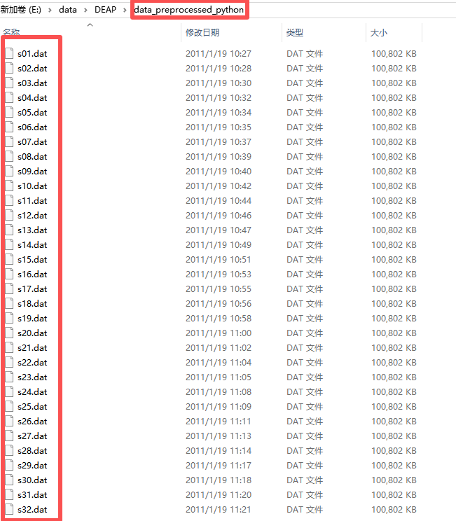
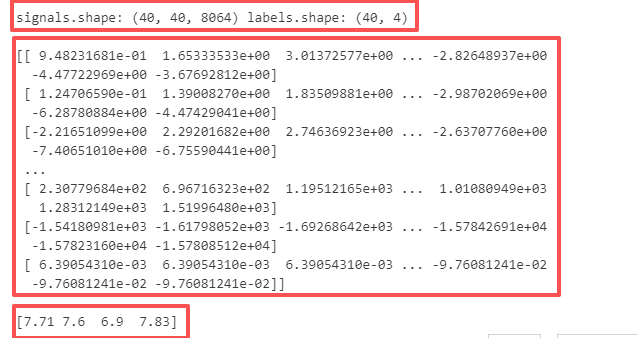
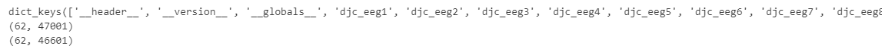
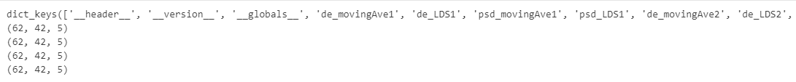

## 0 引言

本文大致介绍一些心电数据集的组成部分，并附带代码可以直接运行查看相关数据的内容，方便大家能快速上手使用。

由于心理数据集不同意申请，所以在本文**最后部分**，这里贴心为大家提供各种**心电数据的下载链接**，直接可以下载。

## 1 Deap

### 1.1 Deap细致介绍

相关链接：[\[翻译+注解\] DEAP dataset：a dataset for emotion analysis using eeg, physiological and video signals_deap数据集-CSDN博客](https://blog.csdn.net/weixin_44878336/article/details/132541982)

如果需要非常细致的了解，可以点击这个链接查看相关内容，此文档非常详细且细致的讲述了Deap数据集的组成。

### 1.2 Deap简介概要

**受试者人数**：32 人（16 男，16 女）

**刺激内容**：40 段音乐视频片段，每段 60 秒

**实验内容**：每位受试者观看 40 段视频，并在观看后进行情绪自评。

**情绪维度（Self-Assessment ratings）**：

- **Valence（愉悦度）**：1–9
- **Arousal（唤醒度）**：1–9
- **Dominance（支配度）**：1–9
- **Liking（喜欢程度）**：1–9

| 类型        | 数量    | 描述                                              |
| ----------- | ------- | ------------------------------------------------- |
| EEG         | 32 通道 | 使用 Biosemi ActiveTwo 系统                       |
| EOG         | 2 通道  | 眼电信号                                          |
| EMG         | 4 通道  | 面部肌电（Zygomaticus、Trapezius、Corrugator 等） |
| GSR         | 1 通道  | 皮肤电导                                          |
| BVP         | 1 通道  | 血容量脉搏                                        |
| Respiration | 1 通道  | 呼吸信号                                          |
| Temperature | 1 通道  | 皮肤温度                                          |
| Video       | 1 通道  | 被试面部视频（仅限部分）                          |

### 1.3 data_preprocessed_python

这个数据是官方给的处理后的数据集，里面所包含的内容跟1.2介绍的大致相同，唯一的区别是，这里每个受试者看每个视频的时间是63秒，这其中包含了前3秒的适应时间，其组成部分如下图所示，`dat`格式的文件，一共32人。



### 1.3 打印数据查看

接下来我们直接一个人的数据，来查看具体格式，我觉得从代码角度去查看，会更加细致，详细，也方便大家去使用

```python
import pickle
with open(r"..\data\data_preprocessed_python\s01.dat", "rb") as f:
    data = pickle.load(f, encoding='latin1')

signals = data['data']    # EEG 信号
labels = data['labels']   # 情绪标签
print("signals.shape:",signals.shape,"labels.shape:",labels.shape)
print(signals[0])
print(labels[0])
```

主要包含**信号**和**标签**

1. **信号：(40,40,128*63)**

这表示有 40 个视频，每个视频包含 40 条信号通道，其中 32 条为 EEG 通道，8 条为其他生理通道，每条通道的数据长度为 128 Hz × 63 秒的采样点。

2. **标签：(40,4)**

标签的形状为 (40, 4)，对应 40 个视频的情绪评分，每条记录包含四个维度：

- 愉悦度（Valence）
- 唤醒度（Arousal）
- 支配度（Dominance）
- 喜好度（Liking）



## 2 Seed

### 2.1 Seed简介

SEED（SJTU Emotion EEG Dataset）是由上海交通大学 BCMI 实验室构建的情绪识别脑电数据集，主要用于研究基于 EEG 的情绪分类任务。数据通过观看情绪诱发电影片段得到，具有高质量、结构清晰等特点，是情绪计算领域最广泛使用的数据集之一。

- **被试人数**：15 人
- **实验次数**：每位被试进行了 **3 次实验（session）**，间隔至少一周
- **情绪类别**：3 类
  - 正性（positive）
  - 中性（neutral）
  - 负性（negative）
- **刺激材料**：每个 session 包含 **15 段电影剪辑**，每段诱发一种情绪
- **EEG 通道数**：62 通道（国际 10–20 系统）
- **采样率**：1000 Hz
- **提供的数据类型**：
  - 原始 EEG 信号
  - 预处理后的 EEG（滤波、降采样等）
  - 多种特征（如 DE、PSD、时间域特征）

### 2.2 文件夹格式

```text
SEED_Dataset
├── Preprocessed_EEG/
│   ├── sub1_session1.mat
│   ├── sub1_session2.mat
│   └── ...
├── Extracted_Features/
│   ├── sub1_session1_DE.mat
│   ├── sub1_session2_DE.mat
│   └── ...
├── EEG_raw/
│   ├── sub1_session1.cnt
│   ├── sub1_session2.cnt
│   └── ...
├── Eye_Movement/
│   ├── sub1_session1_eye.mat
│   └── ...
└── README.md
    └── 数据集说明与使用指南
```

- **原始EEG数据**：存储在“EEG_raw”文件夹，格式为.cnt，采样率为1000Hz。
- **预处理EEG数据**：存储在“Preprocessed_EEG”文件夹，已降采样至200Hz，经过0-75Hz的带通滤波，并分割为对应每个影片的EEG片段。
- **特征提取**：
- 提取了[微分熵](https://zhida.zhihu.com/search?content_id=249127400&content_type=Article&match_order=1&q=微分熵&zhida_source=entity)（DE）特征，以及[差分不对称](https://zhida.zhihu.com/search?content_id=249127400&content_type=Article&match_order=1&q=差分不对称&zhida_source=entity)（DASM）和[比率不对称](https://zhida.zhihu.com/search?content_id=249127400&content_type=Article&match_order=1&q=比率不对称&zhida_source=entity)（RASM）特征。
- 特征经过移动平均和线性动态系统（LDS）平滑处理。
- **眼动数据**：存储在“Eye_Movement”文件夹，包含眼动追踪的特征数据。

### 2.3 打印数据

这里查看预处理数据，因为实际应用中，我们主要是利用处理后的EEG数据

```python
import scipy.io

seed3_path = r"E:\data\SEED\SEED\SEED\Preprocessed_EEG\1_20131027.mat"
pre_data = scipy.io.loadmat(seed3_path)

print(pre_data.keys())  # 查看包含哪些变量
# 例如常见键：['__header__', '__version__', '__globals__', 'data', 'label']
 
# 查看具体内容
print(pre_data['djc_eeg1'].shape)   # EEG 信号 shape
print(pre_data['djc_eeg2'].shape)  # 标签 shape
```



这里有十五个edjc_egg_X，代表每个人查看了十五个电影片段，格式为（C，T）这里的C代表通道，都是62通道，而T代表200HZ下采样的总时间步，所以即使同个人，但这个数也不同。

## 3 Seed4

### 3.1 Seed4细致介绍

链接：[(16 封私信 / 65 条消息) SEED-IV 数据集介绍 - 知乎](https://zhuanlan.zhihu.com/p/989509591)

这个链接的总结非常全面，如若需要全面了解该数据集可查看该链接

### 3.2 Seed4概要介绍

SEED-IV 是由上海交通大学 BCMI 实验室发布的多模态情绪识别数据集，用于研究更细粒度的情绪分类。数据集通过观看情绪诱发视频片段获取 EEG、生理信号及行为数据，目标是构建更加真实的情绪分类场景。

- **被试人数**：15 名参与者
- **实验会话**：每名被试完成 **3 个 session**（间隔至少一周）
- **情绪类别**：4 类
  - 正性（positive）
  - 中性（neutral）
  - 厌恶（disgust）
  - 恐惧（fear）
- **刺激材料**：共 **24 个电影片段**，每个 session 都会观看全部 24 个
- **EEG 通道数**：62 通道（基于国际 10–20 系统）
- **采样率**：1000 Hz（后期通常会降采样到 200 Hz）
- **数据类型**：
  - 原始 EEG（eeg_raw_data）
  - 提取的频域特征，如 **差分熵（DE）**、**功率谱密度（PSD）**
  - 平滑后的特征（eeg_feature_smooth），包含：
    - movingAve（滑动平均平滑）
    - LDS（线性动态系统平滑）

### 3.3 Seed4文件结构

```text
SEED-IV_Dataset
├── eeg_raw_data/
│   ├── 1/
│   │   ├── sub1_20200101.mat
│   │   └── ...
│   ├── 2/
│   ├── 3/
├── eeg_feature_smooth/
│   ├── 1/
│   ├── 2/
│   ├── 3/
├── eye_raw_data/
│   ├── sub1_20200101_blink.mat
│   ├── sub1_20200101_event.mat
│   └── ...
├── eye_feature_smooth/
│   ├── sub1_20200101.mat
│   └── ...
├── Channel Order.xlsx
├── ReadMe.txt
└── README.md
    └── 数据集说明与使用指南
```

### 3.4 eeg_feature_smooth

这里重要介绍这里面的心电处理后的数据，因为大多数人都只会用到这个数据集

`eeg_feature_smooth` 是 SEED-IV 数据集中提供的预处理特征文件，包含从原始 EEG 提取并经过平滑处理的情绪识别特征。它以每位被试、每个实验 session、每个试次（共 24 个电影片段）组织数据，便于直接用于模型训练。

其中包含的特征主要包括：

- **DE（Differential Entropy，差分熵）**
   情绪识别中最常用的 EEG 特征之一。
- **PSD（Power Spectral Density，功率谱密度）**
   描述脑电在不同频段上的能量分布。

每种特征又分别经过两种平滑方式处理：

- **movingAve**：滑动平均平滑
- **LDS**：线性动态系统平滑

因此每个试次会有类似以下字段：
 `de_movingAve1`、`de_LDS1`、`psd_movingAve1`、`psd_LDS1`（数字表示试次编号 1–24）。

**打印数据**

```python
import scipy.io

seed4_path = r"E:\data\SEED\SEED_IV\SEED_IV\eeg_feature_smooth\1\1_20160518.mat"
pre_data = scipy.io.loadmat(seed4_path)

print(pre_data.keys())  # 查看包含哪些变量
# 例如常见键：['__header__', '__version__', '__globals__', 'data', 'label']

# 查看具体内容
print(pre_data['de_movingAve1'].shape)   # EEG 信号 shape
print(pre_data['de_LDS1'].shape)  # 标签 shape
print(pre_data['psd_movingAve1'].shape)  # 标签 shape
print(pre_data['psd_LDS1'].shape)  # 标签 shape
```

```
通道数（62） × 时间窗数(T) × 频带数(5)	
1. 62个电极通道
2. 时间窗一般是4秒一段
3. EEG 信号通常分成 5 个标准频带：
δ (delta)：0.5–4 Hz

θ (theta)：4–8 Hz

α (alpha)：8–13 Hz

β (beta)：13–30 Hz

γ (gamma)：30–75 Hz（根据带通滤波上限）
```



## 4 数据集下载链接

这里分享一位博主申请下来的数据集，开箱即用，不需要自己申请

[EEG脑电数据集分享（DEAP、SEED、Dreamer、IEMOCAP、MAHNOB-HCI、Bonn波恩癫痫） - 哔哩哔哩](https://www.bilibili.com/opus/809460473257787458)