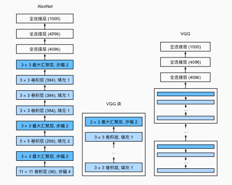
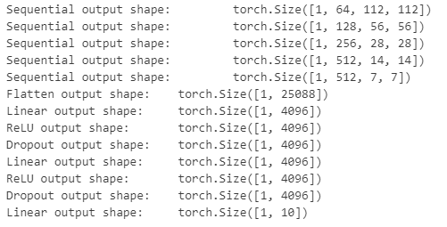
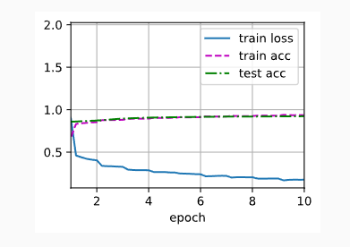

---
title: 深入浅出 VGGNet：经典卷积神经网络解析
date:  2025-10-25 16:55:40
categories:
  - 深度学习
tags:
  - 深度学习
sticky: 0
---


## 0 概要

在深度学习的发展历程中，VGGNet是一个经典且广泛使用的卷积神经网络（CNN）架构，它在图像分类任务中表现优异。本文将带你从背景、网络结构到特点与应用，全面了解 VGGNet。本文附带源码概绍，可直接运行，方便各位从代码角度直观了解VGGNet。

## 1 VGGNet 的背景

VGGNet 由牛津大学视觉几何组（Visual Geometry Group）提出，在 2014 年的 ImageNet 图像分类挑战赛（ILSVRC）中表现出色。VGGNet 的主要创新是**使用连续的小卷积核（3x3）和池化层堆叠**，代替大卷积核，从而在保证表达能力的同时降低参数量和计算复杂度。

## 2 VGGNet 的网络结构

VGGNet 有多个版本，常见的有 VGG-11、VGG-16 和 VGG-19，其中数字表示卷积层的数量，小教育AlexNet，其最大的改变在于使用块结构的结合进行训练推理，使其能具有一个可堆叠的结构。以 VGG-16 为例，其网络结构可以概括为：

1. **卷积层堆叠**
   - 使用 3x3 的卷积核，步长为 1，保持特征图大小不变。
   - 每个卷积层后通常接一个 ReLU 激活函数。
   - 每堆卷积层后加入一个 2x2 最大池化层（Max Pooling），用于下采样。
2. **全连接层**
   - 卷积部分输出的特征图展开后，接 3 个全连接层，其中前两层通常有 4096 个神经元，最后一层输出类别数（如 ImageNet 是 1000）。
3. **Softmax 输出**
   - 最后一层使用 Softmax，将网络输出转换为概率分布，用于分类。




## 3 VGGNet代码

这里的代码以*DIVE INTO DEEP INEARING*为示例代码，需要提前将环境配置好，为了加快训练，本文的VGGNet采用11层架构，也即八个卷积块和3个全连接层

### 3.1 组件vgg块

```python
import torch 
from torch import nn
from d2l import torch as d2l

def vgg_block(num_convs,in_channels,out_channels):
    layers = []
    for _ in range(num_convs):
        layers.append(nn.Conv2d(in_channels,out_channels,kernel_size=3,padding=1))
        layers.append(nn.ReLU())
        in_channels = out_channels
    layers.append(nn.MaxPool2d(kernel_size=2,stride=2))
    return nn.Sequential(*layers)
```

### 3.2 定义vgg网络结构

```python
## 通道数
conv_arch = ((1, 64), (1, 128), (2, 256), (2, 512), (2, 512))

def vgg(conv_arch):
    conv_blks = []
    in_channel = 1
    for (num_convs,out_channels) in conv_arch:
        conv_blks.append(vgg_block(num_convs,in_channel,out_channels))
        in_channel = out_channels

    return nn.Sequential(
        *conv_blks,nn.Flatten(),
        nn.Linear(out_channels * 7*7,4096),nn.ReLU(),nn.Dropout(0.5),
        nn.Linear(4096,4096),nn.ReLU(),nn.Dropout(0.5),
        nn.Linear(4096,10)
    )
net = vgg(conv_arch)
```

### 3.3 输出网络结构

```python
X = torch.randn(size=(1, 1, 224, 224))
for blk in net:
    X = blk(X)
    print(blk.__class__.__name__,'output shape:\t',X.shape)
```




### 3.4 调低通道数

由于我们只是为了测试这个网络结构，加快训练，将前面的通道数减少

```python
ratio = 4
small_conv_arch = [(pair[0], pair[1] // ratio) for pair in conv_arch]
net = vgg(small_conv_arch)
```

### 3.5 定义评估函数

```python
def evaluate_accuracy_gpu(net, data_iter, device=None): ##@save
    """使用GPU计算模型在数据集上的精度"""
    if isinstance(net, nn.Module):
        net.eval()  ## 设置为评估模式
        if not device:
            device = next(iter(net.parameters())).device
    ## 正确预测的数量，总预测的数量
    metric = d2l.Accumulator(2)
    with torch.no_grad():
        for X, y in data_iter:
            if isinstance(X, list):
                ## BERT微调所需的（之后将介绍）
                X = [x.to(device) for x in X]
            else:
                X = X.to(device)
            y = y.to(device)
            metric.add(d2l.accuracy(net(X), y), y.numel())
    return metric[0] / metric[1]
```

### 3.6 定义训练函数

```python
def train_ch6(net,train_iter,test_iter,num_epochs,lr,device):
    def init_weights(m):
        if type(m) == nn.Linear or type(m) == nn.Conv2d:
            nn.init.xavier_uniform_(m.weight)
    net.apply(init_weights)
    print("devices on :",device)
    net.to(device)
    optimizer = torch.optim.SGD(net.parameters(),lr=lr)     ## 获取需要更新的参数
    loss = nn.CrossEntropyLoss()            ## 交叉熵损失函数，先用softmax取值，取得负对数得到损失值
    animator = d2l.Animator(xlabel='epoch', xlim=[1, num_epochs],
                            legend=['train loss', 'train acc', 'test acc'])
    timer, num_batches = d2l.Timer(), len(train_iter)
    for epoch in range(num_epochs):
        metric = d2l.Accumulator(3)
        net.train()
        for i,(X,y) in enumerate(train_iter):
            timer.start()
            optimizer.zero_grad()
            X, y = X.to(device), y.to(device)
            y_hat = net(X)
            l = loss(y_hat,y)
            l.backward()
            optimizer.step()
            with torch.no_grad():
                metric.add(l * X.shape[0], d2l.accuracy(y_hat, y), X.shape[0])
            timer.stop()
            train_l = metric[0]/metric[2]
            train_acc = metric[1] / metric[2]
            if (i + 1) % (num_batches // 5) == 0 or i == num_batches - 1:
                animator.add(epoch + (i + 1) / num_batches,
                             (train_l, train_acc, None))
        test_acc = evaluate_accuracy_gpu(net, test_iter)
        animator.add(epoch + 1, (None, None, test_acc))
    print(f'loss {train_l:.3f}, train acc {train_acc:.3f}, '
          f'test acc {test_acc:.3f}')
    print(f'{metric[2] * num_epochs / timer.sum():.1f} examples/sec '
          f'on {str(device)}')
```

### 3.7 定义数据集

如果已经下载好数据集后，修改数据集的root的位置即可，但是如果没有下载过，需要将`doenload`设置为`TRUE`

```python
from torch.nn.modules import transformer
from torchvision import datasets,transforms


transform = transforms.Compose([
    transforms.Resize((224,224)),
    transforms.ToTensor()

])

## 加载训练集
train_dataset = datasets.MNIST(
    root='../../dataset/mnist/train',
    train=True,
    transform=transform,
    download=False  ## 已经在本地
)

## 加载测试集
test_dataset = datasets.MNIST(
    root='../../dataset/mnist/test',
    train=False,
    transform=transform,
    download=False
)
```

### 3.8 开始训练

```python
lr,num_epochs,batch_size = 0.05,4,128
train_iter = DataLoader(train_dataset,batch_size=batch_size)
test_iter = DataLoader(test_dataset,batch_size=batch_size)
d2l.train_ch6(net, train_iter, test_iter, num_epochs, lr, d2l.try_gpu())
```




## 4 VGGNet 的特点

1. **简单而统一**
   - 全网几乎只使用 3x3 卷积核和 2x2 池化，架构简单且易于实现。
2. **可迁移性强**
   - VGGNet 的预训练权重可以很好地迁移到其他任务，如目标检测、图像分割等。
3. **计算量大**
   - 虽然参数量庞大（VGG-16 大约有 138M 个参数），但性能优异，尤其在提取图像特征方面。
4. **容易扩展**
   - 可以根据任务需求增加或减少卷积层数量（如 VGG-19 更深）。

## 5 VGGNet 的应用

- **图像分类**：ImageNet、CIFAR 等数据集。
- **目标检测**：作为特征提取 backbone。
- **迁移学习**：在小数据集上 fine-tune，提高模型效果。
- **风格迁移与生成任务**：提取内容特征和风格特征。


## 参考

[1] [https://zh-v2.d2l.ai/chapter_convolutional-modern/vgg.html](https://zh-v2.d2l.ai/chapter_convolutional-modern/vgg.html)
