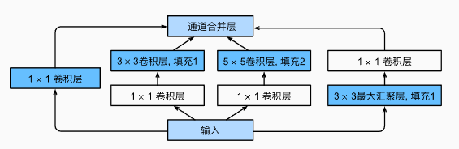
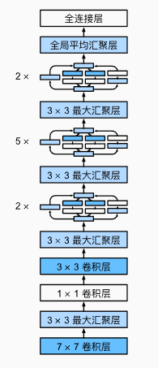
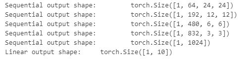
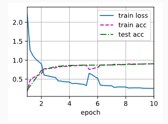

---
title: 深入理解GoogLeNet：从 Inception 模块到高效卷积网络
date:  2025-10-25 16:54:28
categories:
  - 深度学习
tags:
  - 深度学习
sticky: 0
---


## 0 引言

在深度学习的视觉领域，卷积神经网络（CNN）已经成为主流，但随着网络加深，参数量和计算量迅速膨胀。GoogLeNet 的出现，是一次在保持深度的同时极大降低参数量的创新尝试。本文将带你理解 GoogLeNet 的核心思想、网络结构及实际应用。

## 1  核心创新：Inception 模块

如下图所示，Inception 块由四条并行路径组成。前三条路径分别使用不同尺寸的卷积核（如 1×1、3×3、5×5）提取不同空间尺度的特征。其中，中间两条卷积路径在操作前先进行 1×1 卷积降维，以减少输入通道数，从而降低模型复杂度。第四条路径先通过最大池化层提取特征，再使用 1×1 卷积调整通道数。为了保证输入与输出在高宽上保持一致，这四条路径都使用了适当的填充（padding）。最后，将四条路径的输出在通道维度上拼接，形成 Inception 块的最终输出。在实际应用中，Inception 块中可调节的主要超参数是每条路径的输出通道数。




## 2 网络结构

如图 所示，GoogLeNet 由 9 个 Inception 块堆叠而成，并在末端接入全局平均池化层来生成最终的预测结果。在 Inception 块之间插入的最大池化层不仅能够有效降低特征图的空间维度，还能增强网络的平移不变性。

网络的前几层类似于 AlexNet 和 LeNet，用于提取低级特征；而 Inception 块的堆叠则继承了 VGG 的思路，通过多层组合实现深层特征抽象。值得注意的是，GoogLeNet 采用全局平均池化替代传统全连接层，不仅显著减少了参数量，也降低了过拟合的风险，从而使网络在保持高精度的同时更加高效。

此外，为了缓解梯度消失问题，网络在中间层还引入了辅助分类器，它们在训练阶段提供额外监督，但在推理阶段被舍弃，以保证最终预测的稳定性。




## 3 代码实现

这里的代码以*DIVE INTO DEEP INEARING*为示例代码，需要提前将环境配置好

### 3.1 定义Inception

```python
import torch
from torch import nn
from torch.nn import functional as F
from d2l import torch as d2l

class Inception(nn.Module):
    ## c1--c4是每条路径的输出通道数
    def __init__(self, in_channels, c1, c2, c3, c4, **kwargs):
        super(Inception, self).__init__(**kwargs)
        ## 线路1，单1x1卷积层
        self.p1_1 = nn.Conv2d(in_channels, c1, kernel_size=1)
        ## 线路2，1x1卷积层后接3x3卷积层
        self.p2_1 = nn.Conv2d(in_channels, c2[0], kernel_size=1)
        self.p2_2 = nn.Conv2d(c2[0], c2[1], kernel_size=3, padding=1)
        ## 线路3，1x1卷积层后接5x5卷积层
        self.p3_1 = nn.Conv2d(in_channels, c3[0], kernel_size=1)
        self.p3_2 = nn.Conv2d(c3[0], c3[1], kernel_size=5, padding=2)
        ## 线路4，3x3最大汇聚层后接1x1卷积层
        self.p4_1 = nn.MaxPool2d(kernel_size=3, stride=1, padding=1)
        self.p4_2 = nn.Conv2d(in_channels, c4, kernel_size=1)

    def forward(self, x):
        p1 = F.relu(self.p1_1(x))
        p2 = F.relu(self.p2_2(F.relu(self.p2_1(x))))
        p3 = F.relu(self.p3_2(F.relu(self.p3_1(x))))
        p4 = F.relu(self.p4_2(self.p4_1(x)))
        ## 在通道维度上连结输出
        return torch.cat((p1, p2, p3, p4), dim=1)
```

### 3.2 定义五个块

```python
b1 = nn.Sequential(nn.Conv2d(1, 64, kernel_size=7, stride=2, padding=3),
                   nn.ReLU(),
                   nn.MaxPool2d(kernel_size=3, stride=2, padding=1))
                   
b2 = nn.Sequential(nn.Conv2d(64, 64, kernel_size=1),
                   nn.ReLU(),
                   nn.Conv2d(64, 192, kernel_size=3, padding=1),
                   nn.ReLU(),
                   nn.MaxPool2d(kernel_size=3, stride=2, padding=1)) 
                   
b3 = nn.Sequential(Inception(192, 64, (96, 128), (16, 32), 32),
                   Inception(256, 128, (128, 192), (32, 96), 64),
                   nn.MaxPool2d(kernel_size=3, stride=2, padding=1))      
                  
b4 = nn.Sequential(Inception(480, 192, (96, 208), (16, 48), 64),
                   Inception(512, 160, (112, 224), (24, 64), 64),
                   Inception(512, 128, (128, 256), (24, 64), 64),
                   Inception(512, 112, (144, 288), (32, 64), 64),
                   Inception(528, 256, (160, 320), (32, 128), 128),
                   nn.MaxPool2d(kernel_size=3, stride=2, padding=1))    
                   
b5 = nn.Sequential(Inception(832, 256, (160, 320), (32, 128), 128),
                   Inception(832, 384, (192, 384), (48, 128), 128),
                   nn.AdaptiveAvgPool2d((1,1)),
                   nn.Flatten())

net = nn.Sequential(b1, b2, b3, b4, b5, nn.Linear(1024, 10))                   
```

### 3.3 打印网络结构

```
X = torch.rand(size=(1, 1, 96, 96))
for layer in net:
    X = layer(X)
    print(layer.__class__.__name__,'output shape:\t', X.shape)
```




### 3.4 定义评估函数

```python
def evaluate_accuracy_gpu(net, data_iter, device=None): ##@save
    """使用GPU计算模型在数据集上的精度"""
    if isinstance(net, nn.Module):
        net.eval()  ## 设置为评估模式
        if not device:
            device = next(iter(net.parameters())).device
    ## 正确预测的数量，总预测的数量
    metric = d2l.Accumulator(2)
    with torch.no_grad():
        for X, y in data_iter:
            if isinstance(X, list):
                ## BERT微调所需的（之后将介绍）
                X = [x.to(device) for x in X]
            else:
                X = X.to(device)
            y = y.to(device)
            metric.add(d2l.accuracy(net(X), y), y.numel())
    return metric[0] / metric[1]
```

### 3.5 定义训练函数

```python
def train_ch6(net,train_iter,test_iter,num_epochs,lr,device):
    def init_weights(m):
        if type(m) == nn.Linear or type(m) == nn.Conv2d:
            nn.init.xavier_uniform_(m.weight)
    net.apply(init_weights)
    print("devices on :",device)
    net.to(device)
    optimizer = torch.optim.SGD(net.parameters(),lr=lr)     ## 获取需要更新的参数
    loss = nn.CrossEntropyLoss()            ## 交叉熵损失函数，先用softmax取值，取得负对数得到损失值
    animator = d2l.Animator(xlabel='epoch', xlim=[1, num_epochs],
                            legend=['train loss', 'train acc', 'test acc'])
    timer, num_batches = d2l.Timer(), len(train_iter)
    for epoch in range(num_epochs):
        metric = d2l.Accumulator(3)
        net.train()
        for i,(X,y) in enumerate(train_iter):
            timer.start()
            optimizer.zero_grad()
            X, y = X.to(device), y.to(device)
            y_hat = net(X)
            l = loss(y_hat,y)
            l.backward()
            optimizer.step()
            with torch.no_grad():
                metric.add(l * X.shape[0], d2l.accuracy(y_hat, y), X.shape[0])
            timer.stop()
            train_l = metric[0]/metric[2]
            train_acc = metric[1] / metric[2]
            if (i + 1) % (num_batches // 5) == 0 or i == num_batches - 1:
                animator.add(epoch + (i + 1) / num_batches,
                             (train_l, train_acc, None))
        test_acc = evaluate_accuracy_gpu(net, test_iter)
        animator.add(epoch + 1, (None, None, test_acc))
    print(f'loss {train_l:.3f}, train acc {train_acc:.3f}, '
          f'test acc {test_acc:.3f}')
    print(f'{metric[2] * num_epochs / timer.sum():.1f} examples/sec '
          f'on {str(device)}')
```

### 3.5 定义数据集

如果已经下载好数据集后，修改数据集的root的位置即可，但是如果没有下载过，需要将`doenload`设置为`TRUE`

```python
from torch.nn.modules import transformer
from torchvision import datasets,transforms
from torch.utils.data import DataLoader

transform = transforms.Compose([
    transforms.Resize((224,224)),
    transforms.ToTensor()

])

## 加载训练集
train_dataset = datasets.MNIST(
    root='../../dataset/mnist/train',
    train=True,
    transform=transform,
    download=False  ## 已经在本地
)

## 加载测试集
test_dataset = datasets.MNIST(
    root='../../dataset/mnist/test',
    train=False,
    transform=transform,
    download=False
)

train_iter = DataLoader(train_dataset,batch_size=batch_size)
test_iter = DataLoader(test_dataset,batch_size=batch_size)
```

### 3.6 开始训练

```
lr, num_epochs, batch_size = 0.1, 10, 128

d2l.train_ch6(net, train_iter, test_iter, num_epochs, lr, d2l.try_gpu())
```




## 4 GoogLeNet 的优势

- **高性能、低参数**：相比 VGGNet，参数量少了十倍，但精度更高。
- **多尺度特征提取**：Inception 模块能同时处理不同尺度信息。
- **训练稳定**：辅助分类器帮助梯度传播，深层网络不容易退化。


## 参考

[1] [https://zh-v2.d2l.ai/chapter_convolutional-modern/googlenet.html](https://zh-v2.d2l.ai/chapter_convolutional-modern/googlenet.html)
