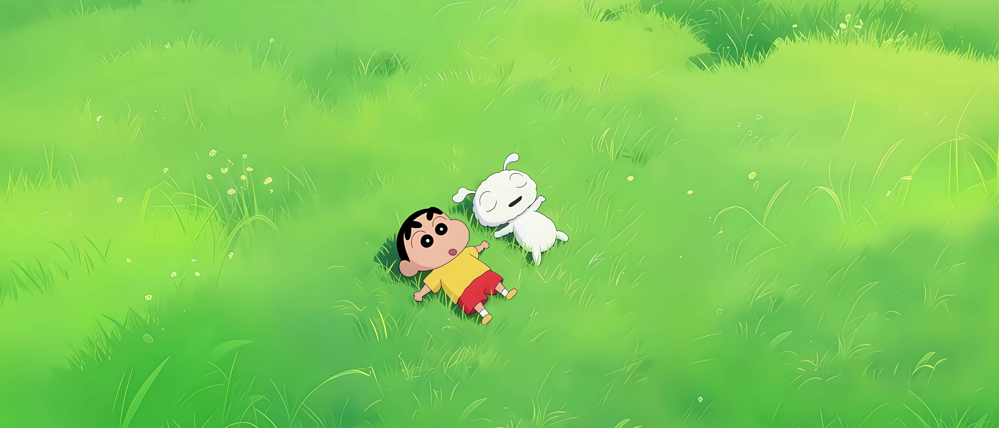
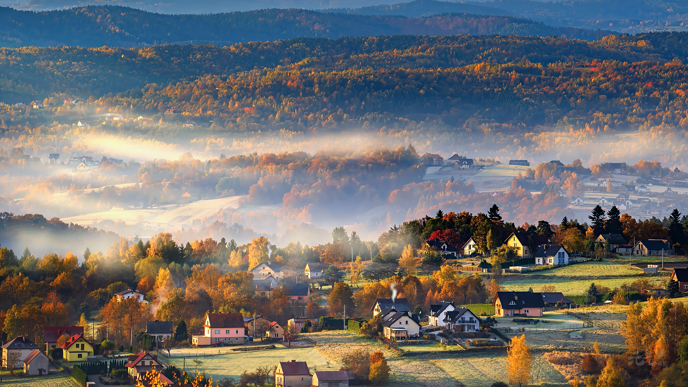
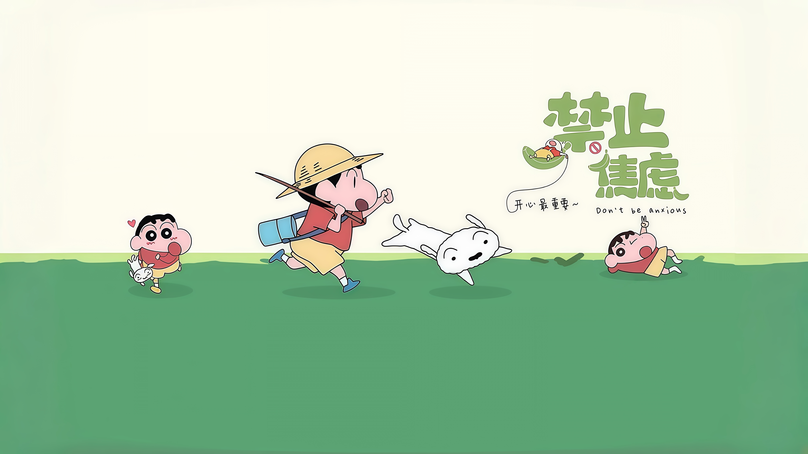

::: center
很早之前就关注到这段话，每次听到都感觉让人很放松，这段话出自——**放轻松 让美好自然流淌**

其实  你越放松  

结果就越好  

你越不在乎  

事情就越顺利  

所以  当你不再急于求成  

开始降低期望  

乐观向上的时候  

一切美好便会水到渠成  

有心栽花花不开  

无心插柳柳成荫  

踏破铁鞋无觅处  

得来全不废功夫
:::

